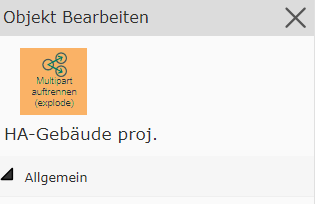

Multipart Geo-Objekt auftrennen (explode)
=========================================

| Ein Multipart-Objekt lässt sich auch wieder in seine einzelnen Geometrie-Teile auftrennen. 
| Dafür muss das Geo-Objekt in der Karte ausgewählt werden (es darf immer nur ein Multipart-Objekt ausgewählt werden, um diese Aktion durchführen zu können).
|
| Um das Objekt aufzutrennen, muss man über das *Bleistift-Symbol* in der Tabelle in die Bearbeitungsmaske springen. 

.. image:: img/multipart_loesen.png

Hier erscheint dann in der linken oberen Ecke des Dialogs das Werkzeug *mulitpart auftrennen (explode)*.

Durch Klick auf dieses Werkzeug gelangt man in den Dialog, der die Sachdaten eines Geo-Objektes anzeigt. 

Klickt man auf ``Auftrennen``, kann man danach wählen, ob man das Ursprungsobjekt beibehalten möchte, oder ob dieses gelöscht werden soll.

.. image:: img/multipart_loesen_2.png

.. image:: img/multipart_loesen_3.png