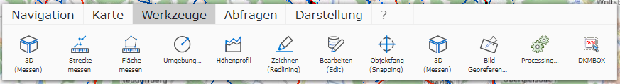

Allgemeine Werkzeuge
====================

Unter *Werkzeuge* befinden sich folgende Werkzeuge (abhängig von den Einstellungen des Kartenautors):

.. toctree::
   :maxdepth: 3

   measure-line
   measure-area
   circle
   profile
   mapmarkup/index
   editing/index
   georeference
   georef-image
   measure-3d 