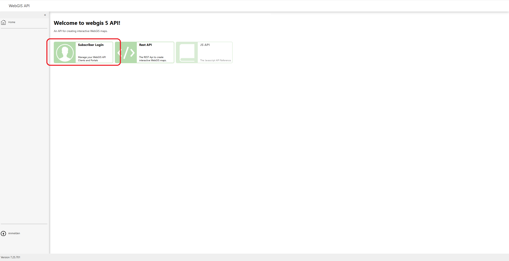
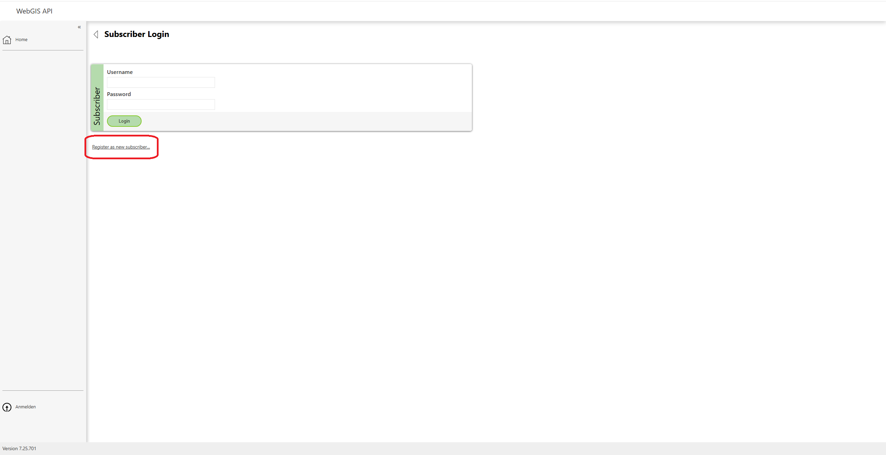
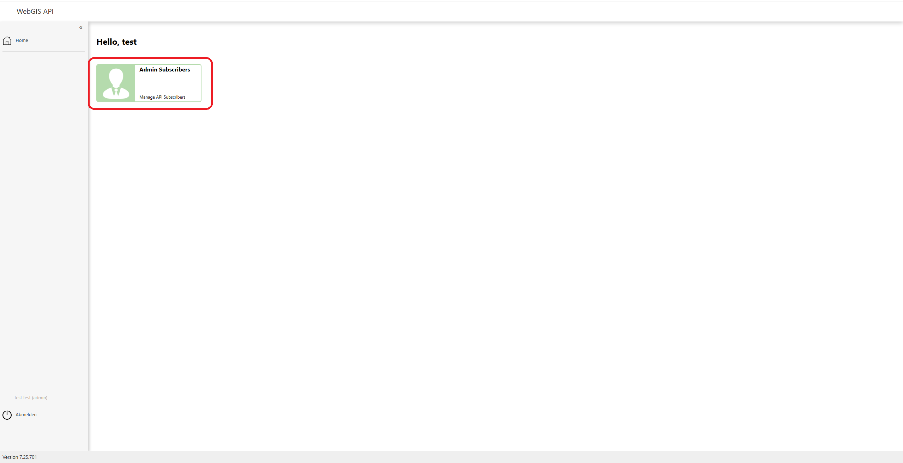

Anmelden und Erstmalige Anmeldung
=================================

Nach der Installation und dem erstmaligen Öffnen der WebGIS-Plattform muss der Admin-Account angelegt werden, da nur dieser Benutzer die Verwaltung anderer Nutzer durchführen kann. Zudem ist es erforderlich, das Standardpasswort des Nutzers „author“ zu ändern, um die Sicherheit zu gewährleisten.

Admin-Account anlegen
----------------------

Um den Admin-Account zu erstellen, klicken Sie auf das Feld **"Subscriber Login"**.

Registrierung als neuer Subscriber
------------------------------------

Klicken Sie anschließend auf **"Register as new subscriber"**, um einen neuen Benutzer zu registrieren.

Formular ausfüllen
------------------

Füllen Sie das Registrierungsformular aus, indem Sie die folgenden Felder ausfüllen:
- **Firstname** (Vorname)
- **Lastname** (Nachname)
- **Email** (E-Mail-Adresse)
- **Password** (Passwort) – Achten Sie darauf, ein sicheres Passwort zu wählen. Ein Beispiel für ein sicheres Passwort wäre:
  - Mindestens 12 Zeichen
  - Kombination aus Groß- und Kleinbuchstaben
  - Mindestens eine Zahl und ein Sonderzeichen (z.B. !, @, #)

Der **Username** muss **"admin"** sein, um den Admin-Account erstmalig anzulegen.

.. image:: img/img_registerFormFilled.PNG
   :alt: Registrierungsformular

Registrierung abschließen
--------------------------

Klicken Sie auf den **"Register"-Button**, um den Admin-Account zu registrieren.

.. image:: img/img_registerButton.PNG
   :alt: Klick auf "Register"

Benutzerverwaltung
------------------

Nachdem der Admin-Account angelegt wurde, können Sie durch Klicken auf **"Admin Subscribers"** eine Liste aller Benutzer einsehen und verwalten.

In der Benutzerliste sehen Sie alle registrierten Benutzer.

.. image:: img/img_listOfUsers.PNG
   :alt: Liste der Benutzer

Passwort des "author"-Benutzers ändern
--------------------------------------

Klicken Sie auf den Benutzer **"author"**, um dessen Einstellungen zu bearbeiten. Ändern Sie das Passwort zu einem sicheren Passwort, um die Sicherheit zu gewährleisten.

.. image:: img/img_changePassword.PNG
   :alt: Klick auf "author" und Passwort ändern

Neuen Benutzer hinzufügen
-------------------------

Nachdem der Admin-Account angelegt wurde, können auch ganz normale Benutzer hinzugefügt werden. Klicken Sie dazu auf den Button **"Register a new user"** und füllen Sie das Formular mit den gewünschten Benutzerdaten aus.

