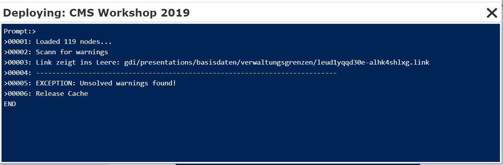
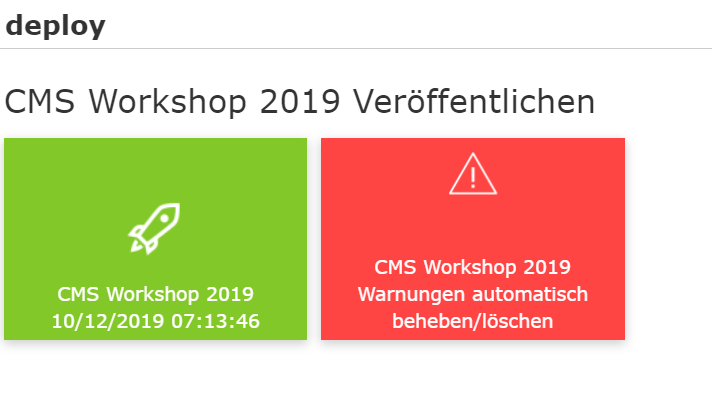
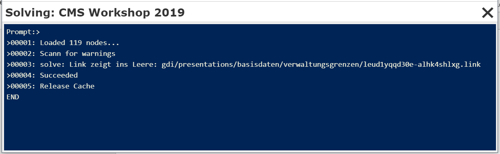
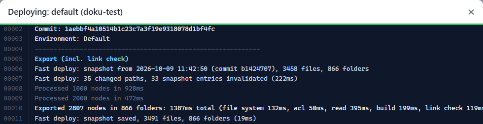

CMS Veröffentlichen
===================

Um zu überprüfen, wie die bisherige Parametrierung im Viewer aussieht, kann das CMS einmal veröffentlicht werden. Dazu klickt man in der Sidebar auf ``Deploy``:

.. image:: img/image132.png

Es erscheint ein Dialog mit einer Schaltfläche, in der noch einmal der Name und gegebenenfalls das Datum der letzten Veröffentlichung angeführt werden.

Ein Klick auf diese Schaltfläche startet den Erstellungsprozess:

.. image:: img/image133.png

Dieser Vorgang kann je nach Größe des CMS Baumes einige Momente dauern. Ist das Erstellen erfolgreich, wird am Ende die Meldung *Succeeded* ausgegeben und der Dialog kann mit ``X`` geschlossen werden. 

Treten beim Veröffentlichen Warnungen auf, etwa weil es Darstellungsvarianten gibt, die auf gelöschte Layer-Schaltungen verweisen, bricht der Vorgang ab:

Ein CMS mit einer Warnung kann nicht mehr veröffentlicht werden. Zum Lösen des Konfliktes gibt es zwei Möglichkeiten:

1.	Aufgrund der ausgegebenen Meldung das Problem suchen und den entsprechenden Verweis löschen (hier eine Darstellungsvariante).
2.	Die Warnung automatisch löschen.

Zu 2:
Nach der Ausgabe von Warnungen das Fenster schließen. Im Deploy-Dialog erscheint jetzt der Hinweis, dass es beim letzten Veröffentlichen Warnungen gegeben hat:

Klickt man auf die rote Schaltfläche, wird versucht, die Warnungen automatisch zu beheben, was so viel bedeutet, dass die entsprechenden Verweise gelöscht werden. 

**Achtung:** Diesen Vorgang sollte man nur durchführen, wenn das Löschen der z.B. Layer-Schaltung beabsichtigt war. Ansonsten werden vielleicht unabsichtlich Verweise gelöscht:

Nach diesem Vorgang ist die rote Schaltfläche im Deploy-Dialog verschwunden und das CMS kann neu Veröffentlicht werden.

.. _cms-deploy-git:

Deploy mit Git
--------------

.. versionadded:: 9.26.4102

Wird ein CMS mit Git versioniert (siehe :ref:`cms-git`), zeigt die Deploy-Seite zusätzlich einen Bereich **Versionierung (Git)**:

.. image:: img/deploy-git-page.png

Dort ist ersichtlich,

- welcher Stand von ``main`` am Git-Server deployt wird (Commit, Datum, Autor und Beschreibung),
- welcher Stand zuletzt deployt wurde,
- ob es im eigenen Arbeitsbereich Änderungen gibt, die **nicht** Teil des Deploys sind (z. B. ungespeicherte oder nicht veröffentlichte Änderungen oder weil man in einem Arbeitszweig arbeitet).

Jede Deploy-Kachel zeigt mit einem Kennzeichen, welche Art von Deploy möglich ist:

- **nur main:** Es kann nur der veröffentlichte Stand deployt werden.
- **main + Branches:** Zusätzlich kann der eigene Arbeitsbereich als Branch deployt werden (siehe :ref:`cms-deploy-branch`). Das muss für das Deployment in der ``cms.config`` mit ``allowBranchDeploy`` freigeschaltet sein (siehe :doc:`../../config/cms/index`).

Veröffentlichter Stand (main)
~~~~~~~~~~~~~~~~~~~~~~~~~~~~~

Beim normalen Deploy wird immer der **veröffentlichte Stand**, also der aktuelle Stand von ``main`` am Git-Server, deployt, und **nicht** der Inhalt des eigenen Arbeitsbereichs. Damit landen nur Änderungen im WebGIS, die gespeichert, veröffentlicht und in ``main`` übernommen wurden. Es ist egal, welcher Bearbeiter den Deploy startet.

Das CMS verwendet dafür am Server eine eigene Kopie des Git-Repositorys (*Deploy-Klon*), die vor jedem Deploy auf den aktuellen Stand gebracht wird. Pro CMS kann immer nur ein Deploy des veröffentlichten Stands gleichzeitig laufen.

.. _cms-deploy-branch:

Arbeitszweig testen (Branch-Deploy)
~~~~~~~~~~~~~~~~~~~~~~~~~~~~~~~~~~~

Ein Branch-Deploy veröffentlicht den **aktuellen Stand des eigenen Arbeitsbereichs**, inklusive ungespeicherter Änderungen, als eigenen *Branch* neben dem veröffentlichten Stand. Damit können Änderungen im WebGIS getestet werden, bevor sie in ``main`` übernommen werden. Andere Anwender sehen weiterhin den veröffentlichten Stand.

.. note::

    Branch-Deploys sind für **Entwicklungs- und Testumgebungen** gedacht. Auf einem Produktivsystem wird in der Regel nur der veröffentlichte Stand (main) deployt. Deshalb muss der Branch-Deploy pro Deployment explizit freigeschaltet werden (``allowBranchDeploy`` in der ``cms.config``) und die WebGIS API muss Branches erlauben (``allow-branches`` in der ``api.config``, siehe :doc:`../../config/api/index`).

Klickt man auf eine Kachel mit dem Kennzeichen *main + Branches*, erscheint ein Auswahldialog:

.. image:: img/deploy-branch-choice.png

- **Veröffentlichter Stand (main):** normaler Deploy wie oben beschrieben.
- **Arbeitszweig testen:** Branch-Deploy des eigenen Arbeitsbereichs. Als Branch-Name wird der Name des aktuellen Arbeitszweiges verwendet. Arbeitet man direkt in ``main``, lautet der Branch-Name ``{benutzer}-main``.

Wie ein deployter Branch im WebGIS ausgewählt und getestet wird, ist unter :ref:`portal-branches` beschrieben.

Unterhalb der Kacheln werden unter **Deployte Branches** alle Branches angezeigt, die für dieses Deployment deployt wurden (Branch, Bearbeiter, Commit, Datum). Mit *Entfernen* wird ein Branch-Deploy wieder gelöscht. Wird ein Arbeitszweig im CMS gelöscht (auch beim *In main übernehmen* mit der Option *Arbeitszweig danach löschen*), werden seine Branch-Deploys automatisch entfernt. Branch-Deploys der Form ``{benutzer}-main`` müssen manuell entfernt werden.

Treten bei einem Branch-Deploy Warnungen auf, wird dafür eine eigene Kachel zum Beheben der Warnungen angezeigt. Die Warnungen des veröffentlichten Stands sind davon nicht betroffen.

.. _cms-deploy-fast:

Fast Deploy
~~~~~~~~~~~

Der Branch-Deploy wird standardmäßig als **Fast Deploy** ausgeführt. Beim ersten Branch-Deploy wird der gesamte CMS-Baum eingelesen und ein Zwischenstand gespeichert. Bei jedem weiteren Branch-Deploy werden nur noch die Dateien neu eingelesen, die sich seitdem geändert haben (ermittelt über Git). Das Ergebnis ist identisch mit einem vollständigen Deploy, bei großen CMS-Bäumen aber um ein Vielfaches schneller.

Im Auswahldialog wird angezeigt, von wann der Zwischenstand ist. Mit der Option **Vollständig neu einlesen** wird der Zwischenstand verworfen und der gesamte Baum neu eingelesen. Das ist normalerweise nicht notwendig.

Im Protokoll des Deploys ist ersichtlich, wie viele Pfade sich geändert haben und wie lange das Einlesen gedauert hat:

Der Zwischenstand wird pro Bearbeiter am CMS-Server gespeichert (nicht im Git-Repository) und beim Löschen des Arbeitsbereichs ebenfalls gelöscht. Der Deploy des veröffentlichten Stands liest den Baum immer vollständig ein.
