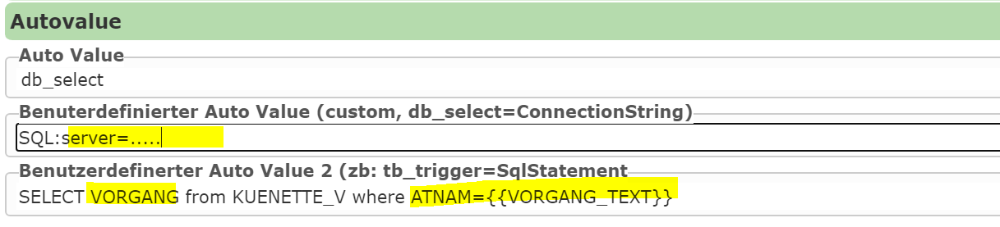

Editierbare Felder: Autovalues
==============================

*Autovalues* befüllen ein Attributfeld beim Speichern am Server **automatisch**, der Anwender muss
den Wert nicht eingeben. Sie werden am Bearbeitungsfeld konfiguriert. Diese Felder werden in der
Eingabemaske meist als *readonly* oder nicht sichtbar definiert.

.. contents:: Inhalt dieser Seite
   :local:
   :depth: 1

Auswahl im CMS
--------------

Die meisten Autovalues werden im CMS über das Feld **Auto Value** aus einer Liste ausgewählt.
Für freie Syntax wird **custom** gewählt und der eigentliche Wert unter
**Benutzerdefinierter Auto Value** eingetragen.

Das gilt insbesondere für:

* Expressions und Templates mit führendem ``=``
* URL- und Rollenparameter
* räumliche Abfragen mit ``from``
* ``mask-insert-default::...``
* die älteren, weiterhin unterstützten Werte ``create_userdas Komma-Leerzeichen-Trennzeichenchange_user``,
  ``create_date_yyyy.mm.dd`` und ``datetime``

Bei ``db_select`` und ``db_select_on_insert`` wird der Autovalue selbst in der Auswahlliste gewählt.
Connection String und SQL-Statement werden in den beiden zusätzlichen benutzerdefinierten
Autovalue-Feldern eingetragen.

Im folgenden Beispiel wird die Länge der erstellten Liniengeometrie in ein Feld übernommen:

.. image:: img/editing18.png

Wann wird ein Autovalue ausgewertet?
------------------------------------

Ein Autovalue kann abhängig von der Bearbeitungsoperation gelten:

.. list-table::
   :header-rows: 1
   :widths: 40 12 12 12 12 12

   * - Gruppe
     - Insert
     - Update
     - Delete
     - Massen-attributierung
     - Transfer
   * - ``create_*das Komma-Leerzeichen-Trennzeichenguid*``
     - ja
     - nein
     - nein
     - nein
     - nein
   * - ``change_*``
     - ja
     - ja
     - ja
     - ja
     - ja
   * - ``db_select_on_insert``
     - ja
     - nein
     - nein
     - nein
     - nein
   * - ``oninsert:...``
     - ja
     - nein
     - nein
     - nein
     - nein
   * - ``onupdate:...``
     - nein
     - ja
     - nein
     - nein
     - nein
   * - Geometrie-, Kontext- und allgemeine Autovalues
     - ja
     - ja
     - ja
     - ja
     - ja
   * - ``db_select``
     - ja
     - ja
     - ja
     - ja
     - ja
   * - Expressions mit ``=``
     - ja
     - ja
     - ja
     - ja
     - ja

.. note::

   Die Tabelle beschreibt die Auswertung des Autovalues. Ob ein Feld bei einer bestimmten Operation
   tatsächlich verarbeitet wird, hängt zusätzlich vom jeweiligen Editing-Ablauf ab.

Werte nur beim Insert
---------------------

Diese Autovalues werden ausschließlich beim Erstellen eines neuen Features gesetzt.

Benutzer und Login
^^^^^^^^^^^^^^^^^^

.. list-table::
   :header-rows: 1
   :widths: 28 52 20

   * - Autovalue
     - Beschreibung
     - Beispiel
   * - ``create_user``
     - Datenbankbenutzer aus der Editing-Workspace-Verbindung
     - ``webgis_edit``
   * - ``create_login``
     - Login des aktuellen Benutzers ohne WebGIS-Namespace vor ``::``
     - ``DOMAIN\max``
   * - ``create_login_full``
     - Vollständiger Login, wie er am aktuellen Benutzer gespeichert ist
     - ``oidc::DOMAIN\max``
   * - ``create_login_short``
     - Login ohne WebGIS-Namespace und ohne Windows-Domain
     - ``max``
   * - ``create_login_domain``
     - Domain aus ``name@domain`` oder der Teil vor ``\`` im vollständigen Login
     - ``domain`` bzw. ``DOMAIN``

Beispiel für einen vollständigen Login ``oidc::DOMAIN\max``:

* ``create_login`` → ``DOMAIN\max``
* ``create_login_full`` → ``oidc::DOMAIN\max``
* ``create_login_short`` → ``max``
* ``create_login_domain`` → ``oidc::DOMAIN``

Bei der Schreibweise ``name@domain`` wird nur der Teil nach ``@`` zurückgegeben und kleingeschrieben.
Bei ``DOMAIN\name`` wird der Teil vor ``\`` zurückgegeben. Ein eventuell vorhandener WebGIS-Namespace
vor ``::`` wird für ``*_login_domain`` nicht entfernt; deshalb ergibt das obige Beispiel
``oidc::DOMAIN``.

GUIDs
^^^^^

.. list-table::
   :header-rows: 1
   :widths: 22 33 45

   * - Autovalue
     - Beschreibung
     - Format
   * - ``guid``
     - Zufällige UUID
     - 32 Hex-Zeichen ohne Trennzeichen
   * - ``guid_sql``
     - Zufällige UUID
     - mit Bindestrichen und geschweiften Klammern
   * - ``guid_v7``
     - Zeitlich sortierbare UUID Version 7
     - 32 Hex-Zeichen ohne Trennzeichen
   * - ``guid_v7_sql``
     - Zeitlich sortierbare UUID Version 7
     - mit Bindestrichen und geschweiften Klammern

.. code-block:: text

   guid      →  9f9c67bea32147e8a46100c17acef040
   guid_sql  →  {9f9c67be-a321-47e8-a461-00c17acef040}

* ``guid`` eignet sich, wenn die GUID in der Datenbank als Text gespeichert werden soll,
  ``guid_sql``, wenn sie in einer SQL-Datenbank als GUID gespeichert werden soll.
* Version 7 GUIDs eignen sich für die Speicherung in Datenbanken, wenn die zugrunde liegenden Felder
  auch indiziert werden sollen. Die erzeugten GUIDs sind zeitlich nach ihrem Wert sortiert, was in
  der Regel zu einer geringeren Fragmentierung der Indizes führt.

Erstellungsdatum und -zeit
^^^^^^^^^^^^^^^^^^^^^^^^^^

.. list-table::
   :header-rows: 1
   :widths: 30 30 40

   * - Autovalue
     - Beschreibung
     - Format
   * - ``create_date``
     - Lokales Erstellungsdatum
     - kulturabhängiges kurzes Datumsformat
   * - ``create_date_yyyy.mm.dd``
     - Lokales Erstellungsdatum
     - ``yyyy.MM.dd``
   * - ``create_time``
     - Lokale Erstellungszeit
     - kulturabhängiges kurzes Zeitformat
   * - ``create_datetime_sql``
     - Lokales Datum und lokale Uhrzeit
     - kurzes Datumsformat + Leerzeichen + kurzes Zeitformat
   * - ``create_datetime_sql2``
     - Lokales Datum und lokale Uhrzeit
     - ``dd.MM.yyyy HH:mm:ss``
   * - ``create_datetime_utc``
     - UTC-Zeitpunkt
     - ``yyyy-MM-ddTHH:mm:ss.fffZ``

Für systemübergreifende Speicherung ist ``create_datetime_utc`` zu bevorzugen, z. B.
``2026-10-01T15:23:45.127Z``.

Änderungswerte
--------------

``change_*`` wird nicht nur beim Update ausgewertet, sondern bei **jeder** Bearbeitungsoperation, bei
der das Feld verarbeitet wird. Damit kann dasselbe Feld bereits beim Insert und danach bei jeder
Änderung aktualisiert werden.

Benutzer und Login
^^^^^^^^^^^^^^^^^^

.. list-table::
   :header-rows: 1
   :widths: 30 70

   * - Autovalue
     - Beschreibung
   * - ``change_user``
     - Datenbankbenutzer aus der Editing-Workspace-Verbindung
   * - ``change_login``
     - Aktueller Login ohne WebGIS-Namespace vor ``::``
   * - ``change_login_full``
     - Vollständiger Login des aktuellen Benutzers
   * - ``change_login_short``
     - Login ohne WebGIS-Namespace und ohne Windows-Domain
   * - ``change_login_domain``
     - Domain aus ``name@domain`` oder ``DOMAIN\name``

Änderungsdatum und -zeit
^^^^^^^^^^^^^^^^^^^^^^^^

.. list-table::
   :header-rows: 1
   :widths: 30 30 40

   * - Autovalue
     - Beschreibung
     - Format
   * - ``change_date``
     - Lokales Änderungsdatum
     - kulturabhängiges kurzes Datumsformat
   * - ``change_time``
     - Lokale Änderungszeit
     - kulturabhängiges kurzes Zeitformat
   * - ``change_datetime_sql``
     - Lokales Datum und lokale Uhrzeit
     - kurzes Datumsformat + Leerzeichen + kurzes Zeitformat
   * - ``change_datetime_sql2``
     - Lokales Datum und lokale Uhrzeit
     - ``dd.MM.yyyy HH:mm:ss``
   * - ``change_datetime_utc``
     - UTC-Zeitpunkt
     - ``yyyy-MM-ddTHH:mm:ss.fffZ``

Für Audit-Felder ist ``change_datetime_utc`` zu bevorzugen.

URL- und Rollenparameter
------------------------

URL-Parameter
^^^^^^^^^^^^^

.. code-block:: text

   url-parameter:<name>

Übernimmt den Wert eines Parameters aus der ursprünglichen URL (siehe Abschnitt: Aufruf des Viewers),
z. B. ``url-parameter:project_id``. Ist der Parameter nicht vorhanden, wird ein leerer String gesetzt.

Die Auswertung kann auf Insert oder Update eingeschränkt werden. Bei einer anderen Operation wird das
Feld dann nicht gesetzt:

.. code-block:: text

   oninsert:url-parameter:project_id
   onupdate:url-parameter:project_id

Rollenparameter
^^^^^^^^^^^^^^^

.. code-block:: text

   role-parameter:<name>

Übernimmt einen Parameter aus den Rolleninformationen des aktuellen Benutzers, z. B.
``role-parameter:GEMEINDENUMMER`` (siehe :doc:`/extended_config/roles/index`). Ist der Rollenparameter
nicht vorhanden, wird ein leerer String gesetzt. Auch Rollenparameter können eingeschränkt werden:

.. code-block:: text

   oninsert:role-parameter:GEMEINDENUMMER
   onupdate:role-parameter:GEMEINDENUMMER

Geometrie-Autovalues
--------------------

Geometrie-Autovalues verwenden standardmäßig das Koordinatensystem der Feature-Geometrie. Für
Koordinaten, Längen und Flächen kann nach einem Doppelpunkt eine positive Ziel-SRefId (EPSG-Code)
angegeben werden:

.. code-block:: text

   shape_area:31256
   shape_centroid_x:4326

Die Berechnung erfolgt auf einer **transformierten Kopie**. Die ursprüngliche Feature-Geometrie und
deren ``SrsId`` werden nicht verändert. Wenn eine Ziel-SRefId angegeben wird, muss die Quellgeometrie
eine gültige ``SrsId`` besitzen. Ein ungültiger EPSG-/SRefId-Wert führt zu einem Konfigurationsfehler.

.. tip::

   Der EPSG-Code sollte immer angegeben werden. Andernfalls hängt das Ergebnis vom Koordinatensystem
   der Feature-Geometrie ab, in der Regel das der Ziel-Featureklasse, was nicht gesichert ist.

Längen und Flächen
^^^^^^^^^^^^^^^^^^

.. list-table::
   :header-rows: 1
   :widths: 35 15 50

   * - Autovalue
     - Geometrie
     - Ergebnis
   * - ``shape_len[:SRefId]``
     - Polyline
     - Länge, auf 2 Nachkommastellen gerundet
   * - ``shape_len_int[:SRefId]``
     - Polyline
     - Länge, auf ganze Zahl gerundet
   * - ``shape_area[:SRefId]``
     - Polygon
     - Fläche, auf 2 Nachkommastellen gerundet
   * - ``shape_area_int[:SRefId]``
     - Polygon
     - Fläche, auf ganze Zahl gerundet
   * - ``shape_perimeter[:SRefId]``
     - Polygon
     - Umfang, auf 2 Nachkommastellen gerundet

Die Einheit ergibt sich aus dem verwendeten Koordinatensystem. Bei einem metrischen
Projektionssystem sind Längen typischerweise Meter und Flächen Quadratmeter.

Schwerpunkt und Ausdehnung
^^^^^^^^^^^^^^^^^^^^^^^^^^

.. list-table::
   :header-rows: 1
   :widths: 35 65

   * - Autovalue
     - Ergebnis
   * - ``shape_centroid_x[:SRefId]``
     - X-Koordinate des Schwerpunkts
   * - ``shape_centroid_y[:SRefId]``
     - Y-Koordinate des Schwerpunkts
   * - ``shape_minx[:SRefId]``
     - minimale X-Koordinate der Bounding Box
   * - ``shape_miny[:SRefId]``
     - minimale Y-Koordinate der Bounding Box
   * - ``shape_maxx[:SRefId]``
     - maximale X-Koordinate der Bounding Box
   * - ``shape_maxy[:SRefId]``
     - maximale Y-Koordinate der Bounding Box

Der Schwerpunkt wird abhängig vom Geometrietyp bestimmt:

* Punkt: der Punkt selbst
* Multipoint: Mittelwert aller Punkte
* Polyline: Punkt bei der halben Linienlänge
* Polygon: flächengewichteter Schwerpunkt; Löcher werden abgezogen
* Envelope: Mittelpunkt

Struktur und Metadaten
^^^^^^^^^^^^^^^^^^^^^^

.. list-table::
   :header-rows: 1
   :widths: 35 65

   * - Autovalue
     - Ergebnis
   * - ``shape_vertex_count``
     - Anzahl der Stützpunkte
   * - ``shape_part_count``
     - Anzahl der Geometrieteile
   * - ``shape_type``
     - ``pointdas Komma-Leerzeichen-Trennzeichenmultipoint``, ``polyline``, ``polygon`` oder ``envelope``
   * - ``shape_srefid``
     - SRefId der Feature-Geometrie

Diese vier Autovalues akzeptieren **keine** Ziel-SRefId, weil sie nicht von einer
Koordinatentransformation abhängen.

Ist keine Geometrie vorhanden oder passt der Geometrietyp nicht zur Berechnung, wird durch diesen
Autovalue kein Wert gesetzt.

Allgemeine Werte und Bearbeitungskontext
----------------------------------------

.. list-table::
   :header-rows: 1
   :widths: 30 70

   * - Autovalue
     - Beschreibung
   * - ``datetime``
     - Lokales Datum und lokale Uhrzeit im Format ``yyyy-MM-dd HH:mm:ss``
   * - ``scale``
     - Aktueller Kartenmaßstab, auf eine ganze Zahl gerundet
   * - ``edit_operation``
     - Aktuelle Bearbeitungsoperation
   * - ``map_srefid``
     - SRefId der aktuellen Karte
   * - ``edit_service_id``
     - Service-ID des bearbeiteten Themas
   * - ``edit_layer_id``
     - Layer-ID des bearbeiteten Themas
   * - ``edit_theme_id``
     - ID des Editing-Themas

``edit_operation`` liefert einen stabilen technischen Wert:

.. list-table::
   :header-rows: 1
   :widths: 50 50

   * - Operation
     - Wert
   * - Insert
     - ``insert``
   * - Update
     - ``update``
   * - Delete
     - ``delete``
   * - Massenattributierung
     - ``mass_attribution``
   * - Transfer
     - ``transfer``

Benutzerdefinierte Werte mit „custom“
-------------------------------------

Mit dem Autovalue ``custom`` können Werte direkt im Feld **Benutzerdefinierter Auto Value** definiert
werden. Ein Wert mit führendem ``=`` wird als Expression bzw. Template ausgewertet. Beispielsweise
kann für ein Feld **QUELLE** immer der Wert ``WEBGIS`` eingetragen werden:

.. code-block:: text

   =WEBGIS

Expressions und Templates
^^^^^^^^^^^^^^^^^^^^^^^^^

Beginnt ein Custom-Autovalue mit ``=``, wird er als Expression bzw. Legacy-Template behandelt:

.. code-block:: text

   =Objekt [NAME]
   =concat([VORNAME], " ", [NACHNAME])
   =round(shape_area(31256), 2)

Expressions werden bei allen Bearbeitungsoperationen ausgewertet. Feldwerte werden aus dem aktuell
bearbeiteten Feature gelesen. Die vollständige Syntax, alle Funktionen und die Sicherheitsregeln sind
im Anhang beschrieben: :doc:`/annex/expressions`.

Defaultwert nur in der Insert-Maske
^^^^^^^^^^^^^^^^^^^^^^^^^^^^^^^^^^^

.. code-block:: text

   mask-insert-default::<wert>

Dieser Eintrag ist **kein** serverseitig gesetzter Autovalue. Er zeigt beim Anlegen eines neuen
Features lediglich einen Defaultwert in der Eingabemaske an, z. B. ``mask-insert-default::Entwurf``.
Der Benutzer kann den Wert vor dem Speichern ändern.

Automatische Attributierung über räumliche Beziehungen
------------------------------------------------------

Ein Custom-Autovalue kann Werte aus Features eines anderen Layers übernehmen, die die aktuelle
Geometrie räumlich schneiden.

.. code-block:: text

   <Feld> from <Layer> [Optionen]

Der Layer kann über seinen Namen oder seine ID angegeben werden. Verfügbare Optionen:

.. list-table::
   :header-rows: 1
   :widths: 30 55 15

   * - Option
     - Beschreibung
     - Standard
   * - ``service <Service-ID>``
     - Service, in dem der Layer gesucht wird
     - leer
   * - ``bufferdist <Distanz>``
     - Puffer um die aktuelle Geometrie
     - ``0``
   * - ``max <Anzahl>``
     - maximale Anzahl übernommener Werte
     - ``20``
   * - ``seperator <Text>``
     - Trennzeichen zwischen mehreren Werten
     - ``;``

.. note::

   ``seperator`` ist aus Kompatibilitätsgründen genau in dieser Schreibweise zu verwenden.

Der besondere Wert ``space`` im Separator wird durch ein Leerzeichen ersetzt. Texte mit Leerzeichen
können in Anführungszeichen geschrieben werden. Bei Punkt-Layern wird eine Pufferdistanz von mindestens
``0.03`` verwendet. Die Einheit des Puffers entspricht dem Koordinatensystem der Feature-Geometrie.
Die gefundenen Feldwerte werden in Abfragereihenfolge verbunden, ``null``-Werte werden übersprungen.

Beispiele:

.. code-block:: text

   NR from GDBAbfrage service kataster

→ Das Attribut **NR** wird von Objekten aus dem Thema **GDBAbfrage** übernommen, wenn diese sich
räumlich mit dem gespeicherten Objekt decken. Gibt es mehrere Treffer, werden diese mit
**Strichpunkten** getrennt.

.. code-block:: text

   GNR from Grundstuecke service kataster max 10 seperator ", "

→ Das Attribut **GNR** wird übernommen, es werden maximal **10** Werte mit Komma und Leerzeichen getrennt eingetragen.

.. code-block:: text

   TYP from kasten service strom@mycms bufferdist 20 seperator space-space max 10

→ Das Attribut **TYP** wird von Objekten aus dem Thema **Kasten** übernommen, wenn diese im Umkreis von
**20** Einheiten liegen. Mehrere Ergebnisse werden mit **Leerzeichen-Bindestrich-Leerzeichen**
getrennt, maximal **10** Ergebnisse.

Automatische Werte aus einer Datenbankabfrage („db_select“)
-----------------------------------------------------------

``db_select`` führt bei jeder unterstützten Bearbeitungsoperation eine **skalare** Datenbankabfrage
aus. Dazu müssen folgende Angaben gemacht werden:

* **Benutzerdefinierter Auto Value:** Connection String
* **Benutzerdefinierter Auto Value 2:** SQL-Statement

Beispiel:

.. code-block:: text

   select GNR
   from GRUNDSTUECK
   where OBJECTID = {{OBJECTID}}

Featurefelder werden mit ``{{FELDNAME}}`` referenziert (z. B. ``{{VORGANG_TEXT}}``). Diese Werte werden
als **Datenbankparameter** übergeben und nicht direkt in das SQL eingesetzt.

.. warning::

   Um Platzhalter dürfen **keine Hochkommas** gesetzt werden, auch nicht bei Textfeldern:

   .. code-block:: text

      -- richtig
      where CODE = {{CODE}}

      -- falsch
      where CODE = '{{CODE}}'

Benutzer- und sitzungsabhängige Filterplatzhalter werden vor der Ausführung ebenfalls aufgelöst. Das
Statement muss genau einen skalaren Wert liefern. Der erste Wert des ersten Datensatzes wird als
Autovalue verwendet.

db_select_on_insert
^^^^^^^^^^^^^^^^^^^

Funktioniert wie ``db_select``, wird aber ausschließlich beim Insert ausgeführt. Bei anderen
Operationen wird das Feld nicht gesetzt und die Datenbankkonfiguration nicht geprüft.

Verhalten bei Massenattributierung
^^^^^^^^^^^^^^^^^^^^^^^^^^^^^^^^^^

Bei einer Massenattributierung wird die Abfrage nur ausgeführt, wenn mindestens eines der
referenzierten Featurefelder enthalten ist. Sind nur einige, aber nicht alle benötigten Felder
enthalten, wird ein Fehler mit den fehlenden Attributnamen ausgegeben.

Autovalues über WebService (DataLinq)
-------------------------------------

Ist **Benutzerdefinierter Auto Value** eine HTTP- oder HTTPS-URL, wird keine direkte
Datenbankverbindung geöffnet, sondern ein WebService (z. B. *DataLinq*) abgefragt:

* **Benutzerdefinierter Auto Value:** DataLinq-/HTTP-URL
* **Benutzerdefinierter Auto Value 2:** Query-String mit ``{{FELDNAME}}``

Ein Beispiel für eine *DataLinq*-Abfrage:

``https://localhost:44341/datalinq/select/auswahllisten(oJ...token)@color?value=4711``

Diese Abfrage liefert folgendes JSON-Ergebnis:

.. code-block:: javascript

   [
      {
        "value": "4711",
        "name": "Blau"
      }
   ]

Für die Einbindung dieses Dienstes müssen die Felder folgendermaßen befüllt werden:

**ConnectionString:**

``https://localhost:44341/datalinq/select/auswahllisten(oJ...token)@color``

**SqlStatement:**

``value={{color}}``

Hierbei ist ``color`` das Edit-Eingabe/Auswahllisten-Feld, das für diesen Autovalue verwendet wird.
In diesem Beispiel würde als Autovalue der Wert **„Blau“** übernommen werden. Die Feldwerte werden
URL-kodiert übergeben.

.. note::

   * Es wird immer das **erste Ergebnis** der Abfrage verwendet. Die Antwort muss ein JSON-Array sein.
   * Bei einer URL-Abfrage wird der Wert aus dem Feld **„name“** übernommen.
   * Bei *DataLinq PlainText*-Endpoints heißt das Feld per Definition immer **„text“**.
   * Falls eine eigene SQL-Abfrage in *DataLinq* genutzt wird, sollte das gewünschte Feld
     umbenannt werden: ``SELECT FARBE as name FROM TABLE WHERE ...``

.. note::

   **Sicherheitshinweis:**

   * *ConnectionStrings* oder URLs mit Tokens sollten nicht direkt im CMS hinterlegt werden.
   * Stattdessen sollten diese Werte im Abschnitt ``secrets`` gespeichert werden.
   * Der ConnectionString kann dann mit einem **Platzhalter** angegeben werden:

     ``{{select-datalinq-endpoint-auswahllisten}}@color``

Fehler- und Leerwertverhalten
-----------------------------

* Ein unbekannter Autovalue setzt das Feld nicht.
* Ein leerer Autovalue setzt das Feld nicht.
* Ein operationsgebundener Autovalue (``create_*das Komma-Leerzeichen-Trennzeichenoninsert:``, ``onupdate:`` ...) setzt bei einer
  anderen Operation keinen Wert.
* Fehlende URL- oder Rollenparameter setzen einen leeren String.
* Fehlende oder ungeeignete Geometrien setzen durch den betreffenden Geometrie-Autovalue keinen Wert.
* Ungültige SRefIds, fehlende Quell-SRefIds bei einer Transformation, unbekannte Services/Layer und
  fehlerhafte Datenbankkonfigurationen erzeugen einen nachvollziehbaren Fehler.
* Expressions melden Syntax-, Typ- und Rechenfehler und fallen nicht still auf einen anderen Parser
  zurück.

Empfohlene Konfigurationen
--------------------------

.. list-table::
   :header-rows: 1
   :widths: 45 55

   * - Feld → Autovalue
     - Zweck
   * - ``CREATED_BY`` → ``create_login_short``
     - Ersteller
   * - ``CREATED_AT`` → ``create_datetime_utc``
     - Erstellungszeit
   * - ``CHANGED_BY`` → ``change_login_short``
     - Letzter Bearbeiter
   * - ``CHANGED_AT`` → ``change_datetime_utc``
     - Änderungszeit
   * - ``FEATURE_ID`` → ``guid_v7``
     - Eindeutige, sortierbare ID
   * - ``AREA_M2`` → ``shape_area:31256``
     - Fläche in einem metrischen Koordinatensystem
   * - ``EDIT_ACTION`` → ``edit_operation``
     - Bearbeitungskontext protokollieren
   * - ``EDIT_THEME`` → ``edit_theme_id``
     - Bearbeitungskontext protokollieren
   * - ``MAP_SREF`` → ``map_srefid``
     - Bearbeitungskontext protokollieren
