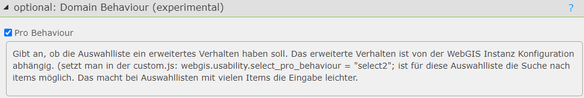

.. _cms-fields-domain-behaviour:

Domain Verhalten ändern
=======================

Domain Felder werden in der Editmaske als HTML ``<SELECT>`` Element dargestellt.
Das Verhalten dieser Felder kann im CMS über die Option ``optional: Domain Behaviour (experimental)``
geändert werden. Diese Option ist nur verfügbar, wenn das Feld als Domain definiert ist:

Die Option ``Pro`` ändert das Verhalten der Auswahlliste, sodass sie als *select2* dargestellt 
wird. Dies bietet eine bessere Benutzererfahrung, da *select2* erweiterte Funktionen 
wie Suchfunktionen bietet:   

.. image:: img/domain-behaviour2.png
    :alt: Domain Behaviour Pro im Viewer
    :width: 400px

.. note::

    Damit das *select2* Verhalten funktioniert, muss die *select2* Bibliothek im Viewer
    eingebunden sein. Dies geschieht standardmäßig, wenn die ``webgis.usability.select_pro_behaviour`` 
    Konstante in der ``custom.js`` gesetzt ist:

    .. code:: javascript
       
       ``webgis.usability.select_pro_behaviour = true;``

    :ref:`Auswahllisten Pro Verhalten (custom.js) <customjs-domain-pro-behaviour>`.
