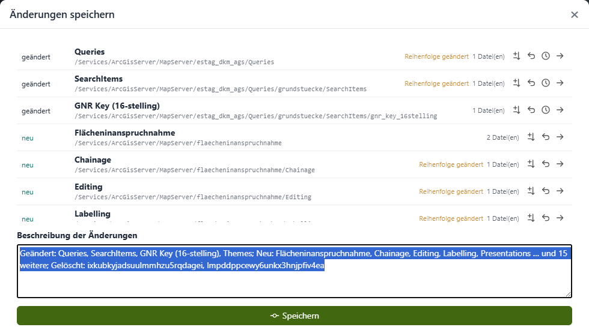
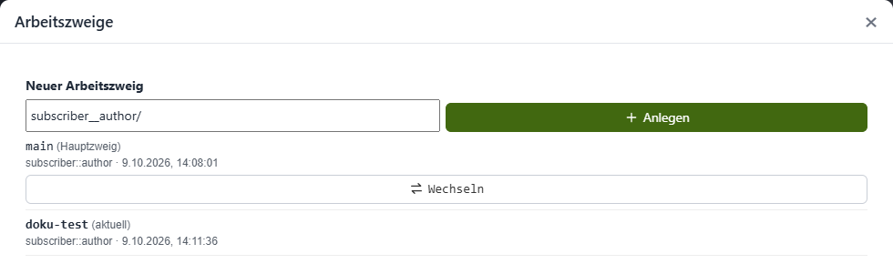
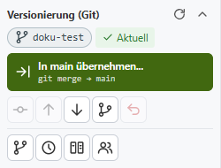
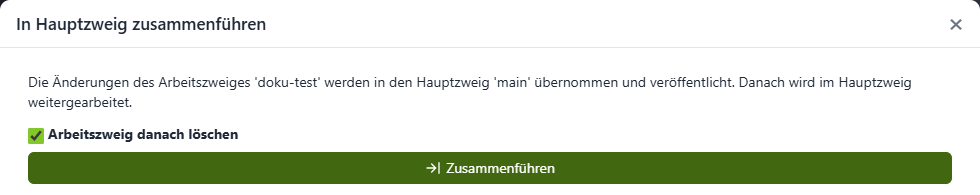
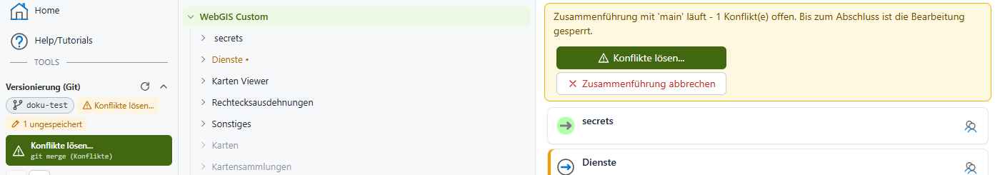
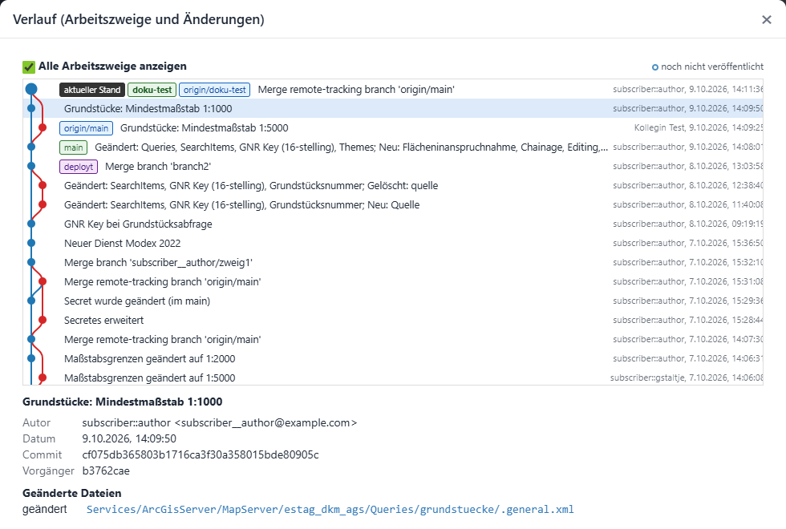
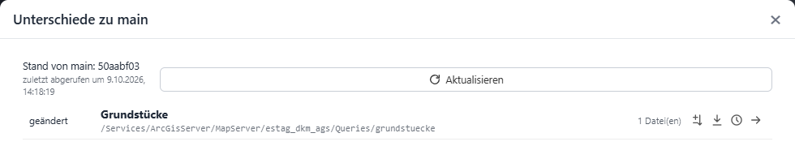

.. _cms-git:

Versionierung mit Git
=====================

.. versionadded:: 9.26.4102

Optional kann ein CMS-Baum mit **Git** versioniert werden. Jede Änderung ist dann nachvollziehbar (wer hat wann was geändert), kann verglichen und wiederhergestellt werden, und mehrere Bearbeiter können gleichzeitig am selben CMS arbeiten, ohne sich gegenseitig zu stören.

Ob ein CMS mit Git versioniert wird, legt der Administrator in der ``cms.config`` fest (siehe :ref:`cms-config-git`). Ist für ein CMS kein Git konfiguriert, funktioniert das CMS genau wie bisher: Alle Bearbeiter arbeiten im selben Baum, jede Änderung ist sofort für alle sichtbar.

Grundprinzip
------------

Mit Git gilt Folgendes:

- **Eigener Arbeitsbereich:** Jeder Bearbeiter bekommt am CMS-Server einen eigenen Arbeitsbereich (eine Kopie des CMS-Baums). Änderungen anderer Bearbeiter sieht man erst, wenn sie veröffentlicht und in den eigenen Arbeitsbereich übernommen wurden.
- **Git-Server:** Der gemeinsame Stand liegt in einem externen Git-Repository (z. B. GitLab, Gitea, Azure DevOps, GitHub). Dort ist der komplette Verlauf gespeichert.
- **Hauptzweig main:** Der Hauptzweig (in der Regel ``main``) ist der *veröffentlichte Stand*. Nur dieser Stand wird beim normalen Deploy veröffentlicht (siehe :ref:`cms-deploy-git`).
- **Arbeitszweige:** Größere Änderungen können in einem eigenen Arbeitszweig (Branch) vorbereitet und getestet werden, bevor sie in ``main`` übernommen werden. Kleinere Änderungen dürfen auch direkt in ``main`` gespeichert werden.

Die Oberfläche verwendet bewusst einfache Begriffe. Die entsprechenden Git-Befehle werden jeweils klein darunter angezeigt:

.. list-table::
   :widths: 30 20 50
   :header-rows: 1

   * - **Im CMS**
     - **Git**
     - **Bedeutung**
   * - Änderungen speichern
     - ``git commit``
     - Die Änderungen werden im eigenen Arbeitsbereich mit einer Beschreibung gespeichert. Sie sind damit noch nicht am Git-Server.
   * - Veröffentlichen
     - ``git push``
     - Die gespeicherten Änderungen werden auf den Git-Server übertragen und sind damit für andere Bearbeiter verfügbar.
   * - Aktualisieren
     - ``git pull``
     - Holt die neuesten Änderungen anderer Bearbeiter vom Git-Server in den eigenen Arbeitsbereich.
   * - Arbeitszweig
     - ``git branch``
     - Ein eigener Entwicklungszweig, in dem unabhängig von ``main`` gearbeitet werden kann.
   * - Änderungen aus main übernehmen
     - ``git merge main``
     - Holt den aktuellen Stand von ``main`` in den aktuellen Arbeitszweig.
   * - In main übernehmen
     - ``git merge`` → ``main``
     - Führt den Arbeitszweig in ``main`` zusammen und veröffentlicht das Ergebnis.

.. note::

    Versioniert wird der **gesamte** CMS-Baum, inklusive Berechtigungen (``.acl``-Dateien) und verschlüsselter Secrets. Das Git-Repository muss daher privat sein und auf einem vertrauenswürdigen Server liegen.

Arbeitsbereich holen
--------------------

Öffnet ein Bearbeiter ein mit Git versioniertes CMS zum ersten Mal, existiert für ihn noch kein Arbeitsbereich. Das CMS zeigt einen entsprechenden Hinweis an. Mit einem Klick wird der aktuelle Stand vom Git-Server geholt und der Arbeitsbereich angelegt. Danach kann wie gewohnt im CMS-Baum gearbeitet werden.

Ist das Git-Repository noch leer, wird es beim ersten Arbeitsbereich automatisch mit dem bestehenden CMS-Baum (``path`` aus der ``cms.config``) befüllt.

Das Git-Panel
-------------

In der Sidebar erscheint im Bereich *Tools* das Panel **Versionierung (Git)**:

.. image:: img/git-panel-changes.png

Das Panel zeigt:

- den **aktuellen Arbeitszweig** (hier ``main``),
- den **Zustand** des Arbeitsbereichs, z. B. *34 ungespeichert*, *1 nicht veröffentlicht*, *Aktuell* oder *x neue Änderung(en) am Server*,
- eine **Hauptaktion** (grüne Schaltfläche), die sich nach dem Zustand richtet: *Änderungen speichern...*, *Veröffentlichen*, *In main übernehmen...*, *Konflikte lösen...* oder *Zusammenführung abschließen*,
- weitere **Werkzeuge** als Symbole. Der Tooltip eines Symbols beschreibt die jeweilige Funktion.

.. list-table::
   :widths: 35 65
   :header-rows: 1

   * - **Werkzeug**
     - **Beschreibung**
   * - Status prüfen
     - Fragt beim Git-Server nach, ob es neue Änderungen gibt (``git fetch``). Das Symbol befindet sich neben dem Panel-Titel.
   * - Änderungen speichern...
     - Öffnet den Dialog zum Speichern der Änderungen (``git commit``).
   * - Veröffentlichen
     - Überträgt gespeicherte Änderungen auf den Git-Server (``git push``).
   * - Aktualisieren
     - Holt neue Änderungen vom Git-Server (``git pull``).
   * - Änderungen aus main übernehmen
     - Nur in einem Arbeitszweig: holt den aktuellen Stand von ``main`` in den Arbeitszweig.
   * - Alle Änderungen verwerfen
     - Verwirft alle ungespeicherten Änderungen und stellt den zuletzt gespeicherten Stand wieder her.
   * - Arbeitszweige...
     - Arbeitszweige anlegen, wechseln und löschen.
   * - Verlauf...
     - Zeigt den Verlauf aller Arbeitszweige und Änderungen.
   * - Unterschiede zu main
     - Nur in einem Arbeitszweig: zeigt alle Unterschiede zwischen dem eigenen Stand und ``main``.
   * - Arbeitsbereiche verwalten...
     - Zeigt die Arbeitsbereiche aller Bearbeiter dieses CMS an (siehe unten).

Geänderte Knoten werden im CMS-Baum farbig und mit einem Punkt markiert (z. B. *Dienste •*), so ist schnell erkennbar, wo es ungespeicherte Änderungen gibt.

Ist der Git-Server nicht erreichbar, kann trotzdem weitergearbeitet werden. Das Panel zeigt dann den Hinweis *Server nicht erreichbar*. Gespeichert werden kann lokal, veröffentlicht erst wieder, wenn der Server erreichbar ist.

Änderungen speichern
--------------------

Ein Klick auf *Änderungen speichern...* öffnet einen Dialog mit allen geänderten Knoten:

Für jeden Knoten werden der Zustand (*geändert*, *neu*, *gelöscht*), der Name und der Pfad im CMS-Baum angezeigt. Wurde nur die Reihenfolge von Unterknoten geändert, wird *Reihenfolge geändert* angezeigt. Über die Symbole rechts kann man:

- die **Unterschiede** anzeigen (als Tabelle der geänderten Eigenschaften oder als XML-Text),
- die Änderung an diesem Knoten **verwerfen**,
- den **Verlauf** dieses Knotens anzeigen (siehe unten),
- zum Knoten im CMS-Baum **springen**.

Die **Beschreibung der Änderungen** wird automatisch vorgeschlagen und kann überschrieben werden. Eine aussagekräftige Beschreibung erleichtert später das Nachvollziehen im Verlauf. Mit *Speichern* werden die Änderungen im eigenen Arbeitsbereich gespeichert.

Als Autor wird der angemeldete CMS-Benutzer eingetragen.

Veröffentlichen
---------------

Gespeicherte Änderungen sind zunächst nur im eigenen Arbeitsbereich vorhanden. Das Panel zeigt dann z. B. *1 nicht veröffentlicht* und als Hauptaktion *Veröffentlichen*:

.. image:: img/git-panel-ahead.png

Erst mit *Veröffentlichen* werden die Änderungen auf den Git-Server übertragen.

Hat inzwischen ein anderer Bearbeiter Änderungen im selben Zweig veröffentlicht, werden diese beim Veröffentlichen automatisch zuerst übernommen. Wurden dabei dieselben Knoten auf beiden Seiten geändert, entstehen Konflikte, die vor dem Veröffentlichen gelöst werden müssen (siehe :ref:`cms-git-conflicts`). Änderungen am Server werden nie überschrieben.

.. note::

    Das Veröffentlichen in Git bedeutet noch **nicht**, dass die Änderungen im WebGIS sichtbar sind. Dafür ist weiterhin ein :doc:`Deploy <deploy>` notwendig.

Arbeitszweige
-------------

Über *Arbeitszweige...* können eigene Arbeitszweige angelegt, gewechselt und gelöscht werden:

Als Name wird der Benutzername als Präfix vorgeschlagen, der Name kann aber frei gewählt werden. Ein neuer Arbeitszweig startet immer mit dem aktuellen Stand. Arbeitszweige, die nur am Server existieren (z. B. von anderen Bearbeitern), werden mit *nur am Server* gekennzeichnet und können ebenfalls ausgewählt werden.

Befindet man sich in einem Arbeitszweig, zeigt das Panel dessen Namen an. Die Hauptaktion lautet dann *In main übernehmen...*:

Ein Arbeitszweig kann zum Testen in eine Entwicklungs- oder Testumgebung deployt werden, ohne den veröffentlichten Stand zu verändern (siehe :ref:`cms-deploy-branch`).

Änderungen aus main übernehmen
~~~~~~~~~~~~~~~~~~~~~~~~~~~~~~

Arbeiten mehrere Bearbeiter parallel, entwickelt sich ``main`` weiter, während man im eigenen Arbeitszweig arbeitet. Mit *Änderungen aus main übernehmen* wird der aktuelle Stand von ``main`` in den Arbeitszweig geholt. Das ist sinnvoll, bevor man einen Arbeitszweig testet oder in ``main`` übernimmt.

In main übernehmen
~~~~~~~~~~~~~~~~~~

Ist die Arbeit im Arbeitszweig abgeschlossen, wird er mit *In main übernehmen...* in den Hauptzweig zusammengeführt:

Dabei werden:

1. neue Änderungen aus ``main`` in den Arbeitszweig übernommen (eventuell mit Konflikten, siehe unten),
2. die Änderungen des Arbeitszweiges in ``main`` übernommen und veröffentlicht,
3. in den Hauptzweig gewechselt.

Ist die Option *Arbeitszweig danach löschen* gesetzt, wird der Arbeitszweig lokal und am Git-Server gelöscht. Ein eventuell vorhandener Branch-Deploy dieses Arbeitszweiges wird dabei ebenfalls entfernt.

.. note::

    Danach ist ein Deploy des veröffentlichten Stands notwendig, damit die Änderungen im WebGIS sichtbar werden.

.. _cms-git-conflicts:

Konflikte lösen
---------------

Ein Konflikt entsteht, wenn derselbe Knoten auf beiden Seiten unterschiedlich geändert wurde, z. B. im eigenen Arbeitszweig und gleichzeitig von einem anderen Bearbeiter in ``main``. Konflikte werden **pro CMS-Knoten** gelöst, nicht pro Datei. Eine geänderte Reihenfolge von Knoten wird automatisch zusammengeführt (eigene Reihenfolge zuerst, neue Knoten der anderen Seite werden angehängt).

Solange eine Zusammenführung läuft, ist die Bearbeitung des CMS-Baums gesperrt. Oberhalb des Baums erscheint ein Hinweis mit den Schaltflächen *Konflikte lösen...* und *Zusammenführung abbrechen*:

Der Dialog *Konflikte lösen* zeigt alle betroffenen Knoten mit den unterschiedlichen Eigenschaften der beiden Versionen:

.. image:: img/git-conflicts.png

Pro Knoten wird gewählt, welche Version übernommen werden soll. Mit *Überall ... übernehmen* werden alle Konflikte auf einmal gelöst. Die Unterschiede können als Tabelle der Eigenschaften oder als XML-Text angezeigt werden.

Sind alle Konflikte gelöst, wird die Zusammenführung mit *Zusammenführung abschließen* beendet. Danach kann wieder normal gearbeitet und veröffentlicht werden.

Der Zustand einer laufenden Zusammenführung bleibt erhalten, auch wenn das CMS zwischenzeitlich geschlossen wird. Mit *Zusammenführung abbrechen* wird der Stand vor der Zusammenführung wiederhergestellt.

Verlauf
-------

*Verlauf...* zeigt alle gespeicherten Änderungen als Graph, optional für alle Arbeitszweige. Markierungen zeigen den aktuellen Stand, die Arbeitszweige, den Stand am Server (``origin/...``), den zuletzt deployten Stand (*deployt*) und noch nicht veröffentlichte Änderungen.

Ein Klick auf eine Änderung zeigt Autor, Datum, Commit und die geänderten Dateien. Für jede Datei können die Unterschiede angezeigt werden.

Verlauf eines Knotens und Wiederherstellen
~~~~~~~~~~~~~~~~~~~~~~~~~~~~~~~~~~~~~~~~~~

Über das Verlaufs-Symbol bei einem Knoten (z. B. im Dialog *Änderungen speichern* oder *Unterschiede zu main*) wird der Verlauf nur dieses Knotens angezeigt. Ein früherer Stand des Knotens kann mit *Diesen Stand wiederherstellen* zurückgeholt werden. Das Ergebnis ist eine ungespeicherte Änderung, die geprüft, gespeichert oder wieder verworfen werden kann.

Unterschiede zu main
--------------------

In einem Arbeitszweig zeigt *Unterschiede zu main* alle Knoten, die sich vom aktuellen Stand von ``main`` unterscheiden, inklusive ungespeicherter Änderungen:

Pro Knoten können die Unterschiede angezeigt, der Verlauf geöffnet oder die Version aus ``main`` übernommen werden (als ungespeicherte Änderung). Mit *Aktualisieren* wird der aktuelle Stand von ``main`` vom Git-Server geholt.

Arbeitsbereiche verwalten
-------------------------

Alle CMS-Bearbeiter sind Administratoren. Unter *Arbeitsbereiche verwalten...* sieht man daher die Arbeitsbereiche aller Bearbeiter dieses CMS mit Arbeitszweig, Zustand und letzter Änderung:

.. image:: img/git-workspaces.png

Ein Arbeitsbereich kann hier gelöscht werden, z. B. wenn ein Bearbeiter nicht mehr am CMS arbeitet. **Achtung:** Nicht gespeicherte und nicht veröffentlichte Änderungen dieses Arbeitsbereichs gehen dabei verloren. Der eigene Arbeitsbereich muss danach neu geholt werden.

Mit *Deploy-Klon zurücksetzen* wird die Kopie des Repositorys gelöscht, die das CMS für den Deploy des veröffentlichten Stands verwendet. Sie wird beim nächsten Deploy automatisch neu geholt.
