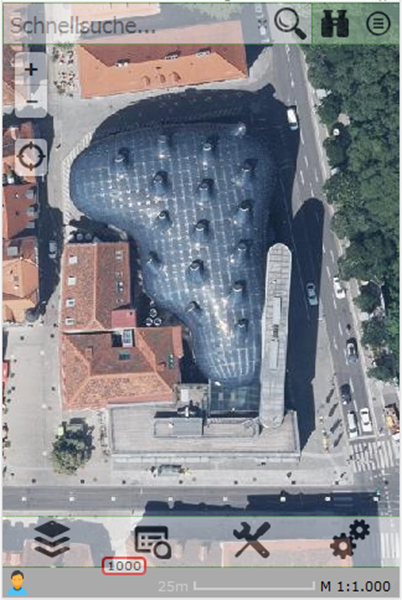
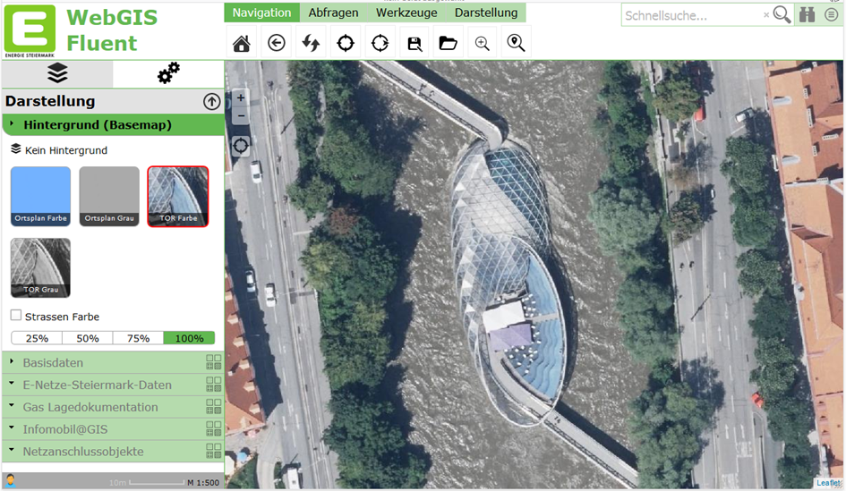

==========================
Benutzerdefinierte Layouts
==========================

WebGIS ist API-basiert, und man kann theoretisch per HTML und JavaScript Anwendungen entwickeln. Um sich das bei jeder Kartenanwendung zu ersparen (man müsste jedes Mal ein HTML-Dokument erstellen und auch irgendwo über einen Webserver hosten), gibt es das WebGIS-Portal, in dem man über eine einfache Weboberfläche (MapBuilder) Kartenanwendungen aus den (im CMS parametrierten) Diensten erstellen kann. Diese Kartenanwendungen werden dann gleich im Portal gehostet. Die grundsätzliche Vorgehensweise für das Erstellen kann der Subscriber-Dokumentation entnommen werden.

Das Default-Layout des Kartenviewers für das Portal ist für Handys optimiert. Neben der bildschirmfüllenden Karte sind alle Elemente wie Layer-Switcher, Toolbox und Schnellsuche sparsam und halbtransparent angebracht:

Da es sich bei WebGIS um eine Web-Applikation handelt, kann es auch von beliebigen Endgeräten aufgerufen werden. Voraussetzung ist nur ein moderner Browser. Auf größeren Displays oder Bildschirmen ist das Bedienen des Kartenviewers zwar möglich, allerdings gäbe es für komplexere Anwendungen übersichtlichere Layouts, um sich viele Klicks und Scrollen zu ersparen. 

Damit WebGIS also in Zukunft auch den Desktop-Bereich abdecken kann, wurde eine Möglichkeit geschaffen, Layouts für größere Displays zu definieren.

Voraussetzungen
===============

Der Mechanismus für das Verwenden von unterschiedlichen Layouts muss erst über die ``portal.config``-Datei eingeschaltet werden. Dafür ist der folgende Key verantwortlich:

.. code-block:: xml

   <add key="query-custom-map-layout" value="true" />

Ist dieser Wert auf ``true`` gesetzt, wird nach dem Aufruf des Kartenviewers vom Client noch einmal ein Ajax-Request mit der aktuellen Fenstergröße des Browsers an den Server gesendet. Dieser entscheidet dann, welches Layout für den Client ideal ist und gibt gegebenenfalls ein benutzerdefiniertes Layout als HTML-Fragment zurück. Erst wenn das benutzerdefinierte Layout in den Kartenviewer eingefügt wurde, startet die Initialisierung der Karte.  

Will man grundsätzlich keine benutzerdefinierten Layouts zur Verfügung stellen, kann man diesen Key löschen oder auf ``false`` setzen und erspart sich diesen Zwischenschritt/Request.

Parametrierung der Layouts
==========================

Benutzerdefinierte Layouts sind Textdateien, die HTML-Fragmente enthalten. Man kann diese Layouts pro Portalseite definieren, d.h., man kann für jede Portalseite unterschiedliche Layouts (anderes Logo, Styles usw.) anbieten.

Abgelegt werden diese Dateien im Verzeichnis:

``portal/ViewerLayouts/{url-der-Portalseite}``

Für unser Portal also beispielsweise unter:

``portal/ViewerLayouts/eni``

Der Name der einzelnen Dateien muss folgendermaßen lauten:

``w{Browserfensterbreite}.html``

Die ``Browserfensterbreite`` muss eine ``Ganzzahl > 0`` sein, also beispielsweise ``w1024.html``, ``w1200.html`` usw. Das ``w`` am Anfang steht für ``width``, also Breite.

Wenn diese Dateien für eine Portalseite existieren, überprüft WebGIS nach dem oben beschriebenen Mechanismus, welches Layout ideal ist. Die Fenstergröße muss dabei mindestens so groß sein wie die Zahl im Dateinamen. Von allen möglichen Kandidaten gewinnt immer das Layout mit der größten Zahl.

Die beiden hier im Beispiel beschriebenen Layouts sind auch in Releases enthalten und können somit als Vorlage für eigene Layouts verwendet werden. Auf die einzelnen Abschnitte wird hier kurz eingegangen.

w1024.html
----------

Die Idee für dieses Layout war, für etwas größere Displays, etwa Tablets, eine optimierte Darstellung zu erzielen. Grundsätzlich sollten bis auf die Toolbox alle UI-Elemente wie beim Handy-Layout bleiben. Die Toolbox sollte allerdings größer und einfacher zugänglich neben den „+/-“ Zoombuttons transparent über der Karte erscheinen. Sobald man die Toolbox fokussiert, ändert sich die Transparenz auf voll sichtbar.

.. image:: img/image_2.png

Egal, ob man nur die Toolbox verändern will – in einem benutzerdefinierten Layout müssen immer alle UI-Elemente angeführt werden:

- **Karte**
- **Tabs** (das Menü mit dem Layerswitcher)
- **Topbar** (Schnellsuche mit Abfragen und Kartenswitcher)
- **Toolbar** (befindet sich jetzt nicht mehr bei den Tabs)

Im ersten Abschnitt werden Styles für die Toolbox angeführt:

.. code-block:: html

   

Die Toolbox sollte quasi transparent über der Karte schweben. Um diesen Effekt zu erzielen, sollte die Toolbox mit diesen Styles einen (3D-)Schatten bekommen.

.. code-block:: html

   

   

Hier wird die Karte ins Layout eingefügt. Die UI-Elemente sind immer ``div``-Tags. Wichtig ist die ``id``, damit der Viewer weiß, um welches Element es sich handelt. ``id="map"`` entspricht beispielsweise der Karte. Über die Styles wird die Karte absolut bildschirmfüllend im Browser positioniert.

Der Wert ``opacity`` wird hier initial auf ``0`` gesetzt, d.h. die Karte ist vollständig transparent. Dies kann genutzt werden, um einen "schöneren" Ladevorgang des Viewers zu erzielen. Sobald die Karte vollständig initialisiert wurde, setzt die API diesen Wert automatisch auf ``1``, wodurch die Karte mit einem Fade-In-Effekt erscheint. 

Da beim Initialisieren teilweise die Karte noch gezoomt wird, was ein gewisses "Ruckeln" verursachen kann, bekommt der Anwender davon nichts mit. Die Karte erscheint somit optional erst, wenn alles fertig ist.

.. code-block:: html

   

   

Die Tabs müssen nicht extra positioniert werden und erscheinen am linken unteren Rand. Durch die Angabe der Klasse ``tabs-layout-container-options`` wird festgelegt, dass hier noch einige Optionen für das Tabs-Control überschrieben werden.

Die Tabs müssen nicht extra positioniert werden und erscheinen am linken unteren Rand. Durch die Angabe der Klasse ``tabs-layout-container-options`` wird festgelegt, dass hier noch einige Optionen für das Tabs-Control überschrieben werden.

.. list-table:: Optionen für das Tabs-Control
   :widths: 20 80
   :header-rows: 1

   * - **Option**
     - **Beschreibung**
   * - ``data-option-add_tools``
     - Ist hier auf ``false`` gesetzt, weil die Tools in einem eigenen Bereich angezeigt werden.
   * - ``data-option-add_tool_content``
     - Wenn ein Werkzeug ausgewählt wird, muss der Werkzeug-Dialog irgendwo angezeigt werden. Diese Option muss hier gesetzt werden, damit dies im Tab-Control geschieht, obwohl die Toolbox an einer anderen Stelle dargestellt wird.
   * - ``data-option-selected``
     - Hier wird festgelegt, dass der Layer-Switcher (Tab ``presentations``) selektiert und aufgeklappt wird. Dies ist eher Geschmackssache und soll lediglich die Möglichkeiten aufzeigen.

Der nächste Block beschreibt, wo die Sanduhr (der kleine graue Streifen, der anzeigt, welche Dienste gerade geladen werden) angezeigt wird. Für gewöhnlich befindet sie sich immer unter dem Tab-Control.

.. code-block:: html

   

       …
   

Ähnlich wird auch die **Topbar** (Schnellsuche usw.) positioniert. Sie erscheint oben rechts:

.. code-block:: html

   

   

Der eigentliche Unterschied zum Original-Layout ist die **Toolbox**. Diese wird über folgende Zeile ins Layout integriert:

.. code-block:: html

   

   

Wichtig ist wieder die ``id="toolbar"``. Über die Klasse ``webgis-ui-trans`` wird die Toolbar transparent und erst voll sichtbar, wenn sie im Fokus ist (Mouseover oder Berührung mit dem Finger).

Die Positionierung kann ebenfalls über Inline-Styles erfolgen. In diesem Beispiel wird die Position allerdings bereits im ersten Abschnitt bei den Styles definiert.

w1200.html
----------

Für größere Displays war die Idee, ein Layout ähnlich dem gewöhnlichen Web-Kartenatlas zu gestalten. Links sollten die Darstellungsvarianten und oben die Toolbox sein. Außerdem bleibt links oben noch genug Platz für ein Logo.

Auch in diesem Layout sind oben wieder notwendige Styles definiert, die sich durch das Layout ergeben. Im nächsten Abschnitt folgt hier ein Skript-Teil:

.. code-block:: html

   

Damit wird angezeigt, dass in diesem Layout ein anderes GDI-Schema verwendet wird. Beispielsweise kann der Anwender in diesem Layout andere (mehr) Darstellungsvarianten im TOC sehen als auf einem kleinen Display. Zu diesem Thema gibt es ein weiterführendes Whitepaper (*GDI-Schemes und Darstellungsvarianten*).

Danach kommt ein Block, in dem das Logo und der Logo-Text rechts oben platziert werden:

.. code-block:: html

   

       <table>
           <tr>
               <td>
                   
               </td>
               <td style="font-size:2.5em;
                          color:#62B851;
                          font-weight:bold;
                          vertical-align:top;
                          padding:0px 12px;">
                   WebGIS Fluent
               </td>
           </tr>
       </table>
   

Danach folgt der Bereich für die Karte. Diese ist diesmal nicht mehr fensterfüllend, sondern links und oben wird ein Bereich für Werkzeuge und TOC freigelassen:

.. code-block:: html

   

   

Danach wird der linke Frame mit den enthaltenen Tabs und der Sanduhr definiert:

.. code-block:: html

   

       

       

       

           

           

           

           

       

   

Zu den oben beschriebenen Optionen für die Tabs kommen hier noch die Positionierung der Controls sowie die Einstellung, dass das Control den gesamten Bereich ausfüllen darf. Die Sanduhr wird unten in den Frame geheftet.

Der letzte Bereich beschreibt den oberen Frame mit Toolbox und Schnellsuche:

.. code-block:: html

   

       

       
   
       

       

   

Der Fantasie sind bei den Layouts eigentlich keine Grenzen gesetzt. Allerdings sollte man unserer Meinung nach ungefähr bei den hier gezeigten Varianten bleiben (besonders beim Desktop-Layout). Der Grund ist, dass Anwender die Applikation und deren Handhabung in den unterschiedlichen Installationen wiedererkennen sollten.

Mit dieser Beschreibung sollten die Möglichkeiten gezeigt werden, sodass jeder eigene Logos, Texte und Hintergrundfarben anpassen kann.
