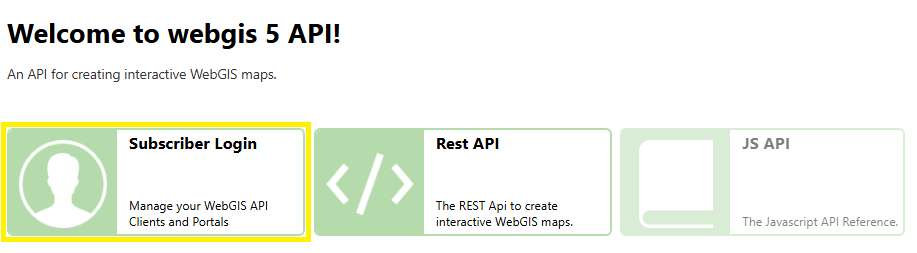

================================
Sicherheitsmaßnahmen (Hardening)
================================

Eine sichere Konfiguration des *WebGIS Portals* ist essenziell, um **Datenverluste, unbefugten Zugriff und Manipulationen** zu verhindern. Selbst wenn die Anwendung nur **im Intranet** genutzt wird, sind zusätzliche Schutzmaßnahmen notwendig, da **die gleichen sensiblen Daten übertragen und gespeichert werden wie bei einer öffentlich zugänglichen Anwendung**.  

.. caution::

    Web-Security ist ein komplexes Thema, das je nach Organisation unterschiedliche Anforderungen haben kann. Diese Beschreibung dient daher lediglich als Orientierungspunkt und stellt eine empfohlene Mindestkonfiguration dar. Es wird empfohlen, weitere Sicherheitsmaßnahmen individuell an die spezifischen Gegebenheiten der eigenen IT-Infrastruktur anzupassen.

Dieser Abschnitt beschreibt empfohlene Sicherheitsmaßnahmen, um das System bestmöglich zu schützen. Weitere generelle Informationen zur Sicherheit von Webapplikationen finden Sie im Anhang unter :doc:`Sicherheitsmaßnahmen für das WebGIS Portal </annex/index>`.

Standardpasswörter ändern
=========================

Bei der Erstinstallation enthält das System vordefinierte Benutzerkonten mit Standardpasswörtern, die allgemein bekannt sind. Diese Passwörter sollten **sofort nach der Installation** geändert werden, um unbefugten Zugriff zu verhindern.

Author-Account
--------------

Dieses Konto wird für das **Bearbeiten und Veröffentlichen von Inhalten** genutzt. Wenn das Standardpasswort nicht geändert wird, könnten sich andere Personen unbefugt einloggen und Karten oder andere Daten manipulieren.

Admin-Account in der API
------------------------

Der API-Administrator hat **erweiterte Rechte**, um wichtige Einstellungen der Anwendung zu ändern. Ein Angreifer mit Zugriff auf dieses Konto könnte die gesamte Anwendung kontrollieren oder sogar Daten löschen. Deshalb ist es entscheidend, das Standardpasswort zu ersetzen.

Um einen **Admin-Benutzer** für die API anzulegen, folgen Sie diesen Schritten:

1. **Öffnen der Registrierungsseite**

   Rufen Sie die folgende URL im Browser auf: `http://hostname:5001/Subscribers/Login`. Der Hostname und das Port müssen an die jeweilige Konfiguration angepasst werden.

   .. image:: img/create_admin_1.png

2. **Registrierung starten**

   Klicken Sie auf **"Register as new subscriber"**.

3. **Formular ausfüllen**

   Geben Sie die erforderlichen Informationen im Registrierungsformular ein.  

   .. image:: img/create_admin_2.png  

   - Das Passwort muss mindestens **8 Zeichen** lang sein.

   .. danger::

     **Achten Sie auf ein starkes Passwort!** Die Mindestlänge ist eine technische Vorgabe, aber basierend auf den vorherigen Sicherheitshinweisen sollten Sie ein möglichst sicheres Passwort wählen.  

   .. important::

     Der Benutzername **muss** mit den Standard-Einstellungen zwingend ``admin`` sein. Die *WebGIS API* verwendet intern diesen **festgelegten Namen**, um den Benutzer der **Admin-Rolle** zuzuweisen. Ohne diesen Namen erhält der Benutzer keine Administratorrechte.

     Welche Benutzername die Administratorenrolle zugeordnet bekommen, wird in der Konfigurationsdatei der Api ``_config/api.config`` festgelegt
     
     .. code:: xml

        <?xml version="1.0" encoding="utf-8" ?>
        <configuration>
          <appSettings>
            ...
            <add key="subscriber-admins" value="admin" />
            ...
          </appSettings>
        <configuration>

Selbstregistrierung für Subscriber deaktivieren
===============================================

Sobald alle notwendigen Benutzerkonten angelegt wurden, sollte die **Selbstregistrierung für Subscriber** deaktiviert werden. Andernfalls könnten sich beliebige Nutzer eigenständig einen Account erstellen, was in den meisten Fällen nicht erwünscht ist.  

Nach der Deaktivierung können neue Benutzerkonten nur noch manuell über das **Admin-Konto** angelegt werden.

Die Selbstregistrierung wird deaktiviert, indem in der Konfigurationsdatei der API (``_config/api.config``) der Wert für ``allow-register-new-subscribers`` auf ``false`` gesetzt wird:

.. code-block:: xml

   <?xml version="1.0" encoding="utf-8" ?>
   <configuration>
      <appSettings>
         ...
         <add key="allow-register-new-subscribers" value="false" /> 
         ...
      </appSettings>
   </configuration>

Sobald diese Einstellung vorgenommen wurde, ist die **Selbstregistrierung für Subscriber deaktiviert**.

Anmeldemöglichkeiten in öffentlich zugänglichen Instanzen deaktivieren
======================================================================

Um zu verhindern, dass sich Benutzer in einer **öffentlichen Installation** von WebGIS anmelden können, muss die Anmeldung sowohl im **Portal** als auch in der **API** deaktiviert werden.

.. tip::

  Diese Einstellung ist besonders dann sinnvoll, wenn eine Konfiguration von **internen Installationen** auf eine **öffentlich zugängliche Instanz** übertragen wird, da sichergestellt werden muss, dass sich **keine externen Benutzer anmelden können**.

Die Anmeldung wird deaktiviert, indem in den Konfigurationsdateien der API (``_config/api.config``) und des Portals (``_config/portal.config``) der Wert für ``allow-subscriber-login`` auf ``false`` gesetzt wird:

API-Konfigurationsdatei (``_config/api.config``)
------------------------------------------------

.. code-block:: xml

   <?xml version="1.0" encoding="utf-8" ?>
   <configuration>
      <appSettings>
         ...
         <add key="allow-subscriber-login" value="false" />
         ...
      </appSettings>
   </configuration>

Portal-Konfigurationsdatei (``_config/portal.config``)
------------------------------------------------------

.. image:: img/disable_portal_login.png

.. code-block:: xml

   <?xml version="1.0" encoding="utf-8" ?>
   <configuration>
      <appSettings>
         ...
         <add key="allow-subscriber-login" value="false" />
         ...
      </appSettings>
   </configuration>

Sobald diese Einstellung in beiden Konfigurationsdateien vorgenommen wurde, ist die **Anmeldung für Benutzer in der öffentlichen Instanz deaktiviert**.