Editing a Customer Database
===========================

This example is intended to show how DataLinq data from a database can be displayed and edited.
A simple table with name and address will serve as the example.
The data is located in a *Postgres* database.

Data Model
-----------

In addition to a unique ID ``id``, the ``customers`` table has one field each for the name ``name``
and for the address ``address``:

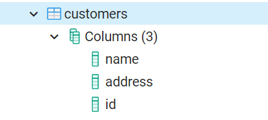

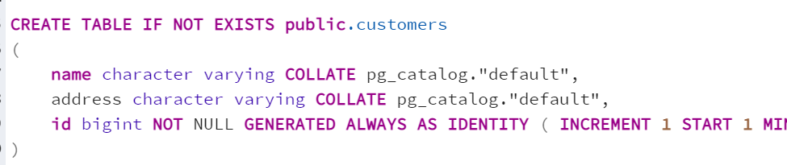

Creating an Endpoint
--------------------

The first step is to create an endpoint (e.g. ``edit_customers``). ``Database`` is set as the
*connection type*, and the *connection string* to the Postgres database is specified.

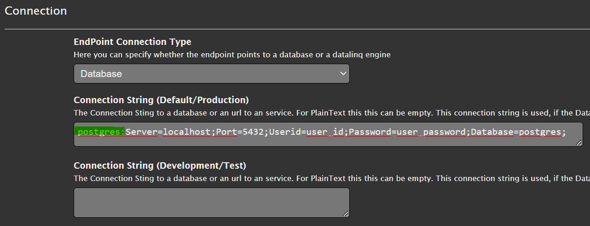

.. note::
   The ``postgres:`` prefix at the beginning of the *connection string* is important. This tells DataLinq
   that it is a Postgres database. Other prefixes are, for example, ``SQL:``
   for SQL Server databases, ``Oracle:`` for Oracle databases, or ``sqlite:`` for file-based
   SQLite databases.

Creating Queries
------------------

The next step is to create a query that provides the customer data, e.g. ``select_customers``:

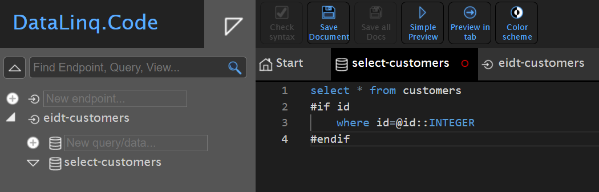

The query is a simple SQL statement ``Select * from customers``. In addition, an
*optional* restriction on the ``id`` field was introduced here:

The line ``where id=@id`` is only added to the query if the ``id`` parameter is passed
via the URL. This value is then passed via the SQL parameter @id.

If there is already data in the database and you run the query, the data should be displayed:

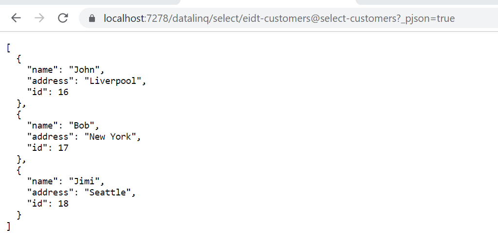

For testing, you can also try passing the ``id`` as a URL parameter:

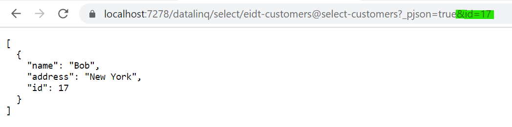

In the next step, queries can be created for creating (``add_customer``), editing (``edit_customer``),
and deleting (``del_customer``). These are not queries with **SELECT**,
but general SQL statements. These can later be triggered via buttons in our viewer:

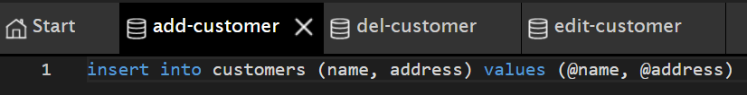

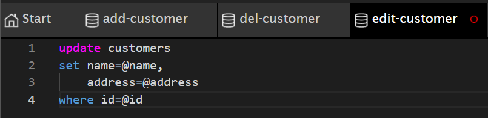

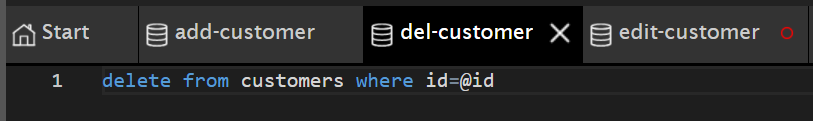

Creating Views
---------------

All views are created under the ``select_customers`` query.

The view that should show a list of all customers can, for example, be called ``all-customers``.
Compared to the *Hello World* example, the table here is not simply shown via the *DataLinqHelper*
method ``Table()``, but by iterating over the individual *records* of the database table:

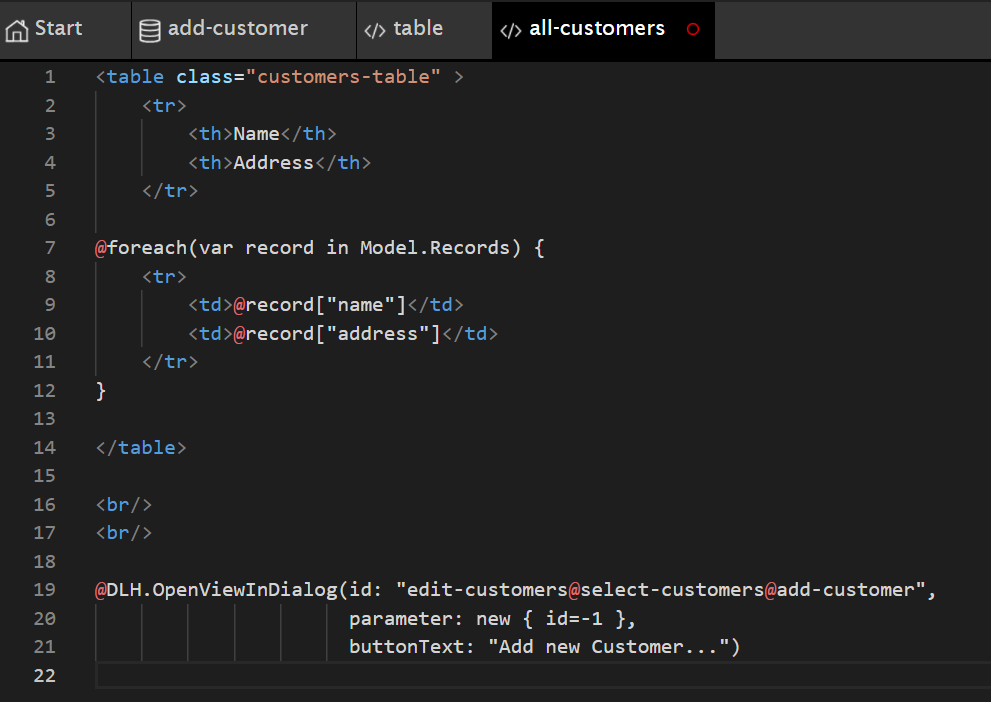

Below the HTML table, a button is inserted via the *DataLinqHelper* method ``OpenViewInDialog``,
which shows a dialog with a view for creating a new customer. The result of this view
should look as follows:

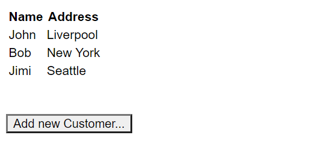

.. note::
   No styling has been done yet here. However, the ``<table>`` has already been given the CSS class ``customers-table``.
   How to create individual styles for an endpoint is shown further below.

The button below the table already works and opens a dialog with an error message
stating that the view ``add-customer`` does not yet exist under the query ``select-customer``.

To fix the error, we create this view as follows:

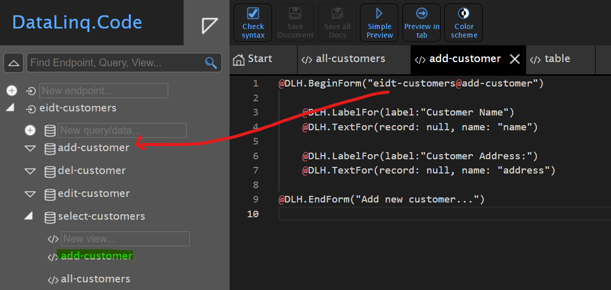

Here, ``@DLH.BeginForm("...")`` creates an HTML form. The *route* to a
*query* is given as the argument. In this case, ``edit-customers@add-customer`` with the SQL ``INSERT`` statement.

Then the fields that can be filled in are specified. For this, a *label* is always specified first with ``@DLH.LabelFor()``,
and an input text field with ``@DLH.TextFor()``. This method must be given a *record*
and the name of the field. In our case, the *record* is only created afterwards, so ``null`` is
specified here. It is important that ``name:`` specifies the name of the database field into which
the value from the input text field should be inserted.

The form is closed with ``@DLH.EndForm("Button Text")``. This shows a button with
which the form can be submitted.

If you now click the ``Add new customer..`` button, the dialog should appear and values can be entered:

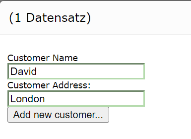

If you confirm the dialog with ``Add new customer``, the dialog closes and the new customer is added to the
database. The new customer is shown immediately in the list.

In the next step, existing customers should be editable or deletable. To do this, the table
in our ``all-customers`` view must first be adjusted. Two columns, each with a
``Update`` and ``Delete`` button, are inserted in each row. The result looks, for example, as follows:

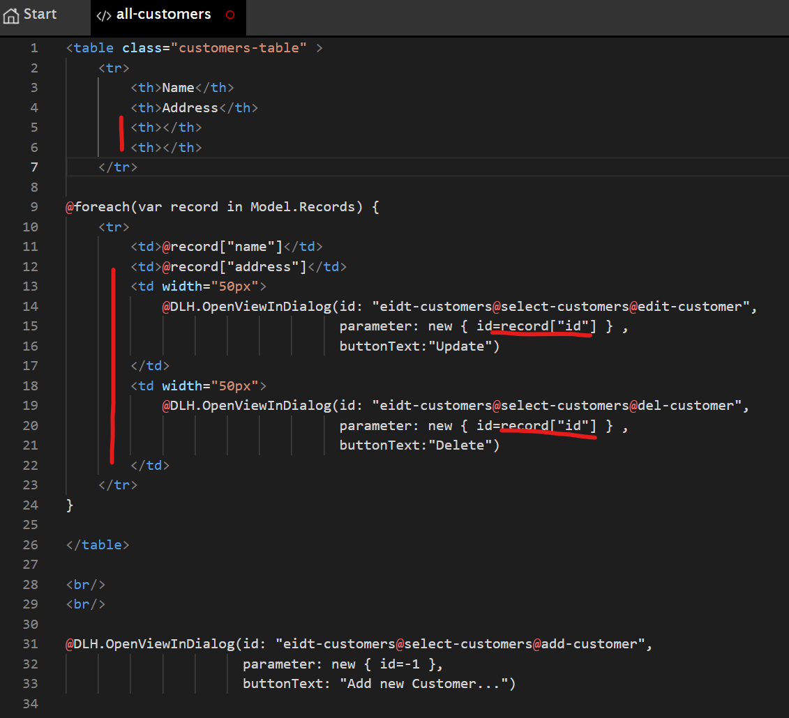

The buttons show *views* in a new dialog. The *ID*
of the respective record is also passed as an argument (``parameter: new { id=record["id"] }``).

If you start the preview, the table should now look like this:

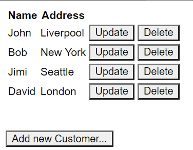

The buttons already open a new dialog with an error message, because the corresponding *views* do not yet exist.

In the next step, the views ``edit-customer`` and ``del-customer`` are created under ``select-customers``.

The finished ``edit-customer`` view should look like this:

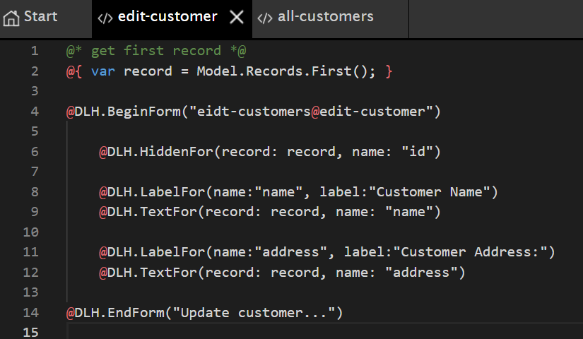

When this view is called, the *ID* of the desired record is passed to the underlying
``select-customers`` query. The record is located in ``Model.Records``. At the beginning of the
*script*, this record is assigned to the variable ``record`` using ``Model.Records.First()`` (First:
the first and, here, only record).

This record is then passed to ``@DLH.TextFor()`` in the form. This fills the input text field
directly with the corresponding values.
Since the ``edit-customer`` query needs the *ID* of the record for the UPDATE statement, this
field must also be included in the form. However, since the user should not see (or need) this field,
it is inserted into the form as a *hidden field*: ``@DLH.HiddenFor(record: record, name: "id")``.

The finished form then looks like this in the preview:

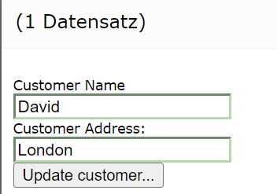

If you confirm this dialog, the record should be changed. However, database errors
can also be shown here:

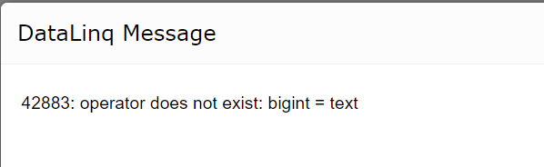

This happens because the *ID* in the database is of type ``bigint``, while a ``string`` is
passed as the parameter. The reason is that DataLinq passes all parameters via URL parameters, and these are always interpreted as
strings. If the database system cannot or does not automatically convert this,
it must be done in the SQL statement. So if this error occurs (database-dependent), the
SQL statements for UPDATE and DELETE can be adjusted as follows (here for PostgreSQL):

.. code-block:: SQL

   update customers
   set name=@name,
      address=@address
   where id=@id::INTEGER

.. code-block:: SQL

   delete from customers where id=@id::INTEGER

The finished view for ``del-customer`` looks like this:

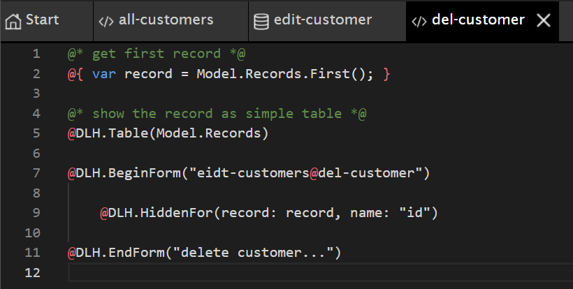

Here too, the first and only record is first read out as the variable ``record``.
Then the table for the *records* in the *model* is shown: ``@DLH.Table(Model.Records)``.
This is only meant to let the user see which record is being deleted before doing so.

The form that is submitted to the ``del-customer`` query with the DELETE statement contains only
the *hidden field* for the record *ID*.

With the changes shown above, the application is complete. New records can be created,
and existing ones can be changed and/or deleted.

Styling
-------

In the last step, the *styling* for the application should be adjusted. Since the *views* use
*Razor syntax*, the *styling* can be done via HTML tags, inline, or even dynamically via JavaScript.

A top-level CSS file can also be created for each endpoint. This CSS file is then loaded in
every *view/report* under this endpoint.
To create/edit an endpoint CSS file, the endpoint's properties dialog must be opened
(by clicking on the endpoint in the tree view).

Under *Styling*, there is the ``Open Endpoint CSS...`` button, which opens an editor with the CSS styles.
Here, the desired styles can be entered and saved:

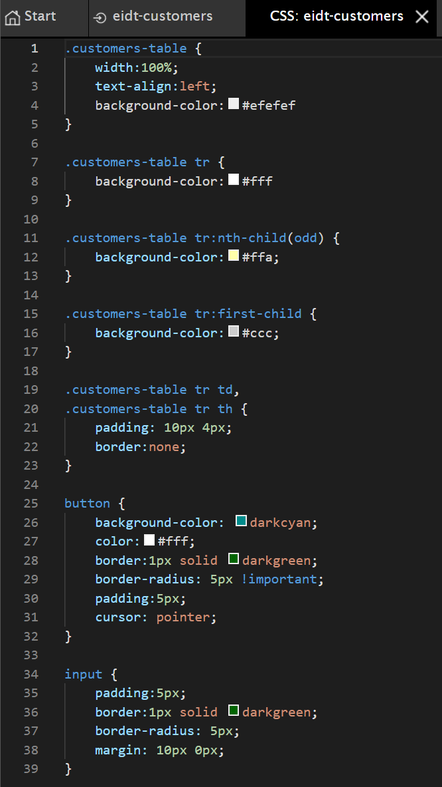

The result then looks roughly like this:

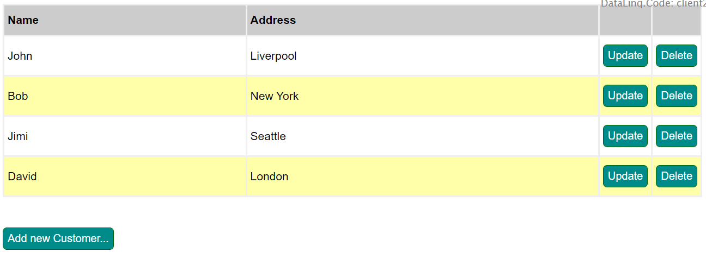

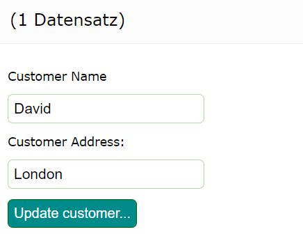

