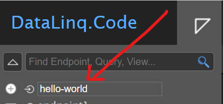
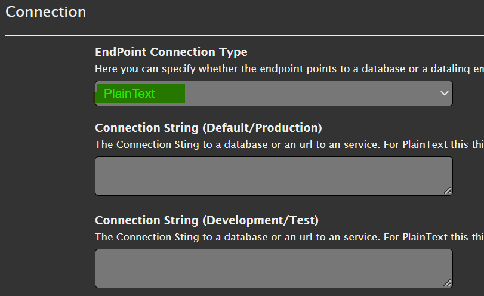
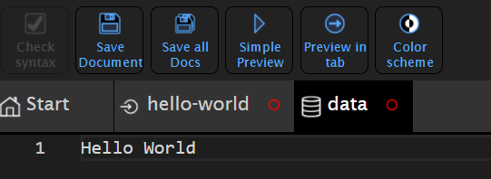
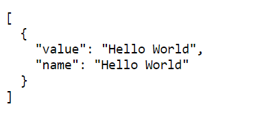
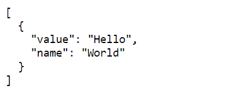
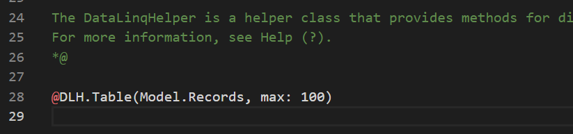
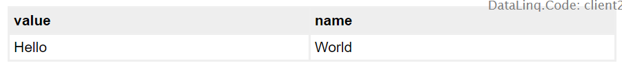

Hello World Example
====================

In this example, the concept of a DataLinq project is explained using a small example.
No connection to a database is required for this example. The "data" is entered as text.

Creating an Endpoint
--------------------

The first step is to create an endpoint. As the name suggests, an endpoint is
always the starting point of a query or a report. The endpoint defines where the data
being queried is located (database, web service, text, ...).

This is created via the *DataLinq.Code* interface, by choosing the name of a new endpoint and
confirming it with Enter.

.. note::
   Only certain characters are allowed for endpoint names: lowercase letters, numbers, and ``-``.
   Special characters should not be used, because the name of endpoints, queries, and views later
   becomes part of the *call URL*.

After the endpoint is created, it appears at the top level of the tree. Clicking on the
endpoint opens the *properties dialog*.

Here, the *connection type* is important for us. It specifies what kind of data is offered
via the endpoint. Since we don't want to connect a database for *Hello World*, we use ``PlainText`` as the type:

.. note::
   `PlainText` means that data is later entered line by line as text in the queries.
   Specifying a *connection string* is not needed for this *connection type*.

Creating a Query
-----------------

The next step is to create a query that provides the data for our example.
To do this, expand the still-empty ``hello-world`` node in the tree view and enter a valid name in the
`New Query/Data` input field. Here, for example, ``data``. The input is confirmed again with Enter:

.. image:: img/hello_world3.png

Clicking on the newly created ``data`` node in the tree view shows an empty
editor window in the *content* area. Here, you enter the actual query that should provide the data
(for the endpoint connection type *Database*, this would, for example, be an *SQL SELECT statement*).

For endpoints of type ``PlainText``, any text can now be entered here, where each line
(excluding empty lines) is interpreted as a record. Here, for example, let's enter ``Hello World``:

You could use the ``Simple Preview`` button from the toolbar to view the result of this query.
However, the changes we have made so far to the endpoint and the query have not yet been
saved (indicated by the red circle in the respective *tab*).
To save the changes, first click the ``Save all Docs`` button (or ``Save Document`` for the currently visible
document). Once the red circles in the tabs disappear, the result can be
opened with ``Simple Preview``.

The result should look as follows:

.. note::
   When you open the ``Preview`` of a query, the result is always a *JSON* with the corresponding data.

For ``PlainText``, the data always becomes a ``value`` / ``name`` pair. Each line is a record.
If it is not specified exactly what ``value`` and what ``name`` are, both values are identical.

To specify ``value`` and ``name``, this is done via a ``:``. Everything before the ``:`` corresponds to ``value``, everything after it
to ``name``.

``PlainText`` is thus very well suited for creating simple selection lists.

If we change the query to ``Hello:World`` and save the query, the preview result should
look as follows:

Creating a View/Report
----------------------

In the last step, we want to make the data available as an HTML table. To do this, under
the query in the tree view, under ``New View...``, enter a valid name and confirm with Enter,
e.g. ``table``:

.. image:: img/hello_world7.png

Clicking on the newly created view shows the *Razor* template for the new
view in the *content* area:

By default, a DataLinqHelper method (``@DLH``) ``Table()`` is inserted into the template.
This simple function displays the data in a simple table.

If you now open this view via one of the ``Preview`` buttons, the result under *Hello World*
is shown as an HTML table:

