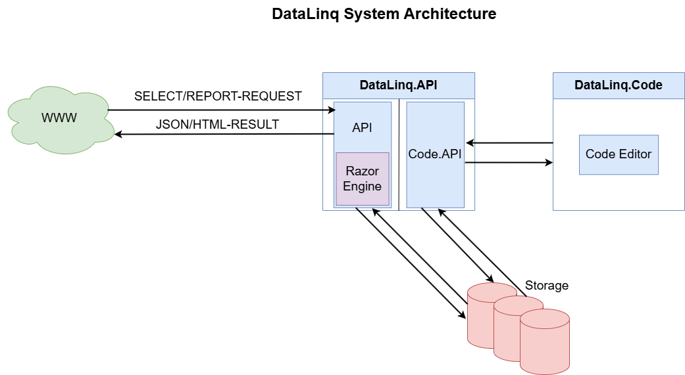

System Architecture of WebGIS DataLinq
======================================

Overview
---------
WebGIS DataLinq is based on a modular architecture that enables efficient querying, processing, and visualization of data. The main components of the system consist of the web access point (WWW), the **DataLinq API**, the **DataLinq Razor Engine**, the **DataLinq Code API**, and the separate **DataLinq Code** application for managing endpoints, queries, and views.

Architecture Components
-----------------------

WWW – External Requests
^^^^^^^^^^^^^^^^^^^^^^^
The system receives external requests via the **WWW**. These requests can be of two different types:

- **SELECT requests**: request raw data in **JSON format**.
- **REPORT requests**: request formatted **HTML reports**.

DataLinq API
^^^^^^^^^^^^
The **DataLinq API** forms the central element of the architecture and handles the following tasks:

- **Receiving and processing requests**
- **Providing data sources (endpoints), queries, and views**
- **Storing and managing configurations in the storage system** (file-based)
- **Rendering HTML results via the DataLinq Razor Engine**

Storage
^^^^^^^
The storage system is a file store that manages the following configuration data:

- **Endpoints** (data source definitions)
- **Queries** (data queries)
- **Views** (presentation options)

This structure enables simple management and fast reuse of queries and presentations.

DataLinq Razor Engine
^^^^^^^^^^^^^^^^^^^^^^
The **DataLinq Razor Engine** is integrated into the DataLinq API and handles the processing of REPORT requests. It:

- **Renders the Razor-based HTML pages**
- **Converts the data from the queries into a formatted presentation**
- **Creates interactive visualizations and reports**

DataLinq Code API & DataLinq Code
^^^^^^^^^^^^^^^^^^^^^^^^^^^^^^^^^
The **DataLinq Code API** serves as the interface between the **DataLinq API** and a separate **DataLinq Code** application, which acts as an **editor**. These components allow users to adjust the system configuration:

- **DataLinq Code** offers a **graphical interface for creating and editing** endpoints, queries, and views.
- The **DataLinq Code API** accepts these configuration changes and stores them in the storage system.

Summary of the Data Flow
--------------------------------
#. **WWW sends SELECT or REPORT requests** to the **DataLinq API**.
#. The **DataLinq API** processes the request:

   - SELECT requests return JSON data.
   - REPORT requests are rendered by the **DataLinq Razor Engine** and returned as HTML.

#. **Users manage endpoints, queries, and views via DataLinq Code**, with the **DataLinq Code API** storing these changes.
