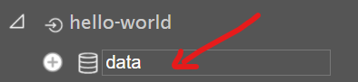
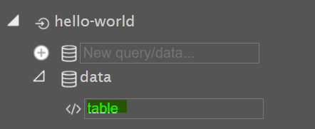
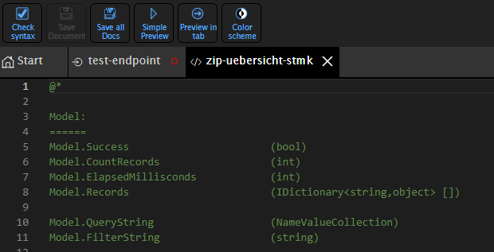
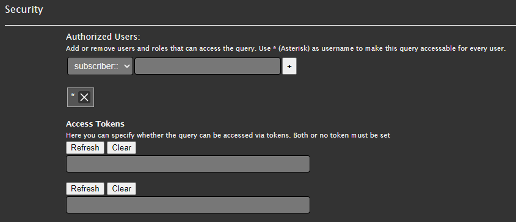

================
Parameterization
================

The **navigation tree** on the left shows the structure of the **endpoints, queries, and views**.
Simply clicking an element allows it to be quickly selected and edited.

Endpoint
========

A new **endpoint** can be created directly in the **sidebar**.
The top input field allows you to **assign a name**, which is confirmed with **Enter**.

.. image:: img/hello_world1.png
   :alt: Create endpoint
   :align: center

.. important::

   Endpoint names may **only contain lowercase letters, numbers, and the hyphen (`-`)**.
   Special characters should be avoided, since the names later become part of the **call URL**.

Clicking on an **endpoint** opens the **properties dialog**, in which the following settings can be made:

Settings
-------------

The following overview lists all sections of the **properties dialog** with their respective fields:

.. list-table::
   :header-rows: 1
   :widths: 30 70

   * - Field
     - Description
   * - **General**
     -
   * - ``EndPoint Id``
     - Unique name of the endpoint for the URL call
   * - ``Name``
     - Name of the endpoint
   * - ``Description``
     - Optional description
   * - **Connection**
     -
   * - ``EndPoint Connection Type``
     - The following **connection types** are possible:

       - Database
       - API (REST interface)
       - GeoRss
       - GeoJson
       - DataLinq
       - PlainText
       - TextFile
       - Cypher
       - JsonApi

   * - ``ConnectionString``
     - The configuration varies depending on the connection type.

       - **Database**:

         Example of an ``SQL Server`` connection:

         .. code-block:: text

            SQL:Server=db123.firma.at\instanz;Database=ssg;User Id=user1;Password=pwd1;

       - **API (REST interface)**:

         Example of a ``WebGIS API REST`` connection:

         .. code-block:: text

            service=http://server123.at/api5test;user=username;pwd=12345

       - **GeoRss**:

         .. code-block:: text

            service=https//some.georss.com;user=username;pwd=12345

       - **GeoJson**:

         See **GeoRss**.

       - **DataLinq**:

         Another ``WebGIS DataLinq service``; the connection string is the URL of the application.

       - **PlainText**:

         Data is queried as **line-based text**; can be left empty.

        - **Cypher**:

          Example of a ``Neo4j`` connection:

          .. code-block:: text

              url=neo4j://urltodb:7687;username=userName;password=super_secret

        - **JsonApi**:

          Example of a ``JsonApi`` connection:

          .. code-block:: text

              https://urltomyapi.com/

       - **TextFile**:

         Data sources are loose text files (`*.txt`, `*.log`, `*.csv`).

         .. code-block:: text

            C:\logs

         .. note::

            This specifies the **directory** in which the text files are located. Multiple text files can be located in one directory, which are then addressed via the query.

   * - **Security**
     - Set permissions for users and roles (see **Permissions**).
   * - **Info**
     -
   * - ``Created``
     - Creation date of the endpoint
   * - **Styling**
     -
   * - ``Open EndPoint CSS Button``
     - Editing the CSS document for all associated **views**
   * - **Scripting**
     -
   * - ``Open EndPoint Javascript Button``
     - Editing the script document for all associated **views**
   * - **Delete**
     -
   * - ``Delete Button``
     - Deleting the endpoint

Query
================

After selecting an **endpoint**, **queries** can be created for it.
The queries enable access to the associated **data**.

A new **query node** can be created directly in the **sidebar**, below the desired endpoint:

Clicking on the new **query** opens an **editor window** in the **content area**, in which the query can be formulated.

The options and syntax for the query differ depending on the **EndPoint Connection Type**.

.. list-table::
   :header-rows: 1
   :widths: 30 70

   * - EndPoint Connection Type
     - Example
   * - **Database (SQL)**
     - Query with a set filter value

       - With color filter: ``DATALINQ-URL-PFAD/select/endpoint@query?GebaeudeArt=Einfamilienhaus&Dachfarbe=rot``
       - Without color filter: ``DATALINQ-URL-PFAD/select/endpoint@query?GebaeudeArt=Einfamilienhaus``

       SQL query:

       .. code-block:: sql

          SELECT
              [NAME],
              [FARBE]
          FROM projekt_gebaeude
          WHERE gebaeudeart = @GebaeudeArt
          #if Dachfarbe
              AND FARBE = @Dachfarbe
          #endif
   * - **REST**
     - Here too, URL parameters passed along with the query URL can be forwarded to the REST API being queried.

       Example: ``DATALINQ-URL-PFAD/select/endpoint@query?parameter1=wert1&parameter2=wert2``

       .. code-block:: text

          https://server123.at/api?p1=parameter1

          #if parameter2
              &p2 = @parameter2
          #endif

       The resulting URL of the REST API being queried would be (if ``parameter2`` is set) ``https://server123.at/api?p1=parameter1&p2=parameter2``, otherwise ``https://server123.at/api?p1=parameter1``

   * - **Text files (CSV)**
     -
        .. hint::

           - Columns in CSV files must be separated with ``;``.
           - If a header row is present, it must be removed. The individual columns can be addressed as `column1`, `column2`, `column3`, ...

        .. warning::

           The file must be located in the endpoint's **directory**. This directory is specified in the endpoint's connection type.

        The following parameters can be defined in the query:

        .. code-block:: text

           my-datafile.csv # Die Quelldatei, welche die Datensätze enthält

           maxlines=10     # Maximale Anzahl der Zeilen (optional)
           from=bottom     # Von unten lesen (optional)
           filter=xxx      # Filterbedingung (optional)

        A filter can be used to extract only the data rows that contain the text defined in the filter (case-insensitive). This can be helpful for searching large amounts of data and extracting only relevant information.

        **Example of a URL with a filter:**

        In this example, the URL ``DATALINQ-URL-PFAD/select/dh-form@get?_pjson=true&GebaeudeArt=Einfamilienhaus`` filters only the records where the respective row in the CSV file contains the value ``Einfamilienhaus``.

        Filter condition in the query:

        .. code-block:: text

           my-datafile.csv

           ...

           #if GebaeudeArt
              filter={{GebaeudeArt}}
           #endif

        This ensures that the filter is only applied if the value `GebaeudeArt` is defined. Otherwise, the filter is not applied, and all rows of the text file are included in the query.

Settings
-------------

The settings for the respective query can be accessed by clicking the **gear icon** in the bottom-right corner of the editor window.

.. list-table::
   :header-rows: 1
   :widths: 30 70

   * - Field
     - Description
   * - **Link**
     -
   * - ``Route``
     - URL route for the query (``endpoint_id@query_id``)
   * - **General**
     -
   * - ``Query Id``
     - Unique name of the query (used in the URL)
   * - ``Name``
     - Name of the query
   * - ``Description``
     - Optional description
   * - **Debug**
     -
   * - ``Test Url Parameters``
     - **Test parameters** for the query can be defined and executed here.

       .. image:: img/ad3_3.png
          :alt: Set test parameters
          :align: center

       .. hint::

          The test parameters should be chosen so that **test queries can always be executed**.
   * - **Http Header**
     - If **JsonApi** was chosen as the type under ``EndPoint Connection Type`` for the associated **endpoint**, **HTTP headers** can be passed along in the query settings.

       - Up to **10 key-value pairs** can be defined.
       - ``{$key}`` accesses a **secret** from the secrets manager.
       - ``{&key}`` accesses a **constant**.
   * - **Security**
     - Set permissions for users and roles (see **Permissions**).
   * - **Domains**
     -
   * - ``Domains``
     - Query domains are used to replace encoded values in a table with understandable names, by using a lookup table that contains the encoded values and their translations.

       - ``Destination Field``: name of the column that contains the encoded values.
       - ``Query Id``: lookup table that contains encoded values and their translations.
       - ``Value Field``: column name in the lookup table that contains the encoded values.
       - ``Name Field``: column name in the lookup table that contains the translations.

   * - **Info**
     -
   * - ``Created``
     - Creation date of the query
   * - **Delete**
     -
   * - ``Delete Button``
     - Deleting the endpoint

Views
=================

**One or more views** can be created to **display** the results of a query.

Views use **HTML with ASP.NET Razor markup**.

Settings
-------------

The settings for the respective query can be accessed by clicking the **gear icon** in the bottom-right corner of the editor window.

.. list-table::
   :header-rows: 1
   :widths: 30 70

   * - Field
     - Description
   * - **Link**
     -
   * - ``Route``
     - URL route for the view (``endpoint_id@query_id@view_id``)
   * - **General**
     -
   * - ``View Id``
     - Unique name of the view (used in the URL)
   * - ``Name``
     - Name of the view
   * - ``Description``
     - Optional description
   * - **Debug**
     -
   * - ``Test Url Parameters``
     - **Test parameters** for the query can be defined and executed here.

       .. image:: img/ad3_3.png
          :alt: Set test parameters
          :align: center

       .. hint::

          The test parameters should be chosen so that **test queries can always be executed**.
   * - **JS Libraries**
     - The currently available JS libraries for the view can be added here.
   * - **PDF Report mode**
     - Settings for a PDF report. More on this under `pdfreporting.rst <pdfreporting.rst>`_.
   * - **DataLinq Cache Token**
     - Settings for the DataLinq cache token. More on this under `use-cache-token-for-one-2-n-links <https://docs.webgiscloud.com/de/webgis/config/api/index.html#datalinq>`_.
   * - **Info**
     -
   * - ``Created``
     - Creation date of the view
   * - ``Changed``
     - Modification date of the view
   * - **Delete**
     -
   * - ``Delete Button``
     - Deleting the endpoint

Permissions
==============

Permissions can be set in the settings for **endpoints and queries**, which are inherited hierarchically.

.. note::

  Hierarchically means: anyone who **does not have access to an endpoint** also **cannot execute its queries**.

- Permissions can be set for **individual users, roles, or groups**.
- **Token and portal authentication** are also possible.

Permissions are managed via the **"+" icon** or by pressing **Enter**.

.. warning::

  Wildcards can also be assigned here using the string `"*"`. This string means **unrestricted access for all users**.

Styles (CSS)
============

CSS styles can be defined **at two levels**:

1. **Global styles for the entire endpoint**.
2. **Inline styles directly in a view** via `<style>` tags or `style` attributes.
