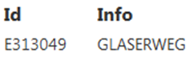

.. _Anchor4 :

.. raw:: html

    
    
    
    
    
    

.. role:: grey
.. role:: brown
.. role:: green
.. role:: orange
.. role:: blue
.. role:: purple

Calling DataLinq and Examples
=============================

Query results are available either as raw data (SELECT) or in a formatted form (REPORT). The call consists of the following parts:

*	:grey:`URL to DataLinq`

*	:brown:`Call type (Select, Report)`

*	:green:`Name (Id) of the endpoint`

*	:orange:`Name of the desired query`

*	:blue:`(optional): name of the view`

*	:purple:`(optional): specification of the request parameters`

:grey:`DataLinq-URL /` :brown:`Call type /` :green:`Endpoint` :orange:`@Query` :blue:`(@View)` :purple:`(?Parameter1=Value1(&Parameter2=..)`

E.g.

:grey:`http://localhost/api5/datalinq/`:brown:`report/`:green:`ssg-sdet`:orange:`@proj-geb`:blue:`@proj-gebbestand`:purple:`?GebaeudeId=E313049&Bezeichnung=Text123`

.. _Anchor41 :

Calling Raw Data (SELECT)
--------------------------

To call the raw data of a query result, select "SELECT" as the call type and omit specifying the view. The data is returned as JSON.

:grey:`http://localhost/api5/datalinq/`:brown:`select/`:green:`ssg-sdet`:orange:`@proj-geb`:purple:`?GebaeudeId=E313049`

.. code-block::

    [
    {
        "ID": "E313049",
        "PLTXT": "GLASERWEG"
    }
    ]

.. _Anchor42 :

Calling Formatted Data (REPORT)
------------------------------------

If one or more views exist for a query, they can be called to display the data in a formatted form:

:grey:`http://localhost/api5/datalinq/`:brown:`report/`:green:`ssg-sdet`:orange:`@proj-geb`:purple:`?GebaeudeId=E313049`

.. code-block:: html

    <table>
        <tr>
            <th>Id</th>
            <th>Info</th>
        </tr>

        @foreach(var record in Model.Records) {
            <tr>
                <td>record["TP"]</td>
                <td>record["PLTXT10"]</td>
            </tr>
        }
    </table>

