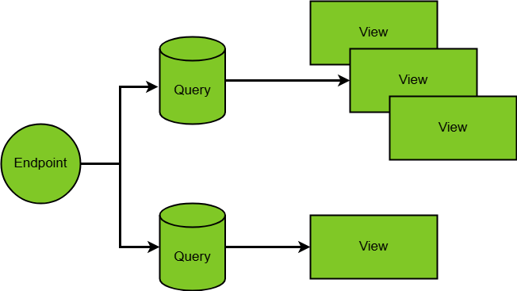

Technical Implementation
========================

The architecture of **WebGIS DataLinq** is based on a modular and hierarchical structure that enables flexible and efficient data querying and presentation. The system consists of three central components:

- **Endpoint**
- **Query**
- **View**

===============

===============

Structure of the Components
---------------------------

1. Endpoint
----------------------
The **endpoint** establishes the connection to the data sources and serves as the interface for external systems. It can address various sources, including:

- **Databases**
- **REST APIs**
- **Other WebGIS DataLinq instances**

An endpoint thus defines the basis for data queries and determines where the data comes from.

2. Query
------------------
The **query** enables access to the data provided via the endpoint. It can:

- Retrieve specific information from the data source
- Return data as **raw data (JSON)** or as a formatted **view**

Queries are flexibly configurable and can contain parameters to filter specific data records.

3. View
-----------------
The **view** is used for the **visualization and presentation** of the query results. It enables:

- Formatted display of the data in a readable form
- Implementation of charts or structured reports
- User-friendly presentation of analysis results
- Creation of **PDF templates** for generating reports and documents from the query results

If only **raw data output (JSON)** is needed, creating a view can be skipped.
