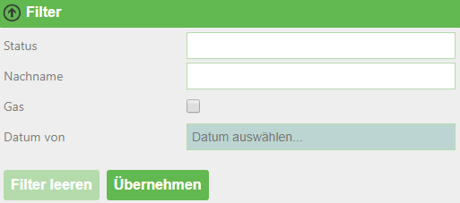
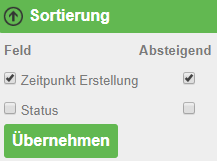
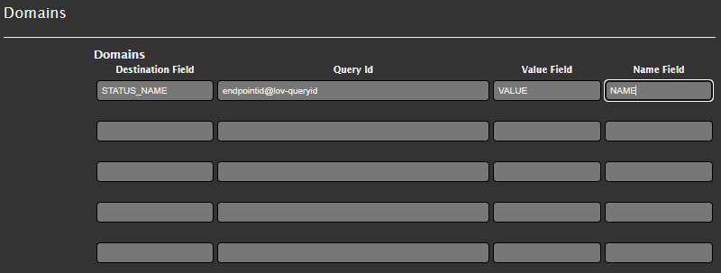

Tips and Tricks for Views
==========================

.. _Anchor51 :

Accessing Query Results
-----------------------------

The results of the query are passed to the view as a model:

*	``Model.Success``

    *	*bool*

    *	whether the query was successful

*	``Model.CountRecords``

    *	*integer*

    *	number of records returned

*	``Model.ElapsedMillisconds``

    *	*integer*

    *	query duration in milliseconds

*	``Model.Records``

    *	*Dictionary<string,object>[]*

    *	contains the records of the result

    *	**CAUTION:** since the value is stored as an object type, direct comparison operations such as ``record[‘NAME‘] == ‘Franz‘`` are **not** possible (reference comparison). Instead, comparisons must be done via Equals, e.g. ``"Franz".Equals(record["NAME"])``

*	``Model.QueryString``

    *	*NameValueCollection*

    *	contains the parameters passed with the call

    *	access e.g. via: ``Model.QueryString["Parametername"]``

The records in the dictionary can be accessed via Linq:

.. code-block::

    Model.Records.Where(r=>String.IsNullOrEmpty(Model.QueryString["x"]) || Model.QueryString["x"].Equals(r["x_field"])).OrderBy(r=>r["data_field")

.. _Anchor52 :

Helper Functions
----------------

There are several helper functions ("DataLinqHelper") that can be used to include additional data or, for example, generate forms. As an abbreviation, "DLH" can be used instead of "DataLinqHelper":

*	``DataLinqHelper.IncludeView(url)``

    *	Shows data from another view within a view

    *	The URL must be entered starting from the endpoint name:

        .. code-block ::

         	DataLinqHelper.IncludeView(“ssg-sdet@proj-geb@proj-geb-bestand?GebaeudeId =E313049“)

*	``DataLinqHelper.IncludeClickView(url,text)``

    *	see IncludeView; the content is only loaded and shown when a button is clicked

    *	the ``text`` parameter refers to the label of the button

*	``DataLinqHelper.ResponsiveSwitcher()``

    *	Creates a button that, when clicked, shows or hides all HTML elements with the class "responsive" within the current table

*	``DataLinqHelper.IncludeCombo(id, url, valueField, nameField)``

    *	Creates a dropdown list with the results of a query

    *	``id`` is set as the HTML id attribute

    *	``url`` points to the query whose results should be listed

        *	e.g. a query with GroupBy

    *	``valueField`` fills the option value with the specified field from the results

    *	``nameField`` fills the option name with the specified field from the results

*	``DLH.UrlEncode(text)``

    *	Encodes the text for use in a URL

These and further helper functions are listed with examples in the DataLinqHelper help. The link to the help can be found at the top right of the Razor markup code editor when creating views.

JavaScript can also be defined in views within ``<script>`` tags. jQuery is already included.

.. _Anchor53 :

Restricting Query Results - Query
------------------------------------------

To keep the server load and, above all, the client-side page load time low, it makes sense to restrict the maximum number of query results and fields:

*   for API endpoints against the WebGIS API, this number is fixed at 1000 records, and all columns defined in the CMS are returned.

*   DB queries can be restricted in the SQL statement, e.g.

    ====================================    ========================
    SELECT TOP 200	 * … 				    for MSSQL
    SELECT * … LIMIT 200 				    for MySQL, PostgreSQL
    SELECT * ... WHERE ROWNUM <= 200 		for Oracle
    ====================================    ========================

Ideally, the results should be restricted as much as possible through filtering with (optional) parameters, in order to allow users to make a faster selection and avoid having to search through hundreds of rows.

.. _Anchor54 :

Restricting / Filtering Query Results
--------------------------------------------

Query results can be restricted using (optional) parameters in the queries. In views, ``DataLinqHelper.FilterView`` can be used to build in a filter that provides a simple and clear way to enter/select these filter parameters. In the background, the passed parameters are simply appended to the call URL (see :ref:`Chapter 4<Anchor4>`).
If filter or sort parameters are already defined via the URL when the view is called, they are already filled in or set in the GUI.

.. code-block ::

    @DLH.FilterView(
        "Filter",
        new Dictionary<string, object>(){
            {"STATUS", new { displayname="Status", source="endpoint@lov-status", valueField="VALUE", nameField="NAME", prependEmpty=true, multiple="multiple"} },
            {"NACHNAME", new { displayname="Nachname" } },
            {"GAS", new { displayname="Nur Gas betroffen", dataType=DataType.Checkbox } },
            {"ERSTELLD_FROM", new { displayname="Datum von", dataType=DataType.Date } },
        }
    )

A filter field can be defined as a selection list whose values come from another DataLinq query, see the ``STATUS`` field. If needed, multiple
list values can also be passed separated by ``;`` (``multiple=“multiple“``). In the SQL statement, this concatenated string must be split apart again. For a REST API query,
the query method of the search field must be defined in the CMS as "In".

If all filter fields are optional (i.e. a search can also be performed without a single restriction), a generally valid
WHERE condition can be defined in SQL statements, with all other optional conditions appended with "AND …".

The selection lists in the filter can be cascading, meaning one input field depends on another field. Whenever this field is changed via the selection list,
the value of the dependent selection list(s) changes.

.. code-block ::

    @DLH.FilterView(
       "Filter",
        new Dictionary<string, object>(){
           {"APP", new { displayname="App(s)", source="read@wlogging-apps", valueField="VALUE", nameField="VALUE", prependEmpty=true }},
           {"TYPE", new { displayname="Type(s)", source="read@logging-types?APP=[APP]", valueField="VALUE", nameField="VALUE", prependEmpty=true } }
        }
    )

Here, the ``TYPE`` field depends on the ``APP`` selection list via the placeholder ``[APP]`` (``APP=[APP]``). Whenever the selection for ``APP`` is changed in the filter,
the ``TYPE`` selection list is refilled.
The corresponding query (here, a database query) must of course take the passed ``APP`` parameter into account, e.g.:

.. code-block ::

   SELECT
      DISTINCT(TYPE) as VALUE
      FROM LOG_TABLE
      WHERE 1=1

    #if APP
        AND APP = @APP
    #endif

**REST API**

.. code-block :: REST

    dienst@cms/queries/abfrage?

    #if STATUS
        &status_in={{STATUS}}
    #endif
    #if NACHNAME
        &nachname={{NACHNAME}}
    #endif
    #if ERSTELLD_FROM
        &date_from={{ERSTELLD_FROM}}
    #endif
    #if GAS
        &gas_betroffen=Ja*
    #endif
    #if _orderby
        &_orderby={{_orderby}}
    #endif

**SQL**

.. code-block :: SQL

    SELECT TOP(200)
        status,
        erstellt,
        ...
    FROM tabelle
    WHERE 0 = 0

    #if STATUS
        and status IN (SELECT value FROM STRING_SPLIT(@STATUS, ';'))
    #endif

    #if NACHNAME
        and nachname = @NACHNAME
    #endif

    #if GAS
        and gasanschluss = true
    #endif
    #if ERSTELLD_FROM
        and erstellt >= CONVERT (date, @ERSTELLD_FROM, 104)
    #endif
    #if _orderby
        ORDER BY @_orderby
    #endif

The filter is rendered in the view:

.. _Anchor55 :

Sorting Query Results
-------------------------------

In addition to filtering, ``DataLinqHelper.SortView`` is another building block available for sorting records in the view via the GUI.
The sort fields, like the filter parameters, are appended to the call URL in the background with ``_orderby=…``.
Descending sort order is passed with a minus ("-") before the column name.

.. code-block::

    @DLH.SortView(
        "Sortierung",
        new Dictionary<string, object>(){
            {"ERSTELLD", new { displayname="Zeitpunkt Erstellung" }},
            {"STATUS", new { displayname="Status" }},
        }
    )

These fields must be accepted in the query, see the statements in :ref:`Chapter 5.4<Anchor54>`; in the view, the sort tool is rendered:

.. _Anchor56 :

Refreshing - Splitting Static and Dynamic Content
------------------------------------------------------------------

When views are (periodically) refreshed, all content is reloaded.
If CSS styles or JavaScript are present in the views, these are also reloaded each time, which can (especially with JavaScript triggers) slow down the page over time (until a "hard" refresh with F5, or a new call via the URL, is performed).

An example of view content that is frequently refreshed on the same client could be hydrographic data – as a kind of dashboard that is refreshed every minute.
In the "simple" form, this page consists of tabular data (HTML), a map (JavaScript), CSS styles, and JavaScript for displaying the charts – all in a single view.
If this view is reloaded every 60 seconds via ``DLH.RefreshViewTicker``, JavaScript and CSS are added again each time – even though only the tabular data (HTML) changes.

Here, it makes sense to separate the static code that always stays the same (JavaScript, CSS) from the dynamic part (HTML) and only reload the latter.
Whenever a view is reloaded, the "onpageloaded" event is fired. The static part can respond to this event, for example to set click listeners:

.. code-block::

    <script>
        webgis_datalinq.events.on('onpageloaded, function(channel, sender, args){
            webgis.$(".TABDET.clickable tbody tr.extended-click").on("click", function() {
                var id = $(this).attr("stoer_id");
                ...

.. _Anchor57 :

Queries with Domain Translation
-------------------------------

Query domains are used when an attribute of an object in a table is encoded with a value, for example 0 for "forest", 1 for "meadow", and 2 for "built-up area".
In a table view, you want to translate these values into the correct names, to make it easier for users to understand.

The "Destination Field" specifies the column name (can also be an alias) of the field that contains the encoded values.
Under "Query Id", a lookup table is specified that contains, on the one hand, the encoded values, and on the other hand, the translation.
"Value Field" and "Name Field" specify the column names of this lookup table.
If the field (in the graphic "STATUS_NAME") is accessed in the view of the original query, not the encoded value (e.g. 1) but the translation ("meadow") is output.

