DataLinq.Code Interface
========================

The user interface of **DataLinq.Code** offers an intuitive and powerful environment for managing endpoints, queries, and views. The individual areas and functions are explained in detail below.

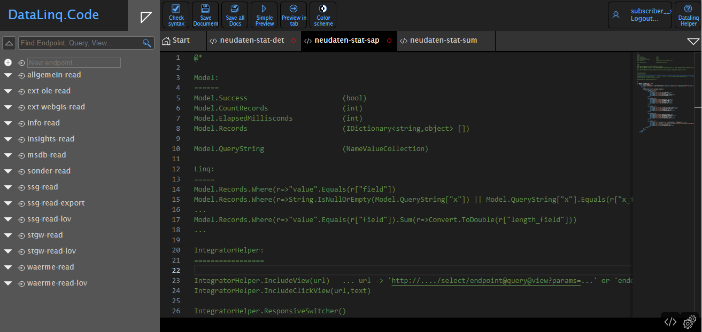

===============

Home Page
----------

When **DataLinq.Code** starts, the following elements appear:

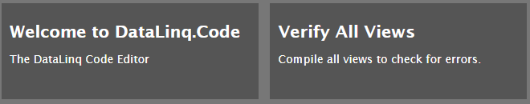

- **Verify All Views**
  - Checks all existing **views** for **syntax errors** and security-relevant keywords.
  - This step is especially recommended after updates, to detect errors early.

===============

Sidebar
-------

The **sidebar** enables efficient navigation and search for **endpoints, queries, and views**.

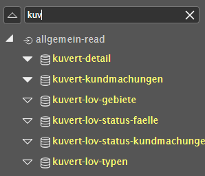

- The **search field** can be used to find specific entries.
- The **up-arrow button** can be used to fully collapse the expanded tree.

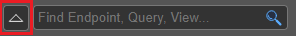

An expanded tree looks, for example, like this:

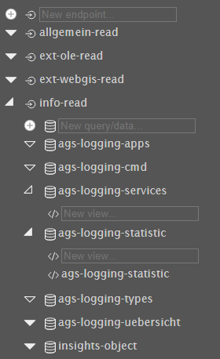

- The **fill of the triangles** indicates whether further child elements exist.
- This is especially helpful when searching for **views**.

Folders
~~~~~~~

- A **right-click** on the **icon** activates **folder mode**.

- While in folder mode:
- **Right-click** saves and exits folder mode.
- **Left-click** creates a new folder.
- **Left-clicking** a new folder allows it to be renamed.
- **Right-clicking** a folder deletes it.
- **Endpoints** can be dragged into folders via **drag and drop**.

- The **folder structure** is only shown once all **endpoints** are opened; otherwise, the old structure remains.

===============

Creating a New Endpoint, Query, or View
------------------------------------------------------------

- Once the corresponding level is open, a new **endpoint, query, or view** can be created.
- After **entering the name**, the associated code editor or settings open.

===============

Deleting an Endpoint, Query, or View
----------------------------------------------------

- To delete an **endpoint, query, or view**, it must first be **opened**.
- The element can then be removed via the **settings at the bottom** using `Delete`.

===============

Copying the Name of an Endpoint, Query, or View
-----------------------------------------------------------------

- When you **hover the mouse over an element**, a **copy icon** appears on the right.
- Clicking it copies the name to the **clipboard**.

===============

Tabs
----

The editor environment supports **multiple open files** at the same time.

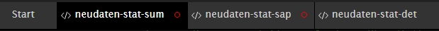

- A **red ring** indicates unsaved changes in the current tab.
- If many tabs are open, a compact navigation view can be opened via the **triangle on the right**:

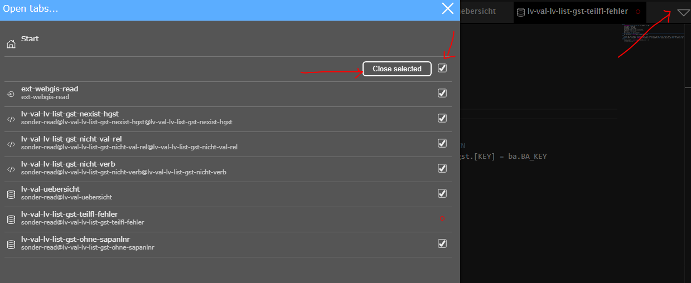

- There, all open files can be managed and closed in a clear overview.
- Before **closing unsaved files**, a confirmation is requested:

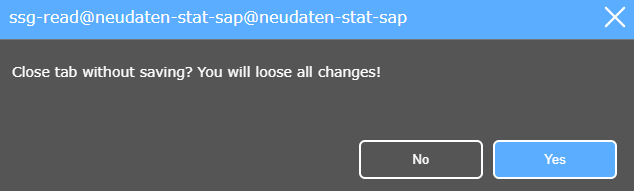

===============

Toolbar
-------

The **toolbar** contains several important functions:

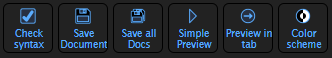

- **Check syntax** → checks for syntax errors
- **Save Document** → saves the current document (`Ctrl+S`)
- **Save all Docs** → saves all open files (`Ctrl+Shift+S`)
- **Simple Preview** → preview in a pop-up (`F5`)
- **Preview in tab** → preview in a new tab (`Ctrl+F5`)
- **Color scheme** → enables/disables **dark mode**

**Note:**
Before saving, it is automatically checked whether there are **errors in a view**. If problems are detected, corresponding **error messages** appear in the **lower area** of the editor.

===============

Secrets & Constants
-------------------

- In the **toolbar**, the **secrets manager** opens via the **icon**.

.. image:: img/secrets_icon.png
   :alt: Icon for opening the secrets manager
   :align: center

-- Here, **secrets** (stored encrypted) and **constants** can be defined.

.. image:: img/secrets_manager.png
   :alt: Placeholder for secrets and constants
   :align: center

-- These values can then be accessed in the code via a **helper**.

===============

Toolbar (Top Right)
----------------------

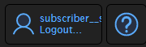

- **Log out** → ends the current session
- **DataLinqHelper** → shows a description of the **DataLinqHelper functions**

===============

Editor
------

The editor enables **editing code and settings**.

- The two buttons at the bottom right can be used to switch between **code and settings**.

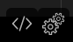

**Further details on configuring the settings** can be found in the **Parameterization** chapter.

===============

Split Screen
------------

By holding down `Shift` and clicking on multiple endpoints/queries/views, it is possible to open up to 3 windows at the same time in split-screen mode.

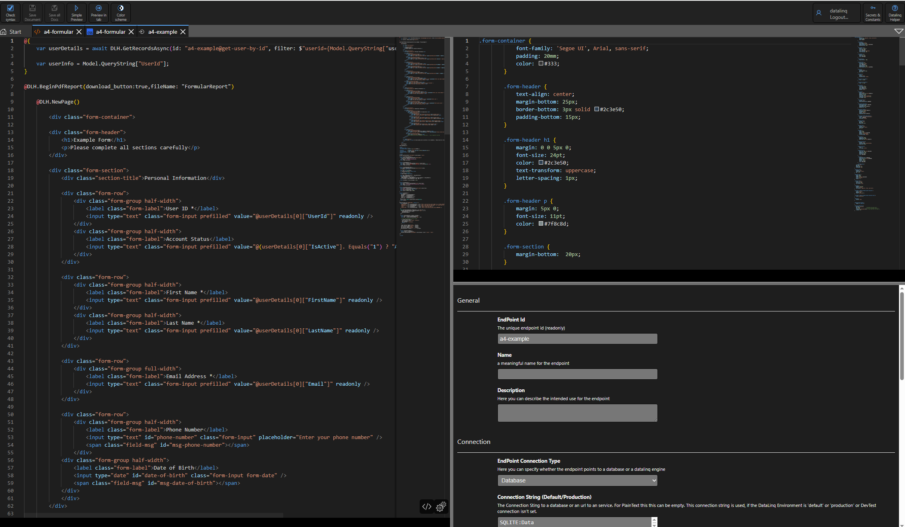

