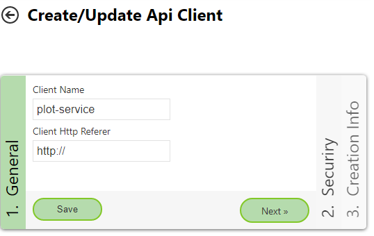

Plot Service
============

With the help of the *PlotService* API, printouts can be fetched in PDF format. For this,

* the name (plus category and portal page) of the map
* a print layout
* a scale
* and a bounding box (plus EPSG code, if not WGS 84)

are passed.

Layout Xml Files
----------------

The API tries to fit the given area into the map layout, provided that this is possible for the given scale.
For this, the API tries different paper sizes (A4, A3, ...) and orientations (portrait, landscape). As soon as a paper size is found, a PDF file is created for this paper size.

Which paper sizes and orientations are possible can be defined in the respective layout.xml file:

.. code:: xml

   <layout to-jpg-if-greater="5" image-format="jpg"
      plot_service_page_sizes="A4,A3,A2"
      plot_service_page_orientations="Landscape,Portrait" >

The attributes for the *PlotService* start with ``plot_service_``:

* ``page_sizes``: paper sizes
* ``page_orientations``: orientations

The order of the values given here also corresponds to the order in which it is tested whether the desired view can be printed at the given scale.
In the example shown here, the following would be tested, for example:

1. A4.Portrait
2. A4.Landscape
3. A3.Portrait
4. A3.Landscape
5. ...

If no possible paper size/orientation combination is found by the end, the API returns an error.

.. note::
   The two XML attributes ``plot_service_page_sizes`` and ``plot_service_page_orientations`` are the prerequisite for a printout to be created. The print service
   generally works for all maps, but only for layouts for which both attributes have been set.
   In addition, a ``ClientId`` and ``ClientSecret`` (see below) must/can be passed when calling the API. Creating PDFs is only possible for maps that are visible to the
   current client. Likewise, all services in the map must be authorized for the client. Otherwise, the API returns an error.

.. note::
   When calling the *PlotService*, a map is passed. The map passed must contain the print tool and the corresponding layout!
   If the layout has not been defined in the MapBuilder for this map, the *PlotService* returns an error message.

.. note::
   Some layouts are only permitted for certain scales via ``<layout scales="5000,2500,1000" >``. This also applies when this layout is used with the *PlotService*. If a different scale is passed, the *PlotService* returns an error message.

REST Call
-----------

The *PlotService* can be called via the REST interface of the WebGIS API at ``https://{api-url}/rest/plotservice``. The call must be made via an ``HTTP POST`` request.
The mandatory parameters listed above are passed as parameters (as HTTP form):

.. code::

   mapName=Basiskarte&mapCategory=Allgemein&mapPortal=dev&layout=lkmyzkjugleodsjpu-75pdg@ccgis_default&scale=1000&bbox=-68310.17,215052.83,-67577.19,216004.68&bbox_srs=31256

* ``mapPortal``, ``mapName``, ``mapCategory``: These define the map that should be printed.

* ``layout``: Specifies the layout that should be printed. This layout must contain the attributes ``plot_service_page_sizes`` and ``plot_service_page_orientations`` mentioned above.
  Either the CMS id of the layout (see above) or the CMS name of the layout can be given as the value, e.g. ``layout=strom-standard``.

* ``scale``: The target scale for the plot. A list of scales can also be passed here, ``scale=1000,2000,5000``. The plot service tries, in sorted order (smallest value first), whether a printout is possible.
  As soon as a scale/paper size combination is found, the printout is created with this combination. Procedure: the first scale is tested with all possible paper formats. If no combination is possible,
  the next scale is used. If the layout is only permitted for certain scales (see above), all passed scales must be permitted. Otherwise, an error is returned.

* ``bbox``: The area (bounding box) that should be printed. If the coordinates here are not passed in *WGS84* (=EPSG code 4326), the coordinate system must be passed as an EPSG code via the ``bbox_srs`` parameter.

The response of a *PlotService* call comes as JSON in the following form:

.. code:: Javascript

   {
      "name": "print_0a0d0ccb44f54ad7b9dce8f328052ae2.pdf",
      "base64": "JVBERi0xLjQKJdP0zOEKMSAwIG9iago8PAovQ3JlYXRpb25EYXRlKEQ6MjAyMDEyMTQwODQyNDYrMDEnMDAnKQovQ3JlYXRvcihQ....",
      "page_format": "A4.Landscape",
      "scale_dominator": 1000,
      "success": true,
      "exception": null
   }

* ``name``: A name for the output file (suggestion)
* ``base64``: The actual PDF file (base64 encoded)
* ``page_format``: The paper format chosen for the plot
* ``scale_dominator``: The scale used
* ``success``: Indicates whether the printout was created without error (``true``). If ``false`` is returned here, an error occurred during printing. A more detailed description of the error is given under ``exception``.
* ``exception``: Errors during the printout are returned here as a ``string``. An error can be, for example, that the given view is not possible with any paper format. Errors can also occur in the underlying services.
  It can also happen here that a PDF is returned in which data/services are missing. To make sure that all services were available during the printout, it is therefore essential to evaluate the ``success`` and ``exception``
  values.

Further optional parameters are:

* ``dpi``: The resolution at which to print, default ``dpi=120``
* ``filters``: Passing of presentation filters
* ``presentations``: Presentation variants

API Client (.NET Standard)
--------------------------

If the *PlotService* is called from a .NET program, it is recommended to use the library ``E.Standard.WebGIS.Api.Client``. This contains a service ``E.Standard.WebGIS.Api.Client.Services.WebGISPlotService``,
which abstracts the call. This especially simplifies passing more complex parameters (``filters``, ``presentations``).

An example project that shows the procedure is the .NET Core console application ``WebGIS.Api.Test.Client``.

To be able to use the service, it must be registered via *DependencyInjection*. In addition,
``IHttpClientFactory`` must also be added for the *DependencyInjection*, e.g.:

.. code::

   services.AddHttpClient("plostservice", c => {})
         .ConfigurePrimaryHttpMessageHandler(() => new HttpClientHandler()
          {
             ServerCertificateCustomValidationCallback = (sender, cert, chain, sslPolicyErrors) => { return true; }
          });

   services.AddWebGISPlotService(o=>
   {
      o.HttpClientName = "plotservice";
   });

After that, ``WebGISPlotService`` can be injected via *DependencyInjection*. The ``RunAsync`` method
performs a call to the PlotService:

.. code::

   var response = await plotService.Run("https://localhost:44341",
      new WebGISPlotServiceRequestOptions("dev", "Allgemein", "Basiskarte und Kataster", "layout-standard", 2000)
      {
         BBox = new double[] { -68310.17, 215052.83, -67577.19, 216004.68 },
         BBoxSrs = 31256
      });

   // alternatively, passing several possible scales
   var response = await plotService.Run("https://localhost:44341",
      new WebGISPlotServiceRequestOptions("dev", "Allgemein", "Basiskarte und Kataster", "layout-standard", new int[]{ 1000,2000,2880 })
      {
         BBox = new double[] { -68310.17, 215052.83, -67577.19, 216004.68 },
         BBoxSrs = 31256
      });

.. note::
   All further possible parameters can be found in ``WebGISPlotServiceRequestOptions``.

The return value is of type ``WebGISPlotServiceResponse``. Here too, it is important to check
whether the plot was successful (``response.Success = true``):

.. code::

   Console.WriteLine($"Request Succeeded: { response.Success }");
   if (!response.Success)
   {
      Console.WriteLine($"Response Message: { response.ExceptionMessage  }");
   }
   else
   {
      string fileName = $@"c:\temp\{ response.Name }";
      Console.WriteLine($"Write file: { fileName }");

      await System.IO.File.WriteAllBytesAsync(fileName, response.BinaryResult);
   }

Presentation Variants
---------------------

Presentation variants can be passed via the ``presentations`` parameter. The parameter must be a JSON string.
Only how presentation variants are passed via the API client library is described here:

.. code::

   Presentations = new WebGISPresentationDefinition[]
   {
      new WebGISPresentationDefinition()
      {
         Id="dv_overviewmap_off",
         ServiceId="overviewmap_ags@my_cms"
      },
      new WebGISPresentationDefinition()
      {
         Id="dv_streets_and_addresses",
         ServiceId="basemap_ags@my_cms",
         Check = true
      }
   }

The presentation variants passed here correspond to the *layer configurations* from the CMS at the service level (not the ones under *Map Viewer/Presentation Variants*).
For this, the *id* of the presentation variant and the *id* of the service must be passed for each presentation variant that should be applied.
The presentation variants passed are executed in the order in which they are listed here.

The value for ``Check`` (default = null) indicates how the presentation variant is applied:

* ``null`` (default): the presentation variant is treated like a *button presentation variant*. All layers of the service, except those listed in the layer configuration, are made invisible. All layers from the *layer configuration* are made visible.
* ``true``, ``false``: the layers listed in the *layer configuration* are made visible (``true``) or invisible (``false``). The visibility of all other layers remains unaffected (corresponds to a *checkbox presentation variant*)

.. note::
   If a service, presentation variant, or layer listed here is not found, the API returns an error message and no printout is created.

Layer Visibility
------------------

Similar to presentation variants, individual layers can also be made visible or invisible via the ``layers`` parameter:

.. code::

   Layers = new WebGISLayerVisibilityDefintion[]
   {
      new WebGISLayerVisibilityDefintion()
      {
         ServiceId="tor_tiles_gray@my-cms",
         Layers=new string[]{ "0" },
         Visible=true
      },
      new WebGISLayerVisibilityDefintion()
      {
         ServiceId="strassen_tiles_default@my-cms",
         Layers=new string[]{ "0" },
         Visible=true
      }
   }

Here, the *id* of the service and a list of *layer ids* (or layer names) must be passed. The value for ``Visible`` indicates whether the layers are made visible (``true``) or invisible (``false``).

.. note::
   If a layer listed here is not found, the API returns an error message and no printout is created.

.. note::
   If you want to switch background services, the *layer id* for the *TileCache* is always ``"0"``. If a background service is switched with this method, all other background services are automatically made invisible.

Authentication
--------------

Maps, services, etc. can be authorized via the WebGIS CMS. If you want to print non-public services,
corresponding *credentials* must be passed when calling the API. Authentication for API calls is generally done via *clients*.

A *client* can be created by a *subscriber* via the API administration interface:

Important for the call are the ``ClientId`` and the ``ClientSecret``:

.. image:: img/plotService2.png

In the CMS, all necessary services must now be authorized for this client. The name that must be given in the CMS is ``{subscriber}@{client-name}``.
If the client shown above was created by the subscriber ``subscriber::gis-admim``, ``subscriber::gis-admin@plot-service`` must be given in the CMS.

When calling the API, the *ClientId* and the *ClientSecret* must be passed with the following parameters:

.. code::

   &client_id=....&client_secret=...

If you use the .NET Standard API client library, the client can be passed as follows when calling:

.. code::

   var response = await plotService.RunAsync("https://localhost:44341",
            new WebGISPlotServiceRequestOptions("dev", "Allgemein", "Basiskarte und Kataster", "strom-standard", 2000)
            {
                BBox = new double[] { -68310.17, 215052.83, -67577.19, 216004.68 },
                BBoxSrs = 31256
            },
            new WebGISApiClient("0e4....", "8337f....."));
