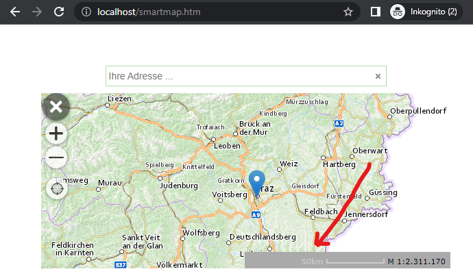

Smartmap with a Draggable Map Marker
========================================

In this example, the marker should not only be shown on the map
when the user finds a result via the search. The marker should also be
settable via a click on the map. A marker that is
already on the map should also be draggable via *drag & drop* to any
location.

Whenever the marker's position on the map is newly set, the
web page should be informed of this and the position should then be sent to the server backend
to query further information.

.. note::
    In addition, a scale bar with an hourglass is built into the map here.
    This requires additional *HTML elements* and the ``map.ui.createHourglass`` method (see below).

The scripts to be included correspond to those of the simple *Smartmap* from the previous example.

Optionally, the elements for the scale bar are additionally added here in the HTML block:

.. code:: html

    

    

    

        

            

        

    

The JavaScript, for example, is extended from the previous one as follows:

.. code:: javascript

    // The WebGIS API Client ID
    webgis.clientid = 'ba2c101cbe6d40ad96c897be5dadf2ec';  // only an example client id, not valid

    webgis.init(function () {
    var map = null, draggableMarker = null;

    function setDraggableMarkerPos(lng, lat) {
        if(!map) {
            return;
        }

        if(!draggableMarker) {
            draggableMarker = map.addMarker({
                lat: lat,
                lng: lng,
                icon: 'blue',
                draggable: true
            });

            draggableMarker.on('dragend', function(e) {
                var pos = draggableMarker.getLatLng();
                commitPosition(pos.lng, pos.lat);
            });
        } else {
            draggableMarker.setLatLng({lat: lat, lng: lng});
        }

        commitPosition(lng, lat);
    };

    function commitPosition(lng, lat) {
        console.log('commit coordinates to server', lng, lat);
    };

    webgis.$('#smartmap-container').webgis_smartmap({
            map_options: {
                services: 'geoland_bm@webgiscloud',
                extent: 'web_mercator_at@webgiscloud',
                enabled: false
            },
            quick_search_service: 'webgis_cloud_allgemein@webgiscloud',
            quick_search_category: '',
            quick_search_placeholder: 'Your address ...',
            quick_search_map_scale: '',
            quick_tools: 'webgis.tools.navigation.currentPos',
            on_init: function (options) {
                map = options.map;
                // UI
                // copy temporary DOM elements into the webgis container
                webgis.$('#map-container-ui').children().each(function () {
                    $(this).appendTo($(options.webgisContainer));
                });
                options.map.ui.createHourglass('#map-container-hourglass');

                map.setScale(2000000, [15.2, 47.3]);

                map.events.on('click',function(channel, sender, e) {
                    if(e.lng && e.lat) {
                        console.log('map-click', e);
                        setDraggableMarkerPos(e.lng, e.lat);
                    }
                });
            }
        })
        .data('eventHandlers')
        .events
        .on('onfeaturefound', function (channel, args) {
            var feature = args.feature,
                marker = args.marker;

            map.removeMarker(marker);
            //console.log('feature', feature);

            if(feature && feature.coords) {
                setDraggableMarkerPos(feature.coords[0], feature.coords[1]);
            }
        });
    });

In the ``on_init`` method of the *Smartmap*, the hourglass and scale bar are
created. Via ``map.events``, an *event listener* is set up for the
``click`` result. When the user clicks on the map, this function is
called and the marker is repositioned.

Via the *Smartmap*'s ``eventHandlers``, the ``onfeaturefound`` event can be
accessed. This event is always triggered when the user finds a
result via the search input box. In the method, the search result marker is first removed from the
map. Instead, a "draggable" marker is placed at the corresponding position.

In the ``setDraggableMarkerPos(lng, lat)`` function, the marker is always set to the desired position.
This happens when the user clicks on the map or selects a result from the search.
If the marker is not yet on the map, it is created via ``map.addMarker`` with the property
``draggable: true``. The marker is also given an event listener on ``dragend``, so
the backend is informed of the new position after the marker is dragged.

The ``commitPosition(lng, lat)`` function can be used to pass the current position
to the backend. In the example, it is called every time the marker
gets new coordinates.

The complete example can be found at:

https://github.com/gis-eni/webgis-examples/blob/main/api/plugins/smartmap/smartmap-draggable-marker.html
