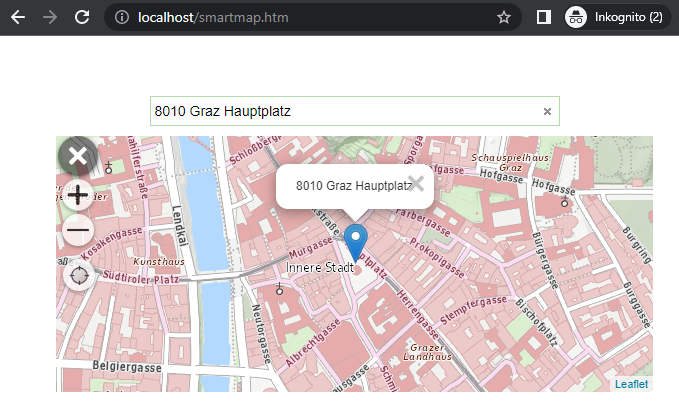

Simple Smartmap Application
===========================

This example shows a simple use case in which a map, including a search field, is embedded in a web page.
The user can navigate in the map. If they select an address from the
search field, the map jumps to the corresponding position and a *marker* with the
search result as text is shown:

To be able to use the *Smartmap plugin*, the usual WebGIS API scripts and the script for the *Smartmap plugin*
must be included on the web page:

.. code:: html

    <!-- required styles and scripts: jquery, api, api-ui, smartmap -->
    
    

    <link href="https://api.webgiscloud.com/content/styles/default.css" rel="stylesheet" />
    <link href="https://api.webgiscloud.com/content/api/ui.css" rel="stylesheet" />

    
    

    <link rel="stylesheet" href="https://api.webgiscloud.com/scripts/api/plugins/smartmap/smartmap.css" />
    

Within the *HTML body element*, an *HTML element* must then be defined,
in which the *Smartmap* should be shown:

.. code:: html

    

    

The *Smartmap* is included in the page's *script block*, or in a separate JavaScript
file, which must be loaded after the scripts listed above.

.. code:: javascript

    // The WebGIS API Client ID
    webgis.clientid = 'ba2c101cbe6d40ad96c897be5dadf2eb';  // only an example client id, not valid

    webgis.init(function () {
        webgis.$('#smartmap-container').webgis_smartmap({
            map_options: {
                services: 'geoland_bm@webgiscloud',
                extent: 'web_mercator_at@webgiscloud',
                enabled: false
            },
            quick_search_service: 'webgis_cloud_allgemein@webgiscloud',
            quick_search_category: '',
            quick_search_placeholder: 'Your address ...',
            quick_search_map_scale: '',
            quick_tools: 'webgis.tools.navigation.currentPos',
            on_init: function (options) {
                // smartmap initialized
                options.map.setScale(2000000, [15.2, 47.3]);
            }
        });
    });

.. note::

   As with every WebGIS API application, the `webgis-clientid` must be specified first.
   The domain of the web page must be registered for this *client* (e.g. http://localhost).

Once ``webgis`` has been successfully initialized, the *Smartmap* can be created within the
``webgis.init`` method.

The map services (``map_options.services``) and the map extent (``map_options.extent``) are passed.
The ``map_options.enabled`` property specifies whether the map is active on startup.
For maps embedded in a larger web page, it is recommended that this value be set to ``false``.
The user must then first activate the map with a click before using it.
This improves *usability*, since otherwise the map could accidentally be zoomed into while scrolling through the page,
and in the worst case the user would no longer be able to scroll "normally" through the page.

.. note::

    Another way to lock the map while scrolling through a page is the following option:

    .. code:: javascript

        webgis.clientid = '...';  // only an example client id, not valid

        // gesture handling
        webgis.usability.cooperativeGestureHandling = true;

        webgis.init(function () {
            // smartmap initialsation code, with map_options: { enabled: true }
        });

    With **Cooperative Gesture Handling**, the map behaves as is also known from Google Maps maps:

    * Scrolling only with the ``CTRL`` key held down
    * Panning (on a phone) only with two fingers

    If the user tries to scroll without ``CTRL``, a hint is shown.

The ``quick_search_*`` properties can be used to specify the search in more detail.
In addition to the search service, a placeholder for the empty search field can be specified. A
scale to which the map zooms when the user selects a search result can also be specified.

The ``quick_tools`` property specifies which quick tools are shown in the map next to ``+`` and ``-``.
``webgis.tools.navigation.currentPos``, for example, provides a button
with which the user can jump to their current position in the map.

Once the *Smartmap* is initialized, the ``on_init`` function is called.
Here, as shown in the example, the map can jump to a specific scale.

The complete example can be found at:

https://github.com/gis-eni/webgis-examples/blob/main/api/plugins/smartmap/smartmap-simple.html
