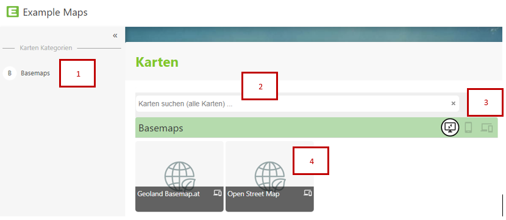

Map Portal (Map Collections)
===============================

Since there can be several maps for different use cases, the entry point for WebGIS is a map portal (or a map collection).
This portal lists all maps (organized into categories):

1. Maps can be organized into different categories. All categories are listed in the *sidebar* (on the left).
   Clicking on a category lists the corresponding maps.

2. If many maps are offered, there is the option to search for maps:

   .. image:: img/portal2.png

   Clicking in the search field initially lists all maps alphabetically. If you enter search terms, only those maps matching the current search term are shown. This search covers not only the map title, but also any
   existing map description, as well as *keywords*, which can also help find maps more easily (e.g. a map *Cadastre* can also be found via the keyword *Parcels*).
   Clicking on one of the tiles opens the *map viewer* with the corresponding map.

3. Some maps are optimized for specific target platforms (desktop, phone). Depending on which end device you use to start, different maps
   are shown. Which maps are preferentially shown on which platform is determined by the *map author/administrator*. If you still want to use the
   maps for a specific platform despite the recommendation (e.g. desktop maps on a phone), the view can be changed with the *platform buttons*:
   (desktop maps, phone maps, maps for all platforms)

4. The *tiles* are the entry point to the map applications. Clicking on a tile opens the corresponding map.
   Moving the mouse (without clicking) over the map title (gray area) shows additional information about this map (if available).
