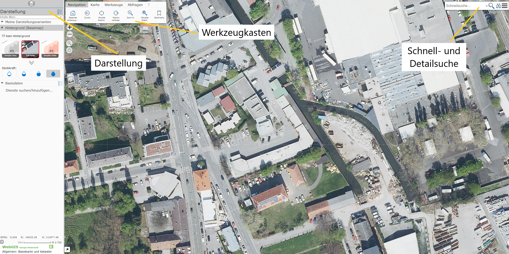
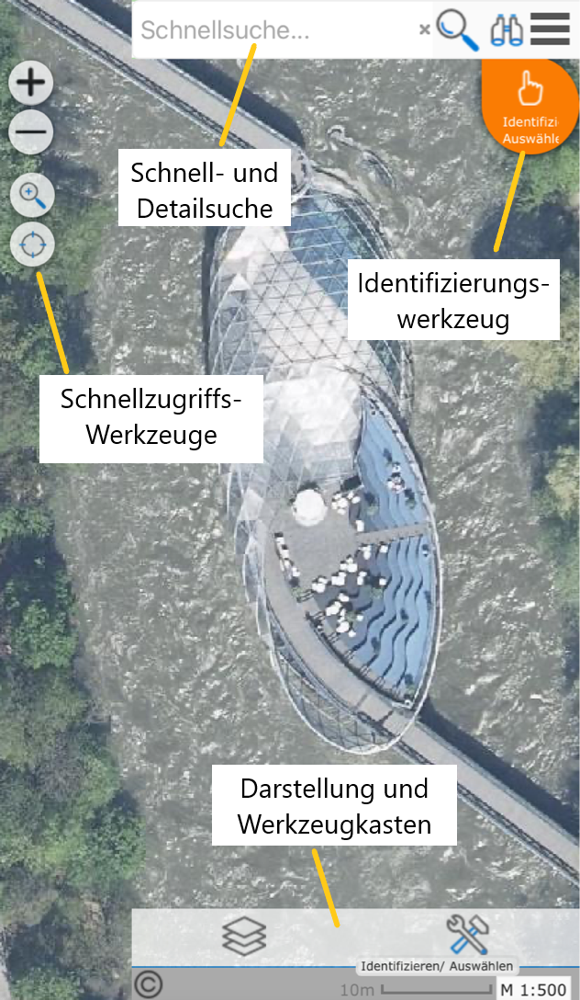
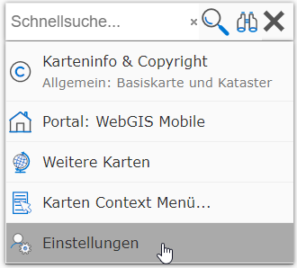
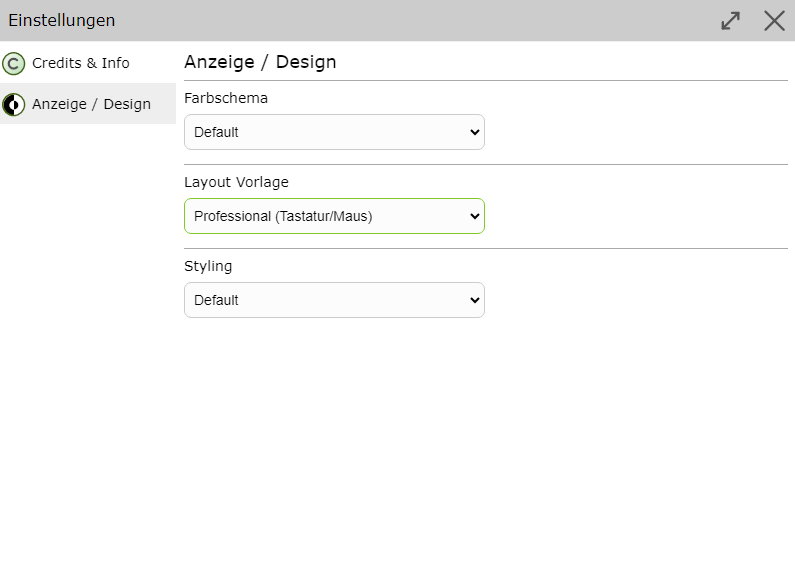

User Interface
==================

After opening a map, the map viewer appears in the following form:

Not all elements shown here need to be visible in a given map. The individual elements are set by the map administrator
so that efficient operation is possible for the respective application.

On mobile devices, the appearance adapts accordingly:

The user interface can be customized in terms of display/design. To do this, go to the settings under *Display/Design*.

| Here you can customize the *color scheme*, *layout template*, and *styling*.
| For the layout template, you can choose between *Mobile (Standard)* and *Desktop (Professional)*. The desktop template offers a more user-friendly interface, especially for users who do a lot of editing.
