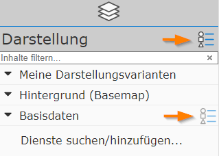
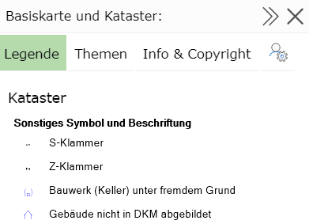
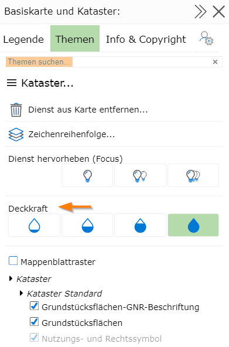

.. sectnum::
    :start: 4

Legend and Topics
==================

Due to complex cartography, the content of a map is not always self-explanatory. To be able to match the symbology on the map to the corresponding object,
a legend is often helpful.

The legend shows all cartographic symbols with an explanatory label.

The legend can be opened via the presentation-variant tree:

Every container, as well as the entire *Presentation* block, offers a *menu* icon. Clicking it opens a corresponding window with further functions.

.. note::
   Clicking on the menu icon in the *Presentation* block opens the properties window for all topics. If you are only interested, for example, in the legend
   for *Base Data*, it is enough to click the menu icon for that container. The content is then restricted to only what is contained in that container,
   which is clearer for most applications.

Clicking on the *menu icon* opens the following dialog:

.. note::
   **Tip:** the window can be widened or narrowed again via the arrow icon in the title bar. Clicking on the title bar has the same effect.
   Maximizing/minimizing by clicking on the title bar also works for all other dialogs shown in the map viewer.

   The **X** icon can be used to close a dialog again.

The dialog is additionally divided into different *tabs* (Legend/Topics/Description and Copyright/Map Info).

Legend
-------

The cartographic symbols are shown here. These are grouped by map service.

.. note::
   **Background:** the thematic data shown in the map viewer generally comes from at least one map service. These services perform the cartographic processing of the data
   according to the individual settings made by the user.

The legend view is dynamic. What is shown depends on the current visibility of the topic layers. Changing the scale or the map extent can also change the content of the legend.

Topics
------

The already mentioned map services (which are responsible for the cartography) consist of (often very many) individual topic layers. Meaningful groupings of these topic layers can be shown or hidden via presentation variants
(see the section Presentation and Map Content). Generally, these predefined toggles should be sufficient.
For special requirements, however, it can happen that the predefined settings are not sufficient and a different combination of topic layers is desired.
For this, all possible individual topic layers of the map services are listed in this dialog and made toggleable here.

.. note::
   The topic tree can become very extensive and confusing. Several hundred layers are often the norm. To make it easier to navigate the tree, topics are sometimes grouped together.
   In addition, as with the presentation variants, there is the option to restrict the tree to a search term via a *Search topics...* search field.

The dialog also offers the option to make individual map services transparent via the *xx% buttons*:

As with the presentation variants, topic layers that are not visible at the current map scale are shown in *gray*.

Description and Copyright
--------------------------

This area shows a description and a copyright text for the individual map services (if available).

Map Info
----------

Further information for the current map is shown here:

* Name of the map and name of the map group/category

* (User name) of the map author/administrator

* Your own user name with which you are logged in to use the map (if anonymous access is not allowed)

* Credits/acknowledgments for the map viewer application

* Administrators can access the admin tools for the map from here (MapBuilder...)

