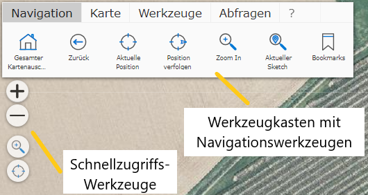

.. sectnum::
    :start: 2

Navigating the Map
=======================

Navigation in the map can be done with the mouse (on desktop), with the corresponding swipe gestures (mobile devices),
or a combination of both.

Navigation with the Mouse
-------------------------

* **Panning the map:** to do this, click into the map with the left mouse button and, while holding the mouse button
* down, move the map. Releasing the mouse button ends the process.

* **Zooming the map in/out:** this can be done using the mouse wheel. Rolling the mouse wheel forward
* zooms out, and vice versa.

Navigation with Swipe Gestures
------------------------------

* **Panning the map:** touch the map with one finger and move it.

* **Zooming the map in/out:** touch the map with two fingers and pull them apart,
* which zooms out. The reverse gesture zooms in.

Navigation Tools:
-------------------------

Depending on availability, various navigation tools are available in a map, either in the toolbox or as
quick-access tools.

The quick-access tools are usually located at the top left directly on the map (so as not to disturb the
map image, they can be shown slightly transparent):

The quick-access tools usually contain a small selection of the tools that can also be found in the
navigation toolbox. The advantage here is that these tools are
always visible. The toolbox tools are partly hidden. For example,
the toolbox is collapsed by default on mobile devices with a smaller screen at startup.
The quick-access tools additionally offer a simple way to zoom the map out or in
using the +/- buttons.

The toolbox has the advantage that a label for the tool is also shown together with the tool icon.

The following tools are available under *Navigation* (depending on the map author's settings):

* **Full map extent:** this tool maximizes the map extent.

* **Back:** this can be used to return to the previous map extent after panning or zooming.

* **Current position:** attempts to set the map extent to the user's current position.
  This depends on the position accuracy provided by an end device (GPS, ...).

* **Track position:** on mobile devices, this tool causes the map extent
  to follow the user's current position. An arrow icon showing the direction of movement is shown at the
  current position. The current speed is shown in the tool dialog.

* **Zoom In:** this tool allows the user to set the current map extent by dragging a
  "window". If you select this tool, in the next step you can click into the map and, while holding the mouse
  button, drag a window. Releasing the mouse button causes the map viewer to try to
  best fit the current map extent to this window.

.. note::
   **Pro tip:** on desktop devices with a keyboard, dragging a window is also always possible without
   this tool. To do this, drag a window in the manner described above while holding down the ``Shift``
   key.

.. note::
   Dragging a window with the ``Shift`` key should not be confused with dragging a window with the ``Ctrl``
   key. This does not change the map extent, but instead queries the
   map objects (parcels, addresses, ...) within the window (see the *Search and Query* section).

* **Current sketch:** with various tools that will be covered later (measuring, creating/editing objects),
  a so-called *sketch* can be drawn. This is a kind of outline drawing of an object.
  If such a *sketch* is present on the map, this tool sets the map extent so
  that the entire sketch is fully visible.

