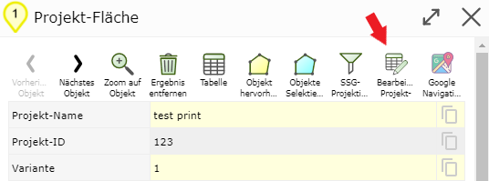
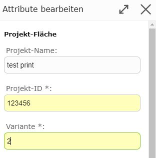
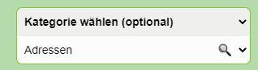
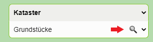
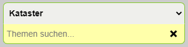

Build 3.0.3902 (2020-09-24)
===========================

Editing Attributes from Search Results
---------------------------------------

If geo-objects that are also editable are found via a search or query, the attribute data
can be edited directly. To do this, it is no longer necessary, as before, to switch to the *Edit* tool and
select the geo-objects there.

.. note::
   Geo-objects can be found both with the quick search and with the detailed search.
   Geo-objects are queried with the *Identify* tool by clicking or dragging a window.

For this, a new button now appears in the detail results of the corresponding geo-object:

.. note::
   The *button* is only available for geo-objects that may also be edited.
   A user must have special permissions for this.

Clicking on the *button* opens an attribute form with which the attribute data can be changed.

When the dialog is completed with ``Save``, the attribute data is changed accordingly in the database.

Categorized Selection Lists for Search and Edit Topics
------------------------------------------------------

In extensive maps, selecting search topics in the detailed search or with Identify is often tedious.
The topics are indeed shown grouped (by service) with headings, but since the list
can be very long, you often have to *scroll* for a long time to find the desired topic.

*Categorized* selection lists offer a simplification here. These are available for the detailed search, for
the Identify tool, and for edit topics.
For the detailed search, the selection list looks roughly as follows:

The selection list now consists of two selection lists. The lower (white) selection list
corresponds to the previous list with topics. By default, all groups with all topics are shown here (as before).

In the upper (gray) selection list, all groups (headings) are listed. If you select a
group here, only the topics of that group are shown in the lower selection list. This makes the list
shorter and clearer. Unnecessary scrolling can thus be avoided.

If you want to show all topics in the selection list again, you must select the group ``--- All --``
(or the original setting ``Select Category (optional)``).

Another feature of *categorized* selection lists is that topics can also be searched for by entering text.
To activate the search, click on the *magnifying glass* icon:

This causes an input field to appear in place of the second selection list:

In this field, terms matching the name of the topic can be entered.
Immediately after entering each character, matching topics are shown in the list. If you select a suggestion
(by clicking on it), it is automatically taken over into the selection list.

.. note::
   **Note:** The search for topics always relates to the currently set group (e.g. above
   *Cadastre*). Only topics from this group are found. If you want to search in all groups,
   the selection must be set to ``--- All ---`` or ``Select Category (optional)``.
