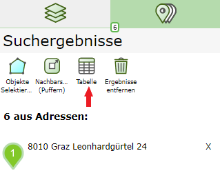
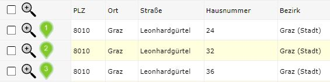
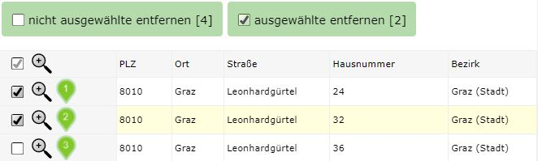
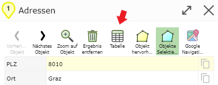
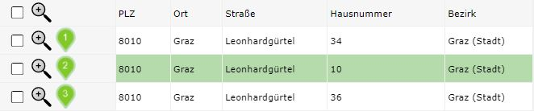
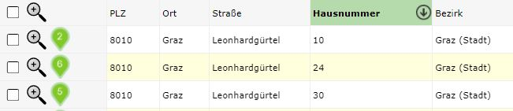

Build 3.0.4002 (2020-10-01)
===========================

Results Table
---------------

After a search or query, the results are first shown in the results list.
Clicking on a result there shows the details of this geo-object in a dialog.
Alternatively, the results can also be shown in a table with all fields.
The table can be reached via the search results area, where the results list is also found:

The table offers tools that apply to all results, for example *Export as CSV for MS Excel*.

As of Build 3.0.4002, the table additionally offers the following functions:

In the first column, additional *buttons* (*checkbox* and *magnifying glass*) are offered.

Using the *checkbox*, individual rows can be selected. This can be used to remove results from the
list. If you select rows, further *buttons* appear above the table, to delete marked or un-
marked rows:

After removing the rows, the corresponding *markers* are also removed from the map.

.. note::
   There is also a *checkbox* in the header row of the table. This can be used to toggle all *checkboxes*
   of the individual rows.

.. note::
   The two *remove buttons* only appear when at least one row has been selected.
   However, the *buttons* also disappear if all rows are selected, since it is not possible
   to delete all rows of a query.
   If you want to remove all results, this can be done, for example, via the *Remove Results button*
   in the search results area:

    .. image:: img/table4.png

The *magnifying glass icon* is used to zoom the map to the area of the corresponding geo-object.

.. note::
   The *magnifying glass icon* is also found in the header row of the table. This causes the map to
   zoom to an area containing all query results.

When zooming via the *magnifying glass icon*, the table remains open. The default behavior of the table is
that clicking on a row also zooms to the geo-object. However, here the
table is closed and the detail results for this geo-object are shown.

The detail results offer additional tools for this geo-object (e.g. navigation, filter, etc.).
New here is that a tool is now also offered for detail results, to jump directly to the table view:

If you open the table from a detail result dialog of a geo-object, the table jumps to the corresponding
row and shows it marked:

**Note:** The table can also be sorted by one or more columns. To do this, click on the
corresponding heading(s).

1. Click: sort by this column
2. Click: reverse sort order
3. Click: remove sorting

