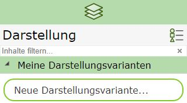
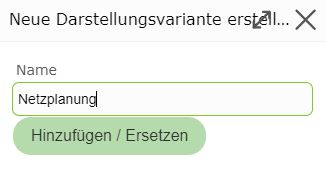
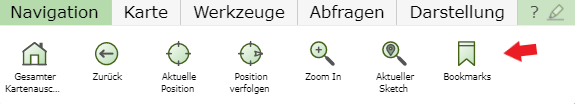
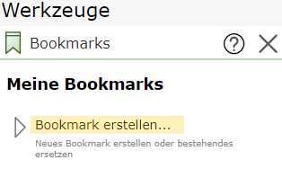
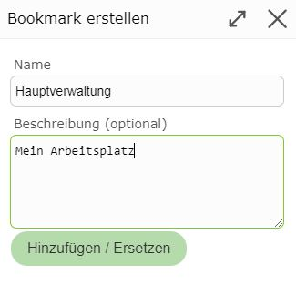

Build 3.21.1501 (2021-04-14)
============================

My Presentation Variants
---------------------------

With *My Presentation Variants*, user-defined presentation variants can be created for each map.

Once the ideal layer configuration has been found for a map, it can be saved and reused again and again for that map.
To do this, under presentation variants, click on ``New Presentation Variant`` under ``My Presentation Variants``:

This opens a dialog in which a name must be assigned to the presentation variant:

The new presentation variant then appears in the ``My Presentation Variants`` area and can be reused for this map at any time.

.. note::
   If you want to replace an existing user-defined presentation variant, the procedure is the same. If an already existing
   name is entered in the dialog, the presentation variant is replaced. As a help, existing presentation variants are offered via *autocomplete*
   as soon as the first characters are entered in the input field.

.. note::
   If you have added additional services to a map with ``Add Services`` and these are affected by the presentation variant,
   these services are automatically reloaded the next time the map is opened, as soon as the presentation variant is selected.
   This means *user-defined presentation variants* can also replace saving projects. Another advantage compared to projects here is
   that several *user-defined presentation variants* can be defined per map.

Bookmarks
---------

If you keep zooming to the same geographic areas (operating region, project area, ...), it is recommended to create bookmarks.
These allow you to jump to the geographic areas with just a few clicks.

Bookmarks are created globally for the user. This means all bookmarks are available in all maps. Regardless of which WebGIS map you open,
you can use the bookmarks to zoom to the desired area.

Bookmarks are managed via the following tool:

Once you have zoomed to the desired area and then click on ``Create Bookmark``, the following dialog opens:

Here, a name and optionally a more detailed description can be assigned.
Clicking on ``Add/Replace`` shows the *bookmark* in the list. Clicking on a *bookmark* allows you to zoom to the defined area again at any time.
The current presentation is retained.

Bookmarks are not map-specific, which means all created bookmarks are available in all maps.
