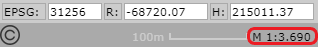
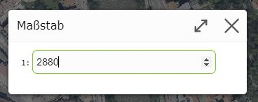
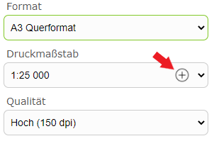
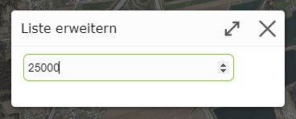

Build 3.21.1608 (2021-04-29)
============================

Map Scales (Free Zooming)
------------------------------

Until now, the scales for displaying the map on screen were necessarily determined by the scales of the preprocessed background map tiles (street map, aerial imagery, ...).
Since the jumps between these scales are sometimes large and the preset scales are not optimal for every use case, *free zooming* is possible as of this version.

The same tools as before are available for zooming:

* **Gestures:** two-finger zoom gestures for devices with touch operation
* **Zoom tool:** dragging open a window once
* **Shift key:** while holding down the *Shift key*, you can always drag open a window with the mouse to zoom to. This method is independent of the currently active tool.

Due to free zooming, the display scales are no longer *round* numbers:

If you want to switch to a specific scale, this is done as before by clicking on the scale display.
However, a selection list is no longer shown here; instead, a *free* number input field is shown in the dialog.
Entering the scale is confirmed with the *ENTER* key:

Print Scale
------------

When printing, the output scale can be specified via a selection list with preset scales.
If these preset print scales are not sufficient, individual scales can also be entered for one-time use.

For this, a *plus* icon is shown in the selection list:

Clicking on the *plus* icon opens a dialog in which you can enter the desired scale:

Confirming the dialog with the *ENTER* key extends the selection list with the new value and automatically switches to the new print scale.

.. note::
   The extended print scales are only retained for the current print job. As soon as the print tool is closed, only the preset print scales are available again.

.. note::
   There may be print layouts that only allow printing at certain scales. For these, the *plus* icon is not available.
