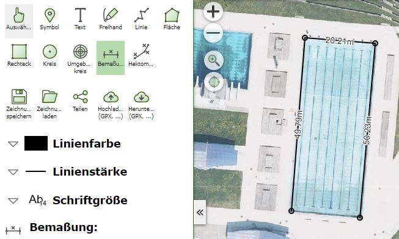
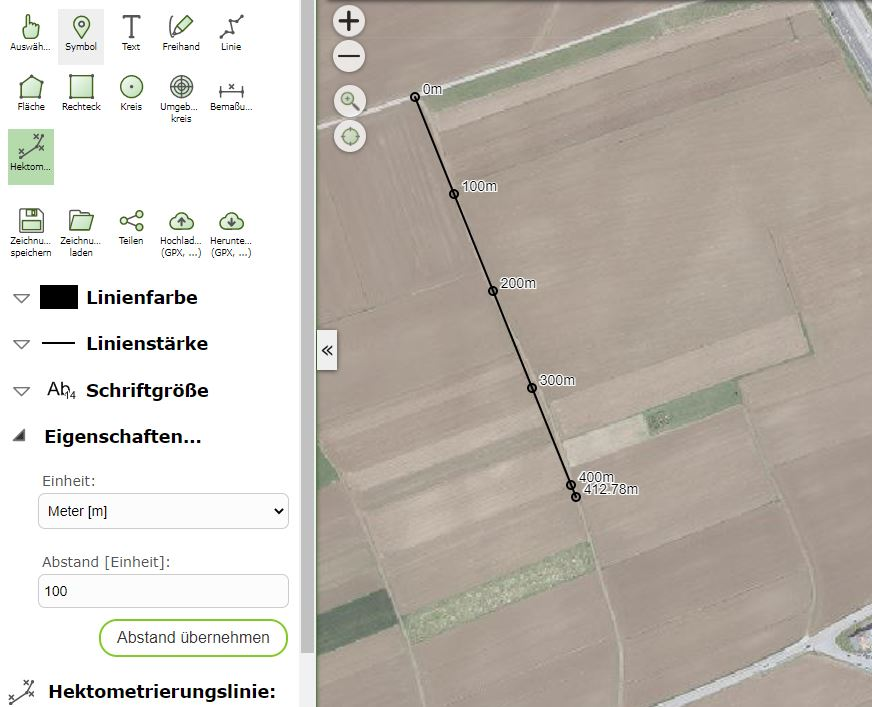

Build 3.21.2403 (2021-06-16)
============================

New redlining tools were introduced with this build. With redlining, simple graphics (lines, areas) and text can generally be added to a map and printed.

The following new graphic types were introduced:

Dimension Line
--------------
For inserting simple dimension lines with automatic labeling of the individual segments.

Chainage Line
---------------------

Line on which points at a certain distance (e.g. 100m) are marked and labeled

