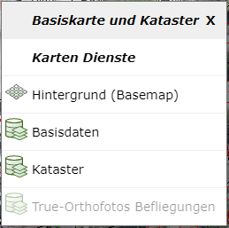
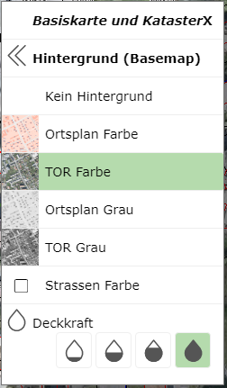
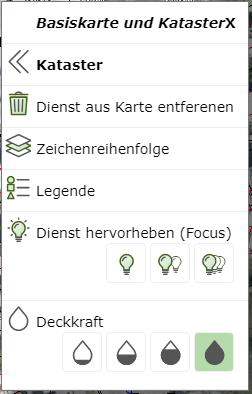
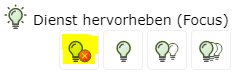
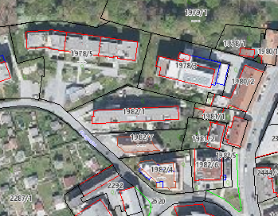
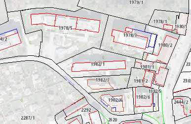
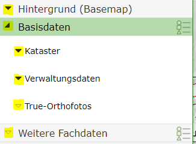
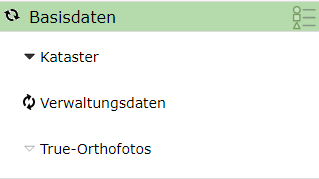

Build 3.21.4601 (2021-11-17)
============================

In this release, a context menu for the map was introduced, allowing faster access to the properties (e.g. transparency, focus, legend) of the individual services.
In addition, the map background (street map, aerial imagery) can be quickly and easily switched via the context menu.
The context menu appears with a right-click on the map and is currently only available in the *desktop* variant (not on mobile).

In addition, the **Focus** property was introduced for services. Focus is comparable to making services transparent. However, here the opacity for the desired service
is set to the maximum value, and all other map services are shown transparently (see below).

Small changes were also made to the presentation variants tree (hourglass, ...)

Map Context Menu
------------------

The context menu for a map appears when you right-click on the map.

.. note::
   The map's context menu is not available when the current tool is a drawing tool (sketch tool, e.g. redlining, measuring, editing, ...).
   There, the right mouse button is already reserved for the sketch's context menu (construction tools).

The heading shows the name of the current map (here: *Base Map and Cadastre*).
Clicking on the heading or the ``X`` icon closes the context menu again.

Under the ``Map Services`` section, all services included in the map are listed. If a service is shown
in *gray text*, no topics for this service are currently switched visible at the current map scale.

The first entry under ``Map Services`` is always ``Background (Basemap)``. Clicking on this entry lists
all available background services in the context menu:

The currently shown background service is highlighted. Clicking on a background service activates it
in the map. At the end of the list, the opacity for the current background service can be set.

With ``« Background (Basemap)``, you can switch back to the original list of services in the context menu.

If you move the mouse pointer over an entry in the list of map services in the context menu, only that service is
shown in the background on the map. This should help identify the desired service in the map.
Clicking on a service opens the context menu for that map service:

The following options are offered here for the service:

* **Remove service from map:**
  The service is removed from the map. This only applies to the current session. If you open the map at a later
  time, this service is back in the map. This of course does not apply to services that were manually
  added to the map during the session.

* **Draw order:**
  Opens the *draw order* dialog for this map. There, the service can be moved up or down.

* **Legend:**
  Opens the *legend dialog* for this service.

* **Highlight service (Focus):**
  Here, the service can be highlighted. This property is also a new feature of this release and is described
  in more detail below.

* **Opacity:**
  Here, the opacity/transparency for this service can be set.

Highlighting Services (Focus)
-----------------------------

With this function, services can be highlighted relative to all map services. In overloaded maps,
the problem often arises that the *crucial* information is difficult to distinguish from less important content.

With *Highlight Services (Focus)*, all services are shown *transparently* (less intensely) (including the background service).
The affected service is shown with full opacity. The *degree of highlighting* can be determined via the light bulb icon:
the more light bulbs, the higher the *focus*:

The *focus* for the service can be set via the context menu for a service described above. If you select a *focus level*,
an icon to end the *focus mode* is also additionally shown. Clicking on this icon restores the
original state of the map:

.. note::
   The icon for ending *focus mode* appears in several places. This is useful for recognizing that *focus mode*
   is active and that it can easily be ended again:

  .. image:: img/focus2.png

What focus does is shown in the following example:
In a map, the aerial imagery and the cadastre are each shown with full opacity. Due to the colorful presentation
of the aerial imagery, not all details of the cadastre can be easily recognized:

If you apply focus to the cadastre service, the following presentation results:

The background is still present here for context, but the crucial information (cadastre) is
better recognizable.

.. note::
   The same effect could also be achieved by making the background service transparent. However, if there are
   several services in the map, *focus mode* is easier to set up for a single service.

Presentation Variants Tree
---------------------------

The icons for expanding groups are shown in two variants:

* **Black (filled) triangle:**
  Indicates that this group contains topics that are switched visible.

* **White (outlined) triangle:**
  In this group, there are currently no topics switched visible.

The different *icons* help provide an overview of which containers/groups currently have visible topics in the map.

When the map is rebuilt, an hourglass icon is shown in the presentation variants tree, indicating from which groups data
is currently being loaded:

