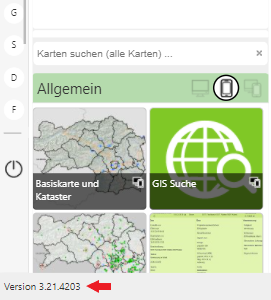
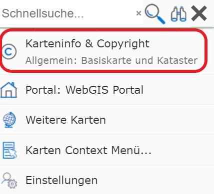
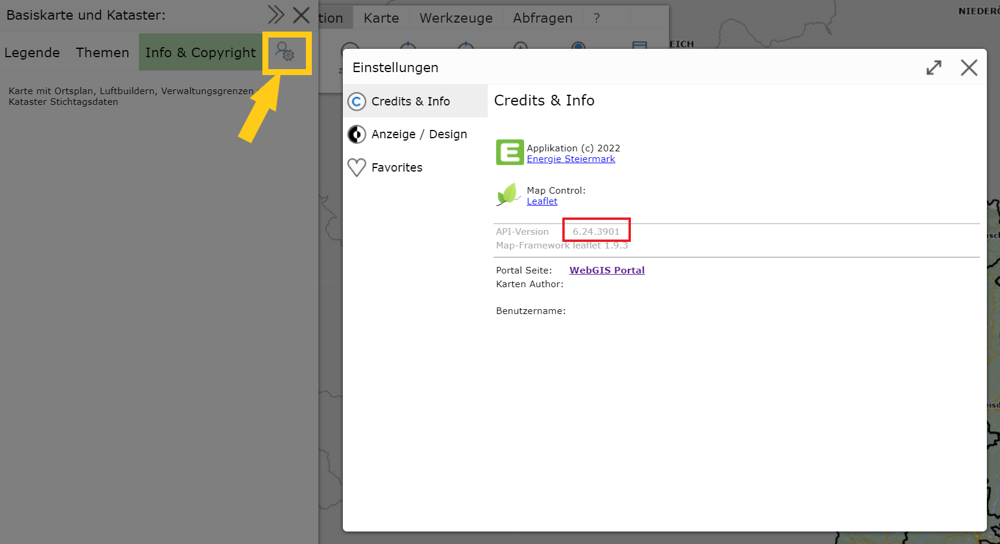

.. sectnum::
    :start: 7

New Features
============

This section describes new features of the map viewer that are relevant to the user.
As a reference, the individual chapters here correspond to the build numbers of the software and the *release* date.

.. toctree::
   :maxdepth: 1

   index.rst

Which *release* is currently used depends on the service provider. For the user, the
current version can be found in different places in the interface:

**Portal Home Page**

The version number is shown here in the *footer* of the page:

**Map Viewer**

For the map viewer, you must first click on ``Map Info & Copyright`` in the menu (top right):

From there, via ``Map Info`` and ``Credits``, you reach the following view, where the version number
can be found:

