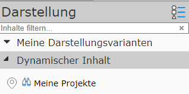
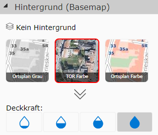
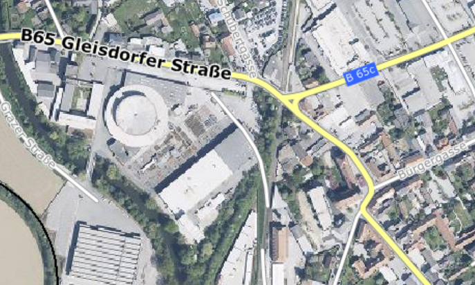
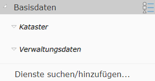
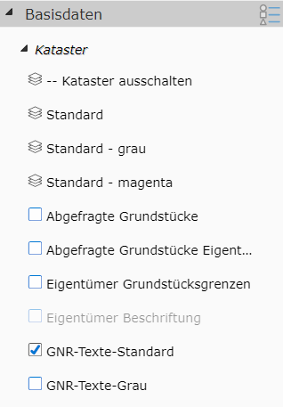
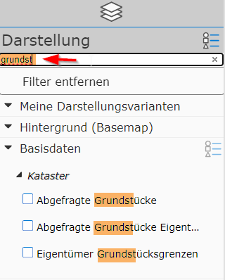

.. sectnum::
    :start: 3

Presentation and Map Content
=============================

Different maps have different content. For example, a map with cadastre data and another with data from zoning are both conceivable.
Of course, a map could also cover both topic areas. The map author determines what content is in a map. Only the general
concepts of how the presentation of map content can be organized, and how the user can influence it, are described here.

The map content is mainly set in the map viewer in the **Presentation** area (usually in the left *frame* on desktop, at the bottom of the screen on mobile devices - see overview).

There are generally different types of geodata that can also be handled in different ways in the map viewer:

Dynamic Content
------------------

Dynamic content is usually very specific data and is not present in every map. It is usually shown at the very top of the list of presentation content and can be shown or hidden separately.
Dynamic content is shown on the map as clickable markers. Only one of these topics can be shown on the map at any given time.

Dynamic content usually serves to provide very dynamic topics (which can change quickly) on a map.
Since it is shown on the map as markers, it behaves like the results of a query/search, and can therefore also be understood as a predefined query.
Queries/searches will be covered in more detail in a later section.

Background (Basemaps)
----------------------

This data is more static and mainly serves for orientation on the map. It is usually located below all other data on the map (background).
This background data is usually aerial imagery or town and street maps. The data is usually area-filling, so only one
background can be shown at a time.

In the presentation area of the map viewer, the background maps appear roughly as follows:

Clicking on one of the tiles switches the background. The *No background* button sets all background maps to *invisible*.
If there are more than three possible background maps, the tile view can be expanded with the arrow icon (down arrow below the tiles).

The *xx% buttons* indicate the transparency of the displayed background.

.. note:: The transparency makes the background appear "lighter," which can lead to better contrast for some applications when overlaid with thematic data.

Optional background maps (so-called *overlay* maps) can, if available, be placed over the actual background map (here *Street Colors*).
This makes sense, for example, if streets and street names should be placed over an aerial imagery map for orientation:

.. note::
   Since background maps usually contain static data, they are available as so-called map tiles. These tiles already exist pre-calculated on the server for all scales,
   which makes the display particularly performant and provides *smooth* transitions when navigating the map.

Presentation Variants (Thematic Data)
-------------------------------------

This is the data that is actually decisive for a map application. Unlike background maps, this data is generally not pre-processed for all scales, but
is generated individually for each map extent based on the user's requirements. This data is therefore more similar to *dynamic content* (see above), with the difference that here on the map
not only *clickable* map markers are shown. Instead, this data appears as a cartographically processed map image that is placed over the background maps.

As a result of this, this data is naturally not shown as *smoothly* as, for example, the pre-calculated background map tiles. In return, however, the user
can have significantly more influence on the content and presentation of this data. The user can decide which data layers should be shown and which should not. A wide variety of data layers can be combined as desired using
presentation variants.

.. note::
   Because the *thematic data* map images are generated dynamically and individually for each user request, it can happen that the display takes
   a few moments after the map extent is changed. The performance of these services depends on the amount of data shown and the cartographic complexity of the maps. The map viewer therefore shows
   a progress indicator in a status bar (bottom left):

   .. image:: img/hourglass1.png

   Once all data has loaded, the progress indicator disappears and the current scale and the scale bar are shown in its place:

   .. image:: img/scale1.png

   **Tip:** clicking on the scale opens a dialog in which the current map scale can be set.

In the map viewer, the presentation variants are organized in expandable containers in the *presentation frame*. Which presentation variants are available depends on the content of the map and the
respective permissions.

The containers contain the *toggleable* presentation variants for each topic group. The figure also shows that these presentation variants can be further subdivided into groups within a container (Base Data),
(Cadastre, Administrative Data). Once this group is expanded, the *clickable* presentation variants appear:

The presentation variants can be shown with different icons:

* **Layer stack icon:** clicking on the presentation variant makes the corresponding layers visible. Clicking on a layer stack usually affects several layers. Other layers that do not make sense for this view are hidden. In the example here, for instance, the cadastre is hidden in gray colors when you click on the presentation variant with the cadastre in "magenta" colors.

* **Checkbox icon:** the *checkmark* icon can be used to show or hide optional presentation variants. Several data layers can also be behind this presentation variant, logically grouped into one presentation variant.

* **Option box icon:** a *radio button* icon can be used (just like the *checkmark* icon) to optionally show topics. The difference here is that these topics are mutually exclusive. Only one *option box* can be active within a group.

.. note::
   How the presentation variants are organized, and which data layers they show, is defined by the map author. The presentation variants should help the user reach their goal as easily as possible,
   without needing exact knowledge of the underlying data structure. For example, the user may only want the option to show the cadastre. However, it doesn't matter to them
   whether that involves the topics parcel boundaries, usage boundaries, building boundaries, usage symbols, parcel numbers, ...

.. note::
   Some presentation variants are listed in *gray*. This means that the topic layers that can be shown with them are not visible at the current scale (a click will not immediately show the
   desired topics on the map). If you zoom further into the map, these topics will eventually become visible, and the presentation variant will no longer appear *gray*.

The reason for the scale-dependent display is usually that not all topics make sense at every scale. Parcel boundaries, for example, don't make sense at a very small scale (e.g. an entire federal state)
and would only slow down the map build-up.

Tips and Tricks
----------------

Maps with a lot of thematic data can have quite extensive presentation-variant trees. Depending on experience, several clicks may be needed to find a presentation variant.
To speed up this process, you can search for presentation variants in the tree. For this, there is a small input field directly above the topmost container (desktop only), labeled *Search content...*

If you enter a value here, all irrelevant presentation variants and *containers* disappear, and all relevant groups are shown expanded.

Clicking on the found presentation variant activates it, and the presentation-variant tree is shown again in its original form.
You can also click on a relevant group to open it in the original tree and show the presentation variants below it.

If you want to show the presentation-variant tree in its original form again, the content must be deleted from the *Search content* input field.

