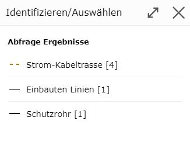

Query
--------

A query is done by clicking on a geo-object with a corresponding query tool.
The various query tools are located in the toolbox, in the *Query* section.

This section will be covered in more detail later. Here, only the basic principle of querying is shown, i.e.
querying with the *standard* tool.

Standard Tool
+++++++++++++

When you open the map viewer, the *standard* or *default* tool is usually active. This tool is always active
when no other tool from the toolbox is active.

On desktop, this tool can be recognized by the mouse cursor: a *pointing finger* with a blue *(i)*.

The pointing finger indicates that the *standard* tool can be used to pan the map extent.
The blue *(i)* stands for *identifying* geo-objects.

The following functions can be performed with the *standard* tool:

* Panning the map extent while holding down the mouse button

* Zooming the map extent in/out with the mouse wheel

* Querying the attribute data of a geo-object by clicking

.. note::
   The first two points also work with almost all tools from the toolbox.

.. note::
   On (mobile) devices with touch operation, clicking on the map works via the *Click Bubble* tool (see the *Click Bubble* section under Tools).
   The advantage of the *click bubble* is that it avoids accidental clicks while navigating and provides higher
   precision when clicking.

Clicking on the map with the tool queries the geo-objects of all topics for the desired location, for
which a query is allowed (and which are also visible based on the topic visibility settings and the scale).

If the query was successful and unambiguous, the results are shown immediately.
The query is not unambiguous if geo-objects from different topic layers are found. If that is the case,
a dialog opens in which the desired topic can be specified:

Along with the name of the topic layer, an icon from the topic's legend is also shown, which can be helpful
for selecting the desired topic layer. In addition, it is also shown (in square brackets) how many objects are affected by this query.

Once a topic layer is selected, the query becomes unambiguous and the results are shown.

.. note::
   The intermediate step described here is necessary because the map viewer can only ever show the query and search results
   of exactly one topic layer at a time.
