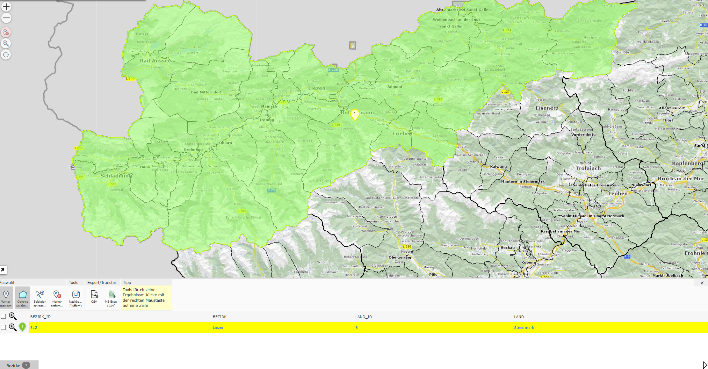
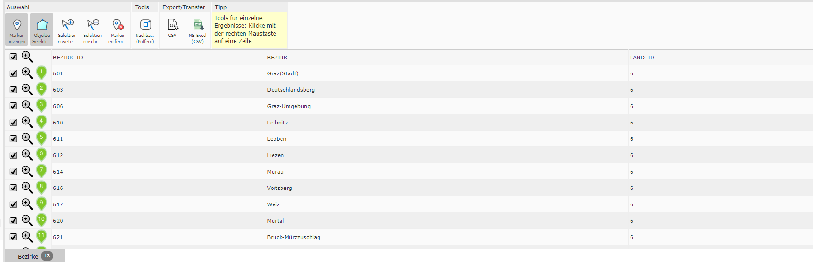
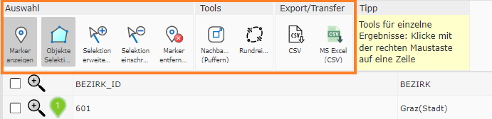
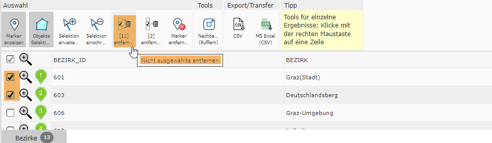
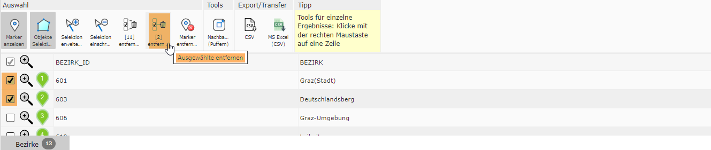
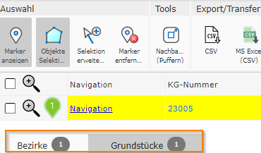

Results in Desktop Layout
============================

The result table in the desktop layout differs slightly from the table in the mobile layout.

Detail Results
----------------

The table for detail results is shown the same way as when several results are shown as a table.

Result List
-------------

Table Tools
------------------

The following table tools are available in the tables:

The functions of the table tools are identical to those in the mobile layout.

If you select entries in a table with several results, two additional table tools appear. These are used to either remove the unselected results or to delete the selected result from the list.

Table Tabs
-------------

Another difference from the mobile layout is the presence of tabs. A tab opens for each query topic. The number of results is shown to the right of the tab label.

If you query a topic again, the previously provided tab is replaced by the updated query result. How to prevent already-open tables from being closed by a new query is described in the next subchapter.

Results History
-------------------

There is no classic history like in the mobile layout in the desktop layout. Instead, it is possible to pin the tabs. To do this, click on the pin icon to the left of the label.

Then, an individual description must be entered into the label field.

Pinning prevents these results from being lost. It is also possible for the table to be shared as well when using *Share Map*.
