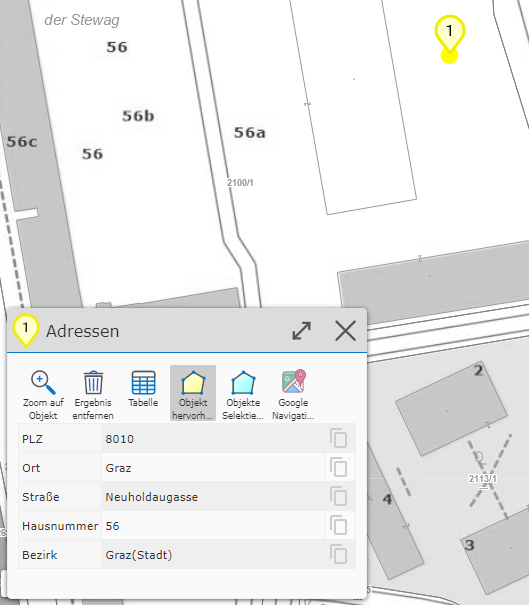
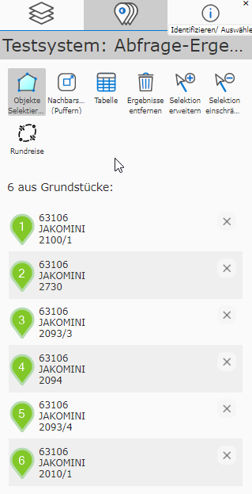
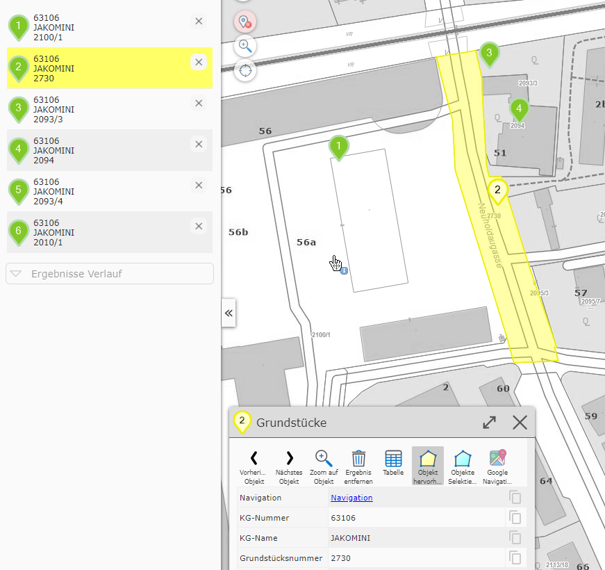
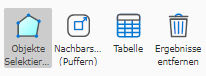
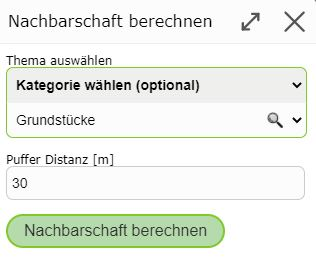
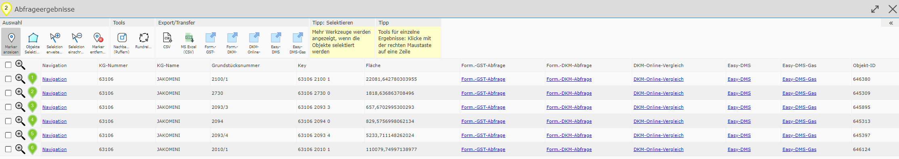
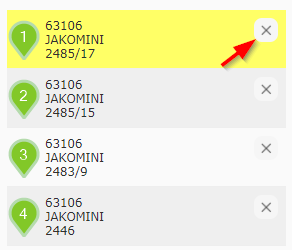
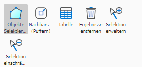
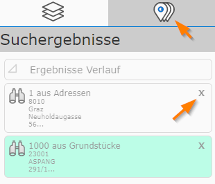

Results in Mobile Layout
===========================

Detail Results
----------------

If a search or query returns exactly one result, in addition to the marker on the map (shown with a marker icon),
a dialog with the detail results (attribute data) is also opened:

The attribute data is shown here in a table. The attributes shown differ for each topic layer
and are defined by the map author. For an address, the attributes could, as in the example here, be postal code, street,
house number, town, district. The corresponding value is shown next to the attribute name.

.. note::
   **Tip:** on the far right, a gray *clipboard* icon is also shown in each row. This can be used to
   copy the corresponding attribute value to the clipboard for further processing.

.. note::
   **Tip:** if a topic shows a lot of attributes, they only become visible by *scrolling* down.
   Alternatively, you can maximize the height of the dialog by clicking on the title bar. The
   dialog can be minimized again in the same way.

In addition to attribute values, a query result can also contain further links. For example, the result
of a query on a municipality might contain a link pointing to the municipality's homepage. These are also
shown in this window and can likewise be copied to the clipboard.

Tools are located above the result table. Depending on the query, these may be more or fewer
than the tools shown here.

The following tools are always present:

* **Zoom to object:** clicking this adjusts the map extent to the result.

* **Highlight object:** if this button is selected, the current object is highlighted (usually shown with a *yellow* background).

* **Select objects:** pressing this button selects the results (shown with a *cyan* background).

.. note::
   The **Select objects** item refers to all results of a query, not just the one currently shown.
   Selecting results is necessary for further processing of the results, for example when editing
   geo-objects or when transferring query results to redlining (see later, in the description of results).
   In addition, the selection is also visible in the printout.

Result List
-------------

If several geo-objects are affected by a query or a search, they are shown on the map.
The detail results, however, are not shown immediately, because only one object can be shown
in the detail view at a time.

.. note::
   An exception is the table view of all results.

For this reason, the results are initially shown as a list with a few (preview) attributes:

The list appears as its own *tab* in the left map viewer frame, next to the *Presentation tab*.
The *tab* also shows a number corresponding to the number of results, which is also visible when the *tab*
is not currently active.

The content of this *tab* shows the results and offers a few tools.
Clicking on one of the (preview) results shows the corresponding detail results and adjusts the
map extent. The geo-object is automatically highlighted (with a *yellow* background), both on the map
and in the list of preview results:

The (preview) results can also be matched to the geo-objects on the map via the number in the map marker.

.. note::
   **Tip:** another way to show the detail results of a geo-object is to click on the corresponding
   map marker.

Tools in the Result List
^^^^^^^^^^^^^^^^^^^^^^^^^^^^^^

Additional context-dependent tools are shown at the top of the (preview) result list.

* **Select objects:** corresponds to the button also shown for the detail results. This selects all results for further processing and shows them with a *cyan* background.

* **Proximity calculation (buffering):** this can be used to create a buffer around the current results, based on which a new query is then performed on its detail results.

Before that, a dialog asks which topic the proximity calculation should apply to, and how large the buffer should be:

* **Show table:** this shows all results in a table.

The table can likewise be maximized by clicking on the dialog's title bar.
Clicking on a row closes the table, shows the detail results, and zooms to the corresponding
geo-object.
The table also offers various export options, e.g. export to MS Excel (via CSV).

* **Remove results:** this removes the results from the map and the preview view.

.. note::
   **Pro tip:** query and search results can always be removed from the map, even when the preview
   list is not active. If there are query results on the map, an additional icon appears with the
   quick-access tools on the map:

   .. image:: img/ergebnisse5.png

   Clicking it likewise removes all result markers from the map and the preview list.

.. note::
   **Tip:** if query results are removed, they are not completely lost within a map viewer session.
   Via *Results History* (see below), you can always access previously performed queries again.

Extending/Restricting Results
---------------------------------

The map viewer can only ever show the result of one query or search at a time. Nevertheless, there is the option
to subsequently extend or restrict an existing result.

The easiest way to restrict a result is to remove the corresponding entry from the preview list.
For this (if at least two results are present), an *X* icon is shown for each entry:

This immediately removes this object from the list and the corresponding marker from the map.

Another option is the geographic restriction/extension of results. To do this, click on an already
existing or a new object on the map with the corresponding tool.

These tools are located among the tools above the preview list and are only visible when the results are selected:

* **Extend selection:** select the tool and click on additional geo-objects on the map.

* **Restrict selection:** select the tool and click on selected objects on the map.

.. note::
   The **Restrict selection** tool is only visible as long as at least two results are present.
   A single result cannot be restricted, only removed.

.. note::
   Whether these tools are shown is up to the map author. If this functionality is not
   desired for an application, they are never shown.

Results History
----------------------------

As already mentioned above, query results can be removed from the map in different ways:

* clicking the **Remove button** via the preview list

* the **Remove marker button** among the quick-access tools (pro tip)

* **Triggering a new search/query** automatically removes the currently shown results

Often, however, it is desirable to access previously made search/query results again. For example, if you perform
a proximity calculation, the original results (on which the proximity calculation is based) are *overwritten*.
The *results history* serves to allow access to these results again later.

The history is shown in the *tab* for the query results (if results are currently shown, the
history is located at the end of the list):

All queries already made (within a map viewer session) are shown. The (preview) text indicates
which topic layers provided the results, and how many geo-objects are affected.

The icon in front indicates how this result was generated:

* **Magnifying glass icon:** the result was generated via a search.

* **Buffer icon:** the result was generated via a proximity calculation.

* **Identify icon:** the result was obtained via a query.

Clicking on a history item immediately restores the query. If you want to permanently remove an item from the history,
this can be done with the *X* icon. The corresponding query results are then permanently removed.
