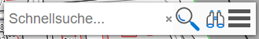
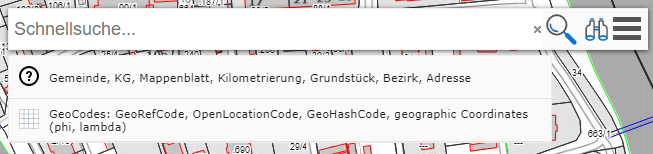
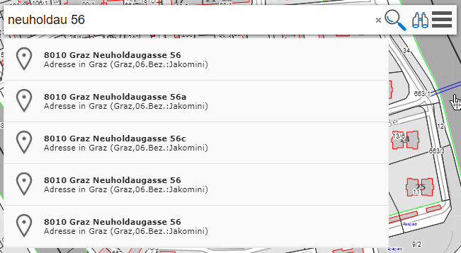
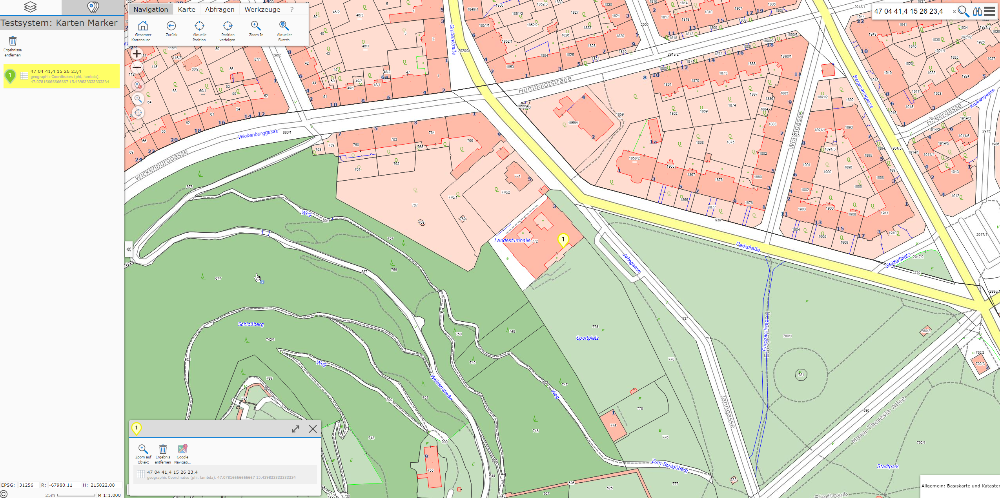
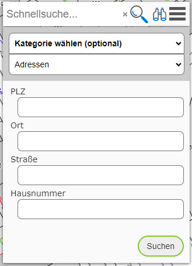

Search
------

There are two options for searching for geo-objects:

* **Quick search:** search for objects by entering search terms into an input field. The result is narrowed down more and more as terms are entered.

* **Detailed search:** a topic is selected in a search form, and input fields for defined search terms are offered for it.

Both methods are reachable via the search tool (usually in the top right of the map viewer). The detailed search opens by clicking on the *magnifying glass icon*.

Quick Search
++++++++++++

As the name suggests, the quick search offers a simple, fast, and convenient way to find geo-objects.
The behavior here is similar to common search engines. After entering a few characters, the first suggestions appear, which are then further narrowed down as more
search terms are entered.
Search terms are separated from each other by a space. The order in which the terms are entered is generally not relevant to the result.

.. note::
   Not all topics can be found via the quick search. For a performant search, topics must be included in a special search index. It is up to
   the administrator/map author which topic layers are included in this search index. These are usually topics that are searched for frequently, e.g. addresses, places, parcels, ...

If you click into the input field only (without typing a character), a suggestion field appears, listing the possible topics in the quick-search index:

Clicking on this suggestion opens a dialog with a further description of the topic or input examples.

.. note::
   This option is only offered if the search index used provides "meta" information.

If you type a few characters/terms for an address, for example, suggestions appear in real time. Not all matches are shown, only the best-fitting suggestions.
If the desired suggestion is not in the list, further search terms usually need to be entered.
If the desired suggestion is in the list, it can be selected by clicking. The map viewer changes the map extent, and the attribute data for the found geo-object is
shown.

If several suggestions are shown, you can hover over (without clicking) these suggestions with the mouse to make the map viewer change the map extent accordingly.
The same behavior can also be achieved with the ``cursor`` keys (up/down).

If you want to show all results on the map that match the entered search terms, click on the *magnifying glass icon* on the right of the input field.

**Entering Coordinates**

In addition to search terms, geographic coordinates and *GeoCodes* (Google Plus Codes, geohash codes) can also be entered into the quick-search field.
If you click into the search field without entering a search term, a suggestion for entering coordinates is shown. Clicking on this field opens a window with further
information and suggestions for input.

If a valid coordinate or a *GeoCode* is entered, this is recognized and listed as a corresponding suggestion. Clicking on this suggestion jumps the map viewer
to the corresponding extent. The size of the extent depends on the precision of the entered coordinate (more decimal places => smaller map extent):

Detailed Search
+++++++++++++++

The form for the detailed search is opened via the *magnifying glass icon* in the search area of the map viewer:

Unlike the quick search, here the user must first decide which topic should be searched.
For this, corresponding input forms are offered for each topic. After entering some characters, the input fields sometimes
provide selection lists.
Generally, not all fields need to be filled in, but the result can be further narrowed down if more
search terms are specified.

After entering the search terms, you can click the *Search* button. If results are found, the map extent is
adjusted accordingly and the results are shown.

