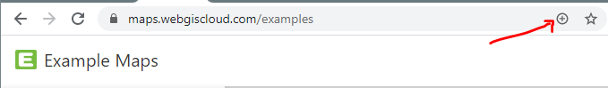
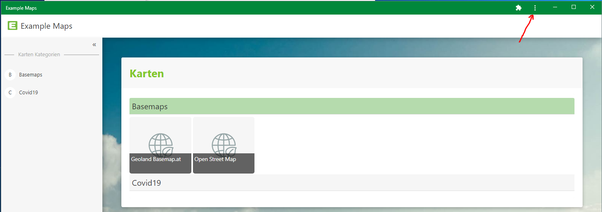

Installing as an App (PWA)
==========================

If desired by the WebGIS operator, the WebGIS portal can also be installed as an app on a mobile device (phone, tablet) or for Windows 10.
This makes the application appear with an icon on the home screen, or on the desktop under Windows. Opening this app no longer opens WebGIS in a browser, but instead appears in its own standalone window.
This achieves better use of the map view on small displays. Another advantage is better caching of content (icons, scripts, ...), which can lead to faster loading of the application.

Installation does not happen via the respective store; instead, the WebGIS portal page must still be opened via the browser as before. However, the browser shows either a corresponding icon for installing (on Windows)
or a direct prompt (on Android).

On iOS, the installation must be done manually (see below).

Installation on Windows 10
---------------------------

Here, you must first navigate to the WebGIS portal page with the (Chrome) browser. If installation is possible, a *plus icon* appears in the address bar:

Clicking on this icon shows a prompt to install the app. This places an icon on the desktop. Corresponding icons are also created in the Start menu and can optionally be pinned to the taskbar.
If you open the application via the created icon (desktop, Start menu), it appears in its own window (no longer in the browser):

In the title bar of the window, there is a *menu icon* (see figure above), which can be used to uninstall the app again.

Installation on Android Devices
--------------------------------

Here, you must first navigate to the WebGIS portal page with the (Chrome) browser. The browser then generally shows a prompt asking whether the app should be added to the home screen. If this does not happen automatically, it can also be done via the
browser menu (``Add to Home Screen``).

The app is uninstalled when the icon is removed from the home screen.

Installation on iOS (iPhones or iPads)
-----------------------------------------

.. note::
   On iOS (iPhone or iPad), there is no prompt or dedicated icon to initiate installation.
   Here, you must first open the WebGIS portal page with the Safari browser, then click on the *Share icon* and select ``Add to Home Screen`` below it.

   .. image:: img/pwa1.png

The app is uninstalled when the icon is removed from the home screen.
