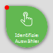
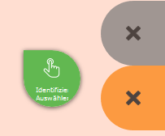
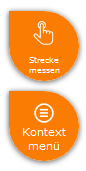

Click Bubble
============

Short Description
-----------------

Instead of clicking on the map, drag the "bubble" onto the map to the desired position.

Detailed Description
------------------------

Some tools require a click on the map, e.g. identify and select, drawing, etc.
Since on mobile devices with touch operation it is not always easy to click exactly on the desired position, this gadget is available.
It also helps improve the usability of the map, since accidental clicks on the map while zooming or panning do not immediately trigger an action.

.. note::
    As long as the "bubble" is active, clicking on the map does not trigger any action. All gestures then only serve to navigate the map.

To use the tool, the "bubble" must be dragged to the desired location. As soon as the "bubble" turns green, it is active.
The tool is triggered directly after release, at the point the top-right tip is pointing to.

After being triggered, the "bubble" returns to its starting position.

While dragging, two areas marked with an "X" become visible on the left.

.. note::
    On mobile devices with small displays, the gray area may not be available due to space constraints.

If you drag the "bubble" onto one of these areas, it immediately changes color. The colors have the following meanings:

* **Orange area**

    The "bubble" should return to the resting area. This can be desirable, for example, if the drag was accidental and no action should be triggered.
    If you drop the "bubble" in the orange area, no action is triggered.

* **Gray area**

    If you drag the "bubble" into this area, it is deactivated. When the "bubble" is deactivated, a tool can also be triggered by clicking on the map.
    This can be desirable if, in addition to gesture control on the device, you also want to use another input medium such as a mouse or a stylus.
    To reactivate the "bubble," you can simply drag it from the gray area onto the map (thereby triggering an action),
    or drag the "bubble" into the orange area (no action).

The "bubble" also appears with the drawing tools. This allows vertices to be placed individually by dragging the "bubble."
In addition, a second "bubble" for the context menu appears with the drawing tools.

The second "bubble" opens the context menu for the (drawing) sketch and thus corresponds to the right mouse button. Since it is often important where you open the context menu,
you can also drag this "bubble" to the desired location to open the menu. For example, to delete a vertex, drag the "bubble" onto the vertex and select
"Delete vertex" from the menu.

