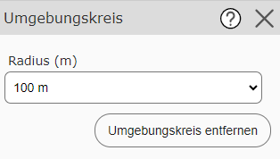
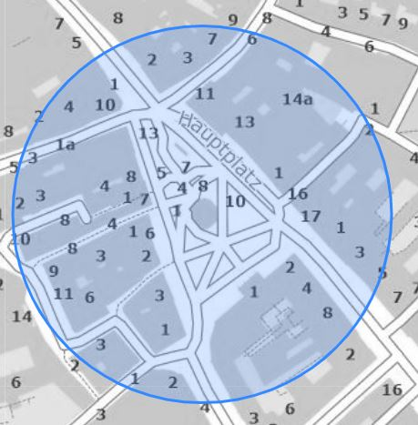
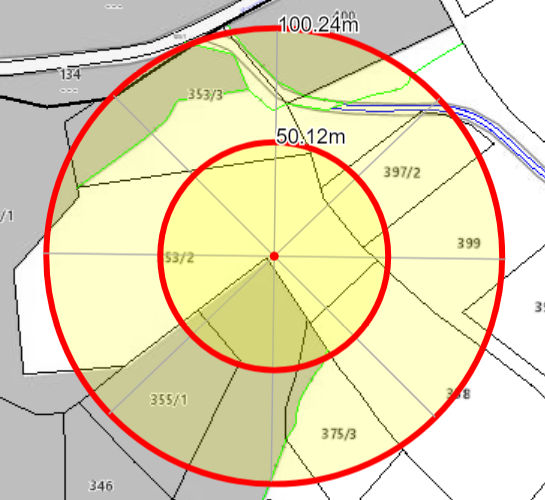

Buffer Circle
==============

The buffer circle is a simple *measurement* tool. Clicking on the map defines the center
of the circle. Predefined values are offered for the radius in the tool dialog:

Clicking on the map repeatedly repositions the circle each time.

The tool is deliberately kept simple and mainly serves to
easily estimate distances on the map:

Further options are offered by the *buffer circle* that can be created with the *drawing (map markup)* tool (e.g. custom radius, labeling, printing).

