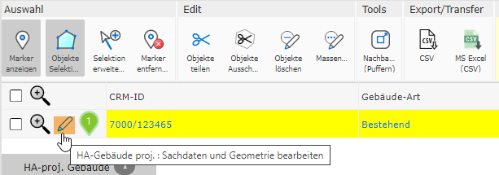
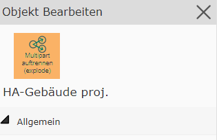
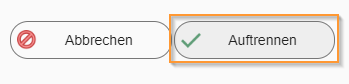
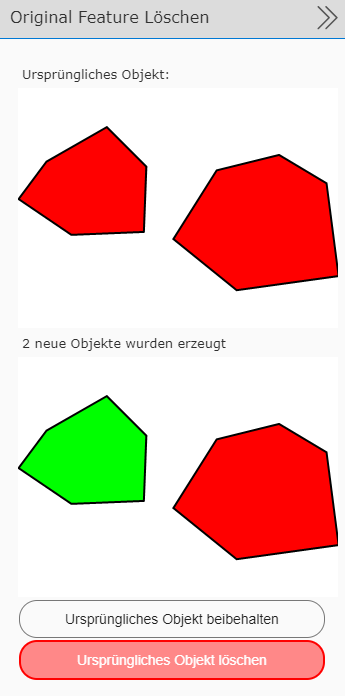

Splitting a Multipart Geo-Object (explode)
==========================================

| A multipart object can also be split back into its individual geometry parts.
| For this, the geo-object must be selected on the map (only one multipart object may be selected at a time to perform this action).
|
| To split the object, you must jump into the edit form via the *pencil icon* in the table.

Here, the *split multipart (explode)* tool then appears in the top-left corner of the dialog.

Clicking this tool takes you to the dialog showing the attribute data of a geo-object.

Clicking ``Split``, you can then choose whether to keep the original object or whether it should be deleted.

