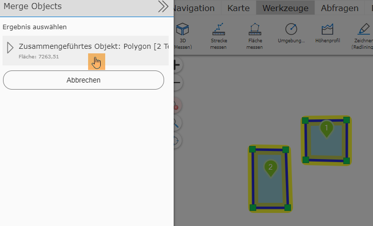
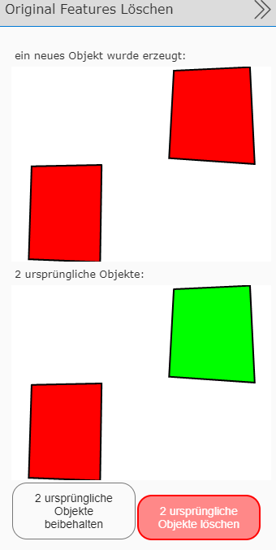

Creating Multipart Geo-Objects (merge)
=======================================

| This tool can be used to create a *multipart object* from several objects, which is a geo-object consisting of several parts.
| For this, at least two geo-objects must be selected. In the query table, the tool *Merge (merge - selected objects)* then appears.

.. image:: img/merge.png

.. note::
    Creating multiparts is not allowed for all geo-objects! This is determined in advance by the map administrator.

First, you must specify which object the attributes should be taken from.

.. image:: img/merge_1.png
    :width: 250px
    :height: 450px

| This is confirmed by clicking the ``Merge`` button.
|
| Afterwards, you must confirm this once more, by clicking *Merged object: ...*.

Now you can again decide whether to keep the original object or not.

