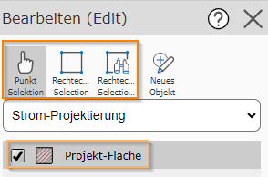
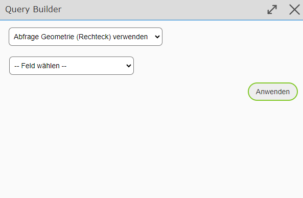

Editing an Existing Object
=============================

Unlike in the mobile layout, the geo-object to be edited must be selected beforehand. For this, the new interface offers three selection tools: *point selection*, *rectangle selection*, and *rectangle selection with query assistant (QueryBuilder)*.

The *rectangle selection with query assistant (QueryBuilder)*, which allows more targeted queries, opens the following dialog window:

.. note::
    To be able to select an object, it must be selected in the list under the drop-down.

Once one or more objects have been selected, the query table opens. The pencil icon can be used to edit the respective object.

.. image:: img/bearbeiten.png

Further Editing Methods
---------------------------

.. toctree::
   :maxdepth: 3

   edit_cut_d.rst
   edit_merge_d.rst
   edit_explode_d.rst
   edit_massattributation_d.rst
