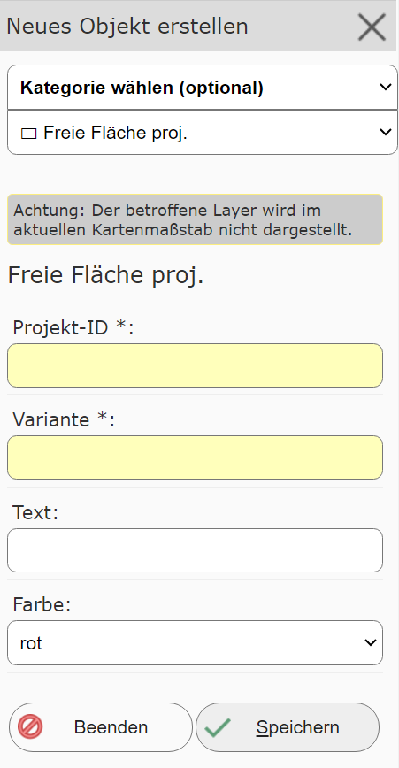
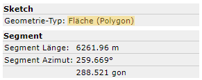
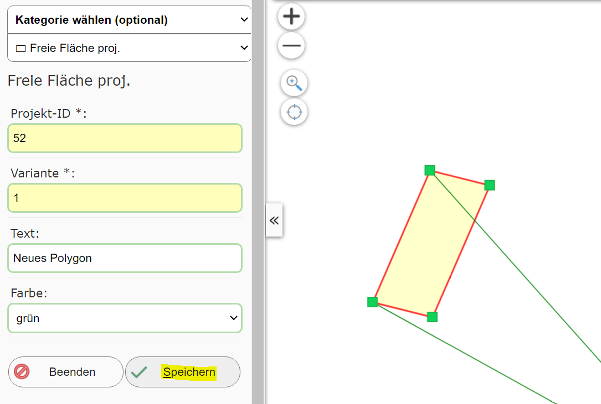
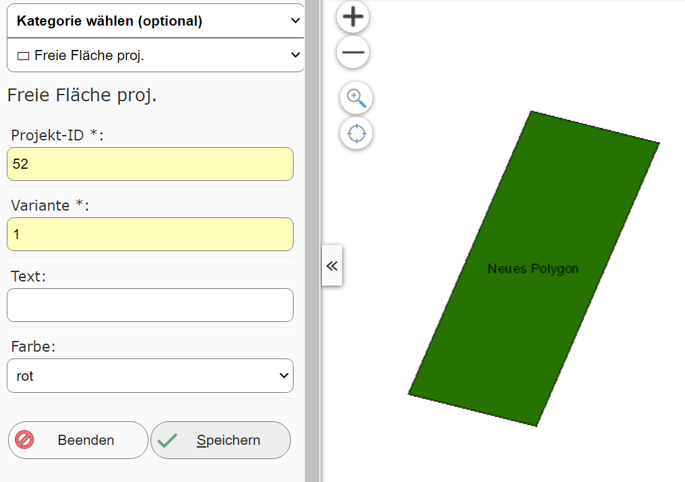
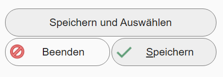

Creating a New Object
=====================

Clicking this (sub)tool opens a new dialog with a creation form.
The first selection list in the dialog is used to choose the topic for which a geo-object should be created:

Changing the topic here usually also changes the attribute data that needs to be entered for this topic.

.. note::
   To be able to take existing objects of a topic into account while editing, the corresponding layers should
   be set visible.
   It is possible that the layer for the desired topic has not yet been set visible on the map.
   If that is the case, the message shown above appears. Clicking ``Show affected layer``
   shows existing objects from this topic on the map.
   It may likewise be possible that the layer is not visible at the current map scale. This is also
   pointed out here as a warning. This can be fixed by zooming to the correct scale (usually
   the map extent needs to be made smaller here).

Once the desired topic is selected, you can start creating. Depending on the topic, a point, line,
or polygon geometry must be drawn/constructed. Which geometry type is involved can be seen in the
*sketch info* below the *create object form*:

In addition, the attribute data in the form must also be filled in (required fields usually have a yellow
input field):

Once all values have been entered correctly and the geometry is valid, the object can be saved to the geodatabase with the ``Save``
button. After saving, the new object should appear on the map,
and a new object can be created:

Depending on the edit theme, there can be different methods for saving a new object. In addition to ``Save``,
for example, there can also be ``Save and Select``:

This exits the editing environment, and the newly created object is shown on the map as if selected via a query.
This can be helpful if the newly created object should, for example, be used further for a proximity calculation.

Depending on the application, the map author may also offer further options, e.g. ``Save and keep all input fields`` (normally
all input fields are reset to the default after saving).

Creating objects can be ended with the ``Finish`` button or by closing the tool dialog.

.. note::
   On end devices, the process described here may change slightly. Here, the geometry must be captured first. Afterwards, you can
   switch to the attribute-data input form via an ``Edit attribute data`` button. The ``Save`` button is then also located there.
