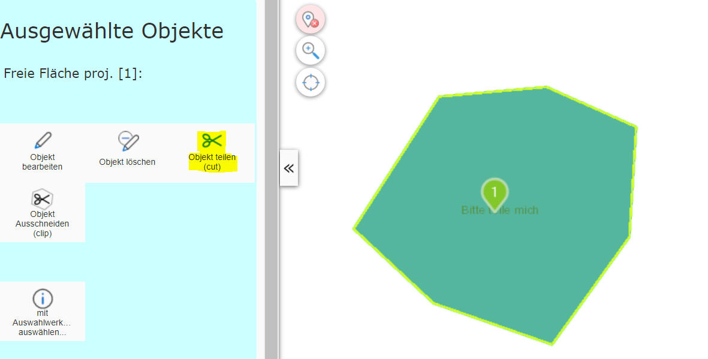
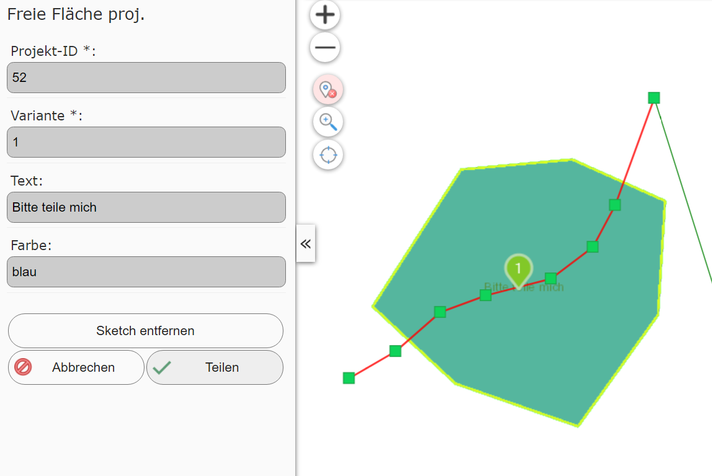
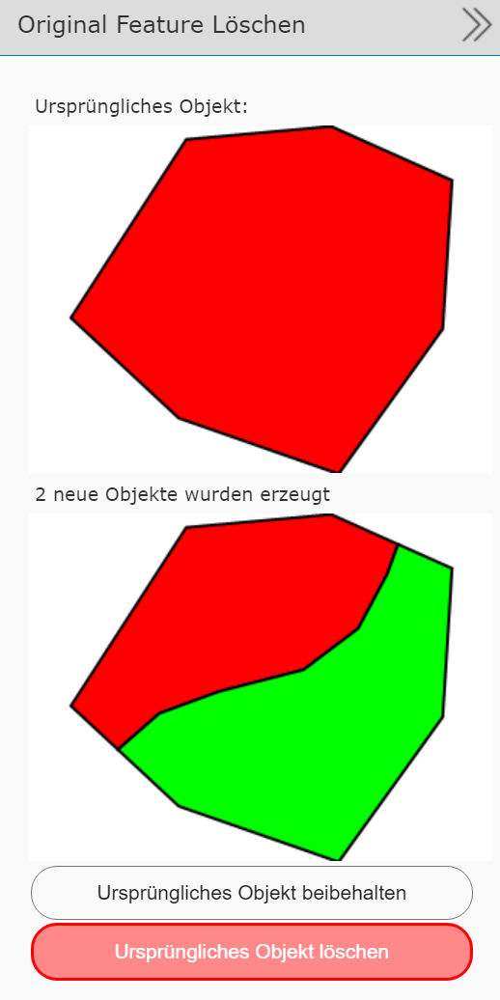

Splitting Geo-Objects (cut)
===========================

This tool can be used to split a line or polygon object into several parts using a cut line.
This requires that the corresponding geo-object is shown on the map selected via the query tool.
In addition, exactly one geo-object may be selected for this process.

Switching to the editing (Edit) tool offers the *split objects* tool:

Clicking the *split object* tool opens a dialog showing the attribute data
of the geo-object. On the map, you can draw a line that is used to split
the object. This line should completely cross the geometry of the geo-object (line or polygon):

The ``Split`` button *splits* the object. A successful split
results in at least two new objects. The attribute data from the original object is carried over into
the new objects. In the dialog shown, you can decide whether the original
object should be kept or deleted:

If you choose ``Delete original object``, the object selected at the start is
deleted.

.. note::
   If you delete the original object, it can theoretically later be restored with *undo*
   (see the previous chapter).

