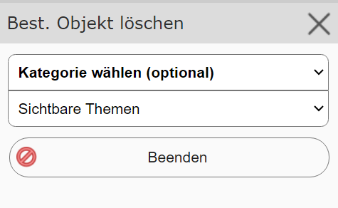
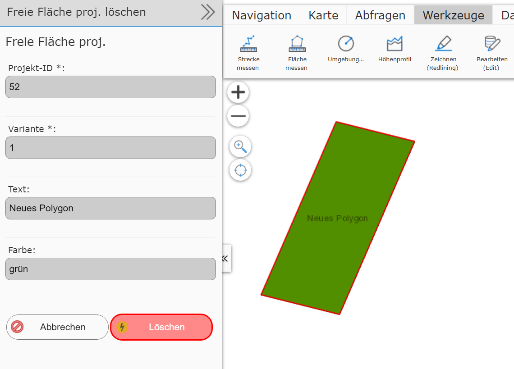

Deleting an Existing Object
===========================

Just as with editing existing objects, an object must first be selected by clicking.
This is again done by specifying a specific object type, or with the ``Visible topics`` option:

Once an object is found, the ``Delete existing object`` dialog opens. Here, the attribute data of the
corresponding object are listed, and the geometry is outlined *red* on the map:

If you really want to delete the object, do so with the ``Delete`` button. Otherwise, the action can be
canceled with the ``Cancel`` button.

.. note::
   Deletion is performed directly on the geodatabase and is generally permanent. For some services, however,
   an undo function is also available (see the next chapter).

