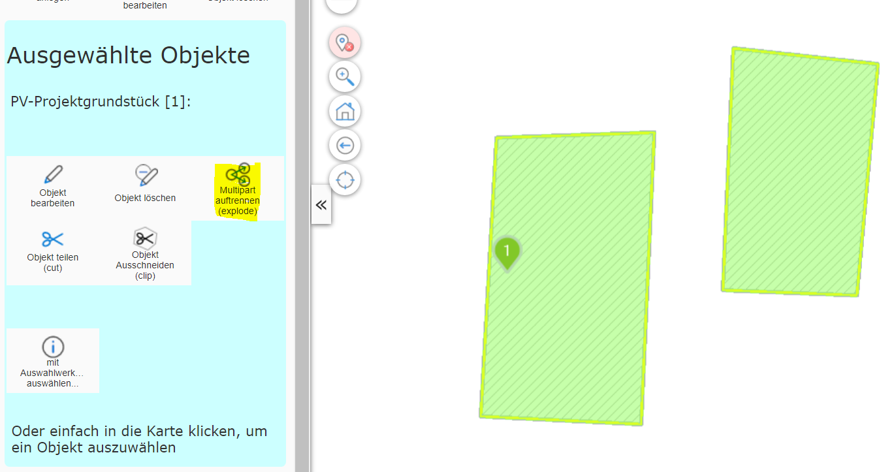
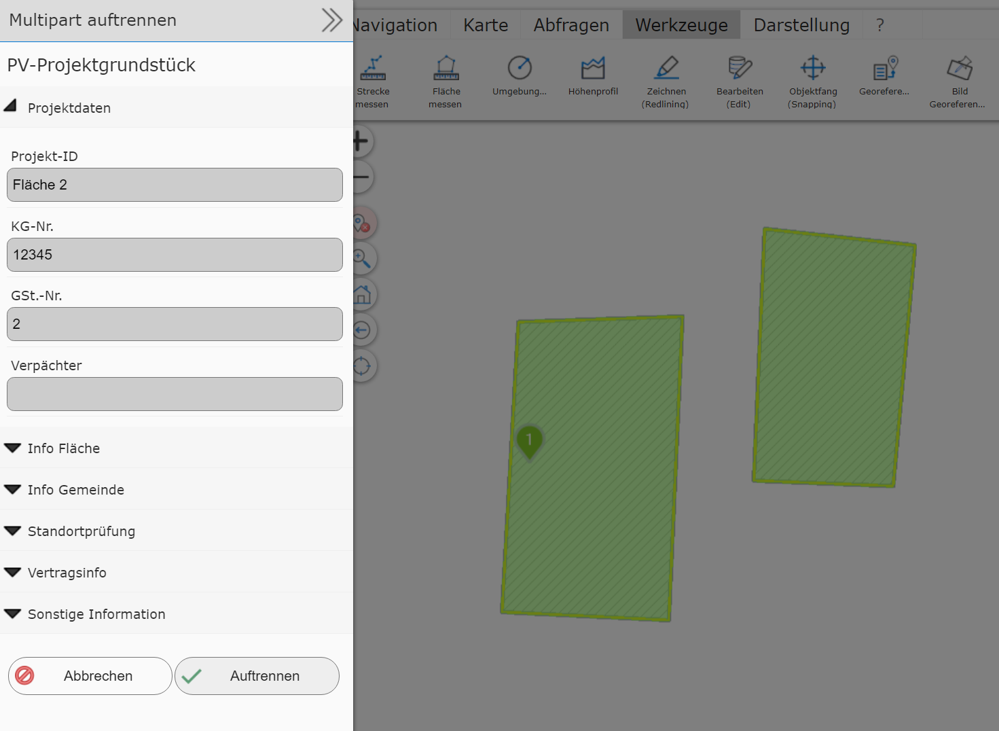
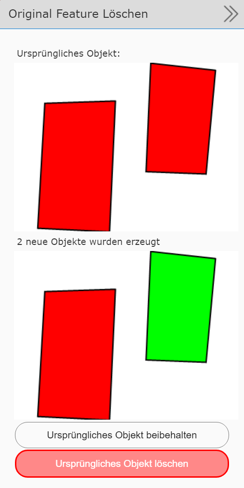

Splitting a Multipart Geo-Object (explode)
==========================================

This tool can be used to split a *multipart object* into its individual geometry parts.
This requires that the corresponding geo-object is shown on the map selected
via a query tool. In addition, exactly one geo-object may be selected for this process.

Switching to the editing (Edit) tool offers the *split multipart objects (explode)*
tool:

The polygon object shown here consists of two sub-areas. Clicking the tool
shows a dialog with the attribute data of the geo-object:

To split the object, click the ``Split`` button. This creates
at least two new geo-objects. The attribute data is carried over from the original object.
You can then still decide whether the original object should be
deleted:

