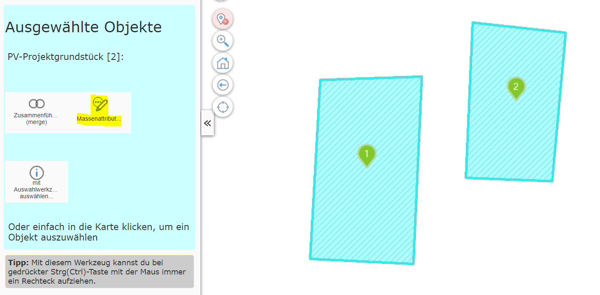
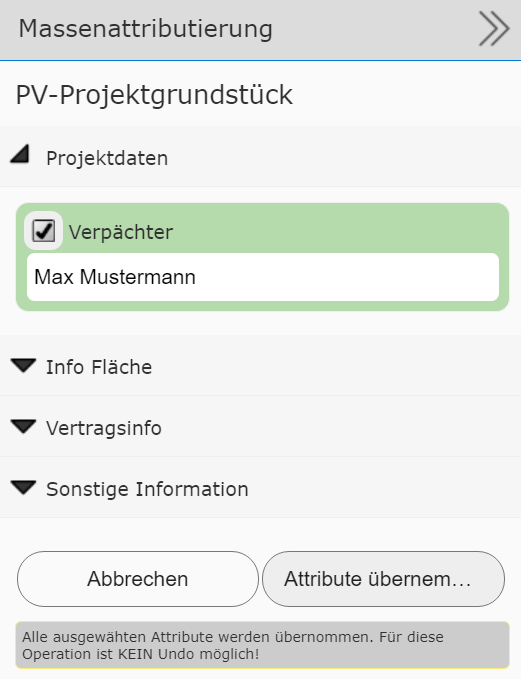

Bulk Attribution
====================

This tool can be used to transfer attribute data to several geo-objects at the same time.
This requires that the objects are shown on the map selected via a query.

Switching to the editing (Edit) tool offers the *bulk attribution* tool:

Clicking the tool shows an attribute form. Here, generally not
all attributes that are also available for editing individually are offered. Which attributes
make sense/are allowed for bulk attribution is decided by the map author:

``Apply attributes`` applies the attribute data to all selected objects.
