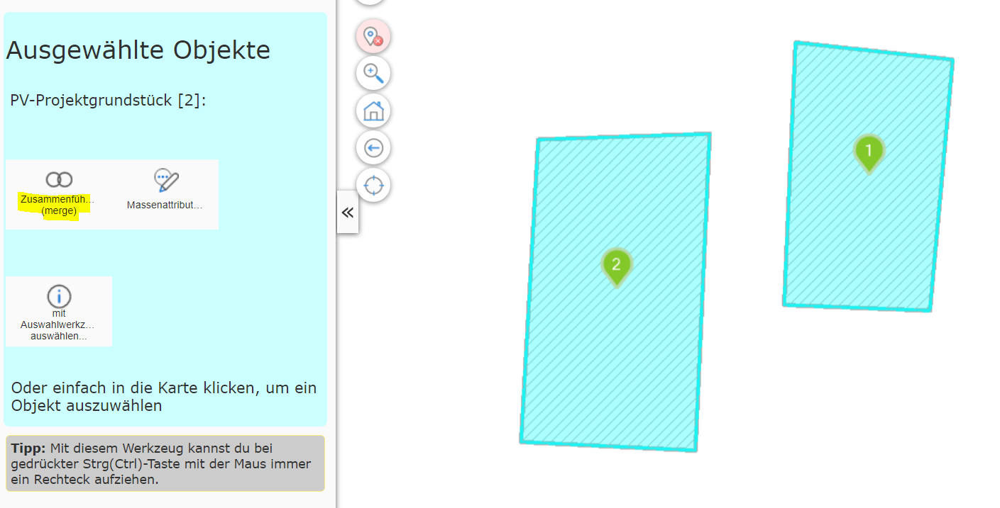
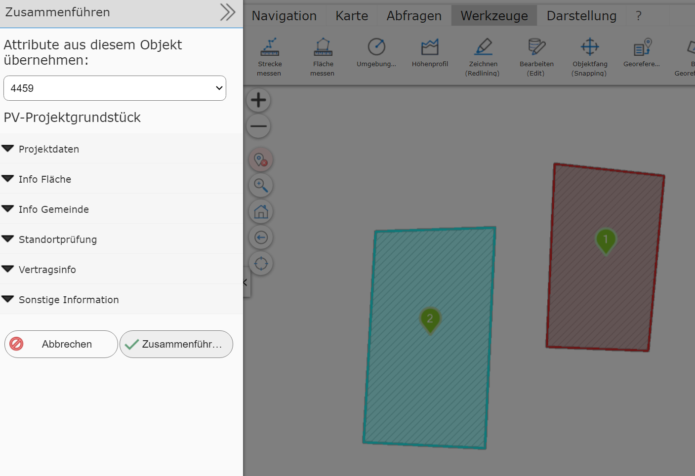
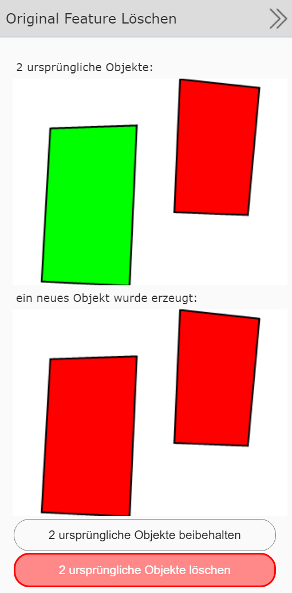

Creating Multipart Geo-Objects (merge)
=======================================

This tool can be used to create a *multipart object* from several objects.
The result is a geo-object with several geometry sections.
This requires that the corresponding geo-objects are shown on the map selected
via a query tool. In addition, at least two geo-objects must be selected for this process.

Switching to the editing (Edit) tool offers the *create multipart* tool:

Clicking the tool opens a new ``Create multipart`` dialog. Since
creating a *multipart object* from many objects results in exactly one object,
the next step is to decide from which of the original objects the
attribute data should be transferred to the new object:

For this, the dialog offers a selection list listing the individual IDs of the original objects.
Changing the ID here changes the attribute data shown for the
corresponding object. The current object is outlined *red* on the map.

Once the attribute data of the correct object is selected, the objects can be merged into a *multipart object* with ``Merge``.
After *merging*, you can still decide
whether the original objects should be deleted:

