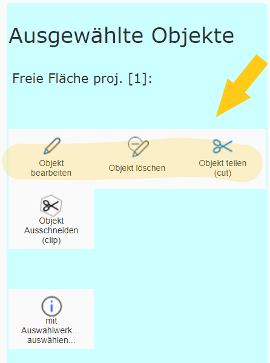

Editing Selected Objects
==============================

For the editing methods shown above, existing objects always first had to be selected by clicking.
If the desired object was already selected on the map via a query or a search,
the steps shown above can also be performed directly.

If an editable object is selected and you switch to the edit tool, *editing tools directly* appear for the current
selection:

Depending on permissions, editing and deleting this object (without the additional step of clicking) is
possible. In addition, depending on the geometry type and the number of selected objects, further tools are available:

* **Split (cut):** if exactly one polygon or line object is selected.
* **Split multipart (explode):** if exactly one line or polygon object is selected whose geometry consists of several sections (sub-areas).
* **Merge:** if several objects have been selected.
* **Bulk attribution:** if several objects are selected and bulk attribution is allowed for the object type by the map author.

.. toctree::
   :maxdepth: 3

   edit_cut
   edit_merge
   edit_explode
   edit_massattributation

.. note::
   **Pro tip:** call the edit tool from the list of results

.. note::
   Use the edit tool to select
