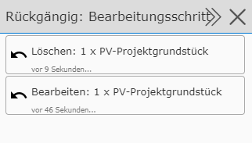
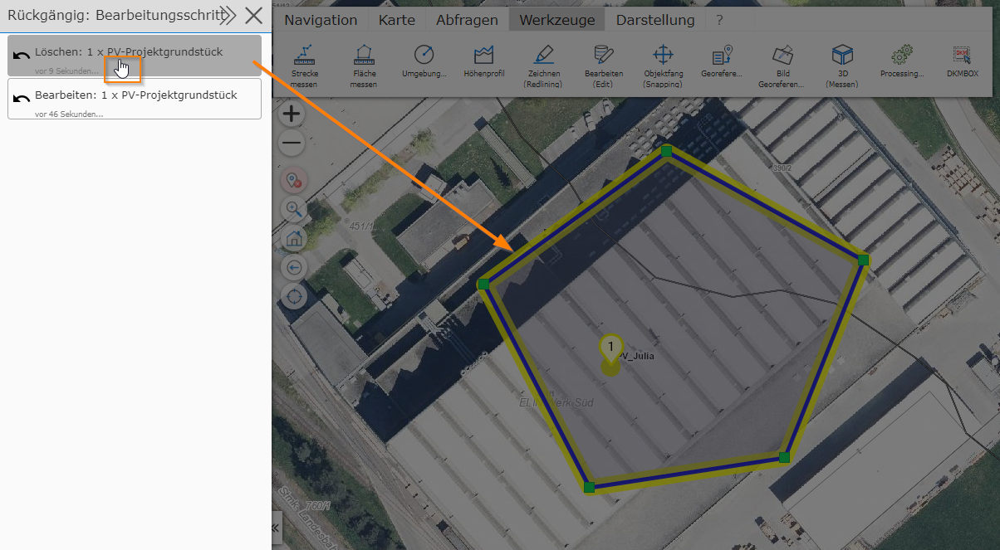

Undoing an Editing Step (Undo)
============================================

.. note::
   An undo function is not available for every map service type. When editing, you should therefore not
   rely on the update being offered.

This tool can be used to undo editing steps. The following can be undone:

* Editing an existing object
* Deleting an existing object

If *undo* is possible, a button appears after editing/deleting existing objects, in the edit tool dialog (at the bottom):

Clicking this button opens the ``Undo: editing step`` dialog:

Here, all editing steps (edit and delete) are listed. The order corresponds to the reverse
chronological order of editing (most recent first). If you are unsure which step should be
undone, a preview can be shown via the *eye icon*. This does not immediately undo the edit, but instead
shows a preview of the changes on the map (geometry only):

To undo the corresponding editing step, click on the list item. The item then disappears
from the list, the editing step is undone, and the dialog closes again.

If you do not want to undo any of the listed editing steps, the dialog can be closed with the ``X`` icon.

.. note::
   Despite the undo option, caution is advised when editing geo-objects. Even with an *undo*,
   geo-objects are not restored 100% identically. For example, deleting and later undoing changes
   the internal database ID (OBJEKT_ID) of the object. Automatically set attributes such as **last
   editor** or **last edit time** are also set anew by database triggers.

.. note::
   The *undo* option is only available for the current session. If the map viewer is closed or you
   switch to a different map, editing steps can no longer be undone.
